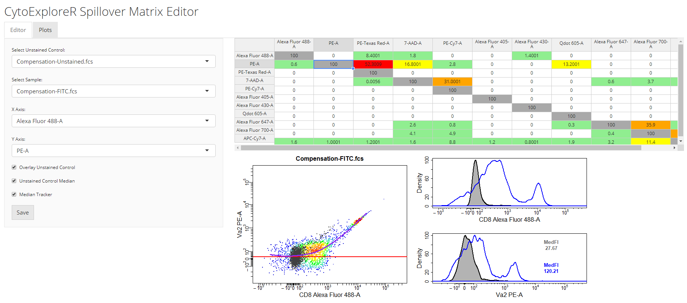

 
<!-- README.md is generated from README.Rmd. Please edit that file -->

```{r setup, include = FALSE}
knitr::opts_chunk$set(
  collapse = TRUE,
  comment = "#>",
  fig.path = "man/figures/README-"
)
```

# CytoExploreR 

[](https://www.repostatus.org/#active)
[](https://travis-ci.org/DillonHammill/CytoExploreR) 
[](https://codecov.io/github/DillonHammill/CytoExploreR?branch=master)
[](https://www.tidyverse.org/lifecycle/#maturing)
[)`-yellowgreen.svg)](/commits/master)
[](https://github.com/ropensci/software-review/issues/281)

**CytoExploreR** is comprehensive collection of interactive exploratory cytometry analysis tools designed under a unified framework. **CytoExploreR** has been specifically designed to integrate all existing cytometry analysis techniques (e.g. manual gating, automated gating and dimension reduction) in a format that makes these tools freely accessible to users with no coding experience. If you are new to **CytoExploreR** visit https://dillonhammill.github.io/CytoExploreR/ to get started. 

## Install R and RStudio

**CytoExploreR** has a minimal requirement for R 3.5.0. If necessary, newer versions of R can be installed by clicking on your operating system in [this link](https://cran.r-project.org/bin/) and following the installation instructions. For the best user experience it is recommended that RStudio be installed as well. RStudio Desktop is free to download and can installed from the [RStudio](https://rstudio.com/products/rstudio/#rstudio-desktop) website.

## Platform-Specific Requirements

After successfully installing R and RStudio, the following additional platform-specific tools are required:

## Mac OS
- Install Xcode developer tools from the [App Store](https://apps.apple.com/au/app/xcode/id497799835?mt=12). Restart your computer.
- Install command line tools by opening the terminal and running xcode-select --install
- Install macOS R toolchain by installing clang7 and gfortran [here](https://cran.r-project.org/bin/macosx/tools/)
- Check if XQuartz is listed in your installed Applications, it may be hiding in the utilities folder. If XQuartz is missing on your computer, it can be installed from the [XQuartz](https://www.xquartz.org/) website.
- Restart your computer so all these changes will take effect.

## Windows OS
- Install the appropriate [Rtools](https://cran.r-project.org/bin/windows/Rtools/) for your R installation.
- Follow these [instructions](https://github.com/RGLab/RProtoBufLib/blob/trunk/INSTALL) to download protobuf Windows binary and set appropriate environment variable. Ignore the section to build protobuf from source.
- Follow these [instructions](https://github.com/RGLab/flowWorkspace/blob/trunk/INSTALL) to install and setup the additional C++ libraries required to successfully build flowWorkspace.
- Restart your computer.

## CytoExploreR Dependencies

Now that all the setup is complete, let's install all the necssary dependencies of **CytoExploreR**. From within RStudio, run the following in the console to install the latest versions of [flowCore](https://github.com/RGLab/flowCore), [flowWorkspace](https://github.com/RGLab/flowWorkspace) and [openCyto](https://github.com/RGLab/openCyto) from Bioconductor.

```{r, eval = FALSE}
# Bioconductor
install.packages("BiocManager")
# Install flowCore, flowWorkspace and openCyto
library(BiocManager)
install(c("flowCore", "flowWorkspace", "openCyto"))
```

Currently, **CytoExploreR** requires the development versions of these RGLab packages hosted on GitHub:

```{r, eval = FALSE}
# Install & load devtools
tryCatch(library(devtools), error = function(e){
  install.packages("devtools")
  library(devtools)
})
# Install flowCore, flowWorkspace & openCyto from GitHub
install_github("RGLab/RProtoBufLib", ref = "trunk")
install_gtihub("RGLab/cytolib")
install_github("RGLab/flowCore")
install_github("RGLab/flowWorkspace")
install_github("RGLab/flowStats", ref = "trunk")
install_github("RGLab/openCyto")
```

## CytoExploreR

Now that all the dependencies are installed, let's move on to installing **CytoExploreR**. To successfully install **CytoExploreR** users will first need to install **CytoExploreRData** which contains example datasets that will be used within **CytoExploreR** to demonstrate key features.

```{r, eval = FALSE}
# CytoExploreRData 
devtools::install_github("DillonHammill/CytoExploreRData")
# CytoExploreR 
devtools::install_github("DillonHammill/CytoExploreR")
```

```{r, eval = TRUE, echo = FALSE, message = FALSE}
library(CytoExploreR)
library(CytoExploreRData)
```

## Design

To ease the transition from GUI oriented software, **CytoExploreR** has been designed to be a consistent and auto-complete friendly package for cytometry data analysis. All exported functions from **CytoExploreR** are prefixed with `cyto_`, followed by the name of the object you wish to change (e.g. `cyto_gate_`) and finally the action that you would like to perform (e.g. `cyto_gate_draw`). To see all available functions simply start typing `cyto_` and you will be greeted with a complete list of exported functions that can be selected from the auto-complete dropdown list:

```{r echo = FALSE, out.width = '95%', fig.align="center"}

```

## Overview

Some of the key features of **CytoExploreR** are outlined below:

* load and annotate samples using `cyto_setup`
* user guided automatic compensation using `cyto_spillover_compute`
* interactively modify spillover matrices using `cyto_spillover_edit`
* compute spillover spreading matrices with `cyto_spillover_spread_compute`
* visualise compensation in all channels using `cyto_plot_compensation`
* customisable data transformations using `cyto_transform` which includes support for log, arcsinh, logicle and biexponential data transformations
* manual gate drawing using `cyto_gate_draw`
* ability to edit drawn gates using `cyto_gate_edit`
* remove gates using `cyto_gate_remove`
* rename gates using `cyto_gate_rename`
* gate saving directly to an openCyto `gatingTemplate` for future use
* support for using both manual and automated gating approaches through linking to `openCyto`
* exploratory visualisations of all existing cytometry data classes using `cyto_plot`
* visualisation of complete gating strategies with back-gating and/or gate tracking using `cyto_plot_gating_scheme`
* visualisation of gating trees using `cyto_plot_gating_tree`
* visualisation of marker expression profiles in all channels using `cyto_plot_profile`
* visualisation of populations in all possible bivariate plots using `cyto_plot_explore`
* produce dimension reduced maps (e.g. PCA, tSNE, UMAP and EmbedSOM) using `cyto_map`
* save samples and analyses to file using `cyto_save`
* export population level statistics tidyverse style using `cyto_stats_compute`

## Usage

**CytoExploreR** is large package and we would not do it justice by demonstrating its usage here. Instead we will explore the use of **CytoExploreR** in a series of vignettes which tackle specific components of the cytometry data analysis pipeline. To work through these vignettes you will need to create a new R project (File -> New Project) and download the example datasets shipped with **CytoExploreRData**.

```{r, eval = FALSE}
# Load required packages
library(CytoExploreR)
library(CytoExploreRData)

# Download Compensation FCS files
cyto_save(Compensation,
          save_as = "Compensation-Samples")

# Download Activation FCS files
cyto_save(Activation,
          save_as = "Activation-Samples")
```

These datasets will be used throughout the package vignettes to demonstrate the key features of **CytoExploreR**. A brief summary of each of the package vignettes is provided below:

+ The `CytoExploreR` vignette outlines a basic flow cytometry data analysis pipeline, which includes steps to compensate for fluorescent spillover, transform data for visualisation and manually gate populations to export population level statistics. This vignette serves as a basic introduction to the package and users are encouraged to explore other vignettes which explore these aspects in a lot more detail.

+ The `Visualisations` vignette will demonstrate the use of `cyto_plot`, a powerful data visualisation tool to explore cytometry data.

```{r echo = FALSE, fig.align="center", out.width = '98%'}
knitr::include_graphics('man/figures/README-2.png')
```

+ Flow cytometry users will find the `Compensation` vignette useful in describing the process of using compensation controls to correctly compensate for fluorescent spillover. 

```{r echo = FALSE, fig.align="center", out.width = '98%'}

```

+ Data transformations are essential to appropriate visualisation of cytometry data. In the `Transformations` vignette we will explore the tools available in **CytoExploreR** to apply log, arcsinh, biexponential and/or logicle transformations to the data.

```{r echo = FALSE, fig.align="center", out.width = '80%'}
knitr::include_graphics('man/figures/README-4.png')
```

+ In `Manual Gating` vignette we will demonstrate the use of `cyto_gate_draw` to interactively draw gates around populations. In particular, we will focus on the different gate types that are supported and how they can be used to gate populations.

```{r echo = FALSE, fig.align="center", out.width = '98%'}
knitr::include_graphics('man/figures/README-1.png')
```

+ Dimensionality reduction is gaining popularity for analysis of high dimensional cytometry data. In the `Dimensionality Reduction` vignette we will demonstrate the use of `cyto_map` to produce PCA, tSNE, UMAP and EmbedSOM maps of cytometry data (coming soon).

```{r echo = FALSE, fig.align="center", out.width = '98%'}
#knitr::include_graphics('man/figures/README-5.png')
```

## News

There is a changelog for the GitHub `master` branch which will reflect any updates made to improve the stability, usability or plenitude of the package. Users should refer to the [Changelog](https://dillonhammill.github.io/CytoExploreR/news/index.html) prior to installing new versions of the package.

## Credits

**CytoExploreR** would not be possible without the existing flow cytometry infrastructure developed by the RGLab. **CytoExploreR** started out as simple plugin for openCyto to facilitate gate drawing but has evolved into a fully-fledged cytometry analysis package thanks to the support and guidance of members of the RGLab. Please take the time to check out their work on [GitHub](https://github.com/RGLab).

## Development

**CytoExploreR** is a maturing package which will continue to be sculpted by the feedback and feature requests of users. The GitHub `master` branch will always contain the most stable build of the package. New features and updates will be made to a separate branch and merged to the `master` branch when stable and tested. The [Changelog](https://dillonhammill.github.io/CytoExploreR/news/index.html) will reflect any changes made to the `master` branch.

## Getting help

The [Get Started](https://dillonhammill.github.io/CytoExploreR/articles/CytoExploreR.html) and [Reference](https://dillonhammill.github.io/CytoExploreR/reference/index.html) sections on the **CytoExploreR** website are your first port of call if you require any help. For more detailed workflows refer the **Articles** tab. If you encounter any issues with the functioning of the package refer to these [issues](https://github.com/DillonHammill/CytoExploreR/issues) to see if the problem has been identified and resolved. Feel free to post new issues on the GitHub page if they have not already been addressed.

## Code of conduct

Please note that the **CytoExploreR** project is released with a
[Contributor Code of Conduct](CODE_OF_CONDUCT.md).
By contributing to this project, you agree to abide by its terms.

## Citation

A **CytoExploreR** publication is on the way, but in the meantime if you use **CytoExploreR** for your work please cite the package as follows:

```{r, eval = TRUE}
citation("CytoExploreR")
```
