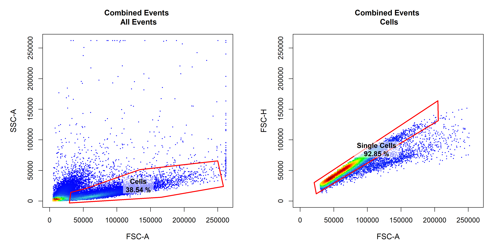

<!-- README.md is generated from README.Rmd. Please edit that file -->

# CytoRSuite 

[](https://www.repostatus.org/#active)
[](https://travis-ci.org/DillonHammill/CytoRSuite)
[](https://codecov.io/github/DillonHammill/CytoRSuite?branch=master)
[](https://www.tidyverse.org/lifecycle/#maturing)
[](/commits/master)
[](https://github.com/ropensci/software-review/issues/281)

**CytoRSuite** is designed to provide an interactive interface for the
analysis of flow cytometry data in R. If you are new to **CytoRSuite**
visit <https://dillonhammill.github.io/CytoRSuite/> to get started.

# Installation

**CytoRSuite** is built on the existing flow cytometry infrastructure
for R developed by the [RGLab](https://github.com/RGLab). In order to
properly install **CytoRSuite** and its dependencies the following
platform-specific tools are required:

## Windows and Linux

flowWorkspace requires additional C++ libraries to build from source
using Rtools for windows users. Windows and Linux users should follow
these
[instructions](https://github.com/RGLab/flowWorkspace/blob/trunk/INSTALL)
before proceeding.

## Mac

Mac users will need to ensure that **XQuartz** is in their list of
installed Applications. **XQuartz** is commonly found in the utilities
folder. If **XQuartz** is missing from your list of applications it can
be installed from this [link](https://www.xquartz.org/). Restart your
computer following installation.

## flowCore, flowWorkspace & openCyto

Once these tools are installed, users can proceed to installing the
latest versions of [flowCore](https://github.com/RGLab/flowCore),
[flowWorkspace](https://github.com/RGLab/flowWorkspace) and
[openCyto](https://github.com/RGLab/openCyto) from Bioconductor.

``` r
# Bioconductor
install.packages("BiocManager")
# Install flowCore, flowWorkspace and openCyto
library(BiocManager)
install(c("flowCore", "flowWorkspace", "openCyto"), version = "devel")
```

## CytoRSuite

Once these packages are successfully installed, users will need to
install **CytoRSuiteData** which contains example datasets which will be
used to demonstrate the features of **CytoRSuite**. **CytoRSuite** can
then be installed from GitHub.

``` r
# CytoRSuiteData development version on GitHub
devtools::install_github("DillonHammill/CytoRSuiteData")
# CytoRSuite development version on GitHub
devtools::install_github("DillonHammill/CytoRSuite", build_vignettes = TRUE)
```

# Overview

**CytoRSuite** provides an interactive interface for analysis of flow
cytometry data. Some key features include:

  - user guided automatic compensation using `spillover_compute`
  - interactively modify spillover matrices using `spillover_edit`
  - visualise compensation in all channels using
    `cyto_plot_compensation`
  - easily associate experimental details with each file using
    `cyto_annotate`
  - manual gate drawing using `gate_draw`
  - ability to edit drawn gates using `gate_edit`
  - remove gates using `gate_remove`
  - gate saving directly to an openCyto `gatingTemplate` for future use
  - support for using both manual and automated gating approaches
    through linking to `openCyto`
  - visualisation of flowFrames, flowSets, GatingHierarchies and
    GatingSets using `cyto_plot`
  - visualisation of complete gating strategies with back-gating and/or
    gate tracking using `cyto_plot_gating_scheme`
  - visualisation of marker expression profiles in all channels using
    `cyto_plot_profile`
  - export population level statistics using `cyto_stats_compute`

# Usage

The full details of how **CytoRSuite** works will be tackled
individually in the package vignettes, but a succinct usage outline is
described below:

1.  Compensation of fluorescent spillover
    
    1.1 Load compensation controls into a `ncdfFlowSet`
    
    ``` r
    library(CytoRSuite)
    library(CytoRSuiteData)
    
    # Save .fcs files to folder "Compensation Controls" in working directory
    files <- list.files(path = "Compensation Controls", full.names = TRUE)
    fs <- read.ncdfFlowSet(files = files)
    ```
    
    1.2 Load compensation controls into `GatingSet` for gating
    
    ``` r
    # Add flowSet to GatingSet
    gs <- GatingSet(fs)
    ```
    
    1.3 Gate Single Cells using `gate_draw`
    
    ``` r
    # Gate Cells
    gate_draw(gs, 
              parent = "root",
              alias = "Cells",
              channels = c("FSC-A","SSC-A"),
              type = "polygon",
              gatingTemplate = "Compensation-gatingTemplate.csv")
    
    # Gate Single Cells
        gate_draw(gs, 
              parent = "Cells",
              alias = "Single Cells",
              channels = c("FSC-A","FSC-H"),
              type = "polygon",
              gatingTemplate = "Compensation-gatingTemplate.csv")
    ```
    
    
    
    1.4 Compute fluorescent spillover matrix using `spillover_compute`
    
    ``` r
    spillover_compute(gs, 
                      parent = "Single Cells")
    ```
    
    1.5 Interactively edit computed spillover matrix using
    `spillover_edit`
    
    ``` r
    spillover_edit(gs, 
                   parent = "Single Cells", 
                   channel_match = "Compensation-Channels.csv", 
                   spillover = "Spillover-Matrix.csv")
    ```
    
    

2.  Analyse samples
    
    2.1 Load samples into a `ncdfFlowSet`
    
    ``` r
    # Save samples to folder "Samples" in working directory
    files <- list.files(path = "Samples", full.names = TRUE)
    fs <- read.ncdfFlowSet(files = files)
    ```
    
    2.2 Annotate samples with markers using
    `cyto_markers`
    
    ``` r
    cyto_markers(fs)
    ```
    
    
    
    2.3 Annotate samples with experimental details using
    `cyto_annotate`
    
    ``` r
    cyto_annotate(fs)
    ```
    
    
    
    2.4 Add samples to GatingSet
    
    ``` r
    gs <- GatingSet(fs)
    ```
    
    2.4 Apply fluorescent compensation
    
    ``` r
    # Load in spillover matrix
    spill <- read.csv("Spillover-Matrix.csv", 
                      header = TRUE, 
                      row.names = 1)
    colnames(spill) <- rownames(spill)
    
    # Apply compensation to samples
    gs <- compensate(gs, spill)
    ```
    
    2.5 Transform fluorescent channels for gating
    
    ``` r
    # Fluorescent channels
    chans <- cyto_fluor_channels(gs)
    
    # Logicle transformation
    trans <- estimateLogicle(gs[[4]], chans)
    gs <- transform(gs, trans)
    ```
    
    2.6 Build gating scheme using `gate_draw`
    
    ``` r
    # Cells
    gate_draw(gs,
              parent = "Cells",
              alias = "Cells",
              channels = c("FSC-A","SSC-A"),
              gatingTemplate = "Example-gatingTemplate.csv")
    
    # Copy above & edit to add new population(s)
    # Repeat until gating scheme is complete
    ```


3.  Visualise gating schemes using
`cyto_plot_gating_scheme`

<!-- end list -->

``` r
cyto_plot_gating_scheme(gs[[4]], back_gate = TRUE)
```


4.  Export population-level statistics using `cyto_stats_compute`

<!-- end list -->

``` r
cyto_stats_compute(gs,
                   alias = c("CD4 T Cells","CD8 T Cells"),
                   channels = c("CD44","CD69"),
                   stat = "median")
```

    #> $`CD4 T Cells`
    #>                 OVAConc Alexa Fluor 647-A   7-AAD-A
    #> Activation1.fcs   0.000          675.1999  606.7077
    #> Activation2.fcs   0.005          720.3611  656.8873
    #> Activation3.fcs   0.050          971.4868  744.3725
    #> Activation4.fcs   0.500         1503.4010 1233.6546
    #> 
    #> $`CD8 T Cells`
    #>                 OVAConc Alexa Fluor 647-A  7-AAD-A
    #> Activation1.fcs   0.000          414.2267 260.0531
    #> Activation2.fcs   0.005          410.1949 248.5102
    #> Activation3.fcs   0.050          454.0508 312.6521
    #> Activation4.fcs   0.500          552.0260 382.5721

# News

There is a Changelog for the GitHub `master` branch which will reflect
any updates made to improve the stability, usability or plenitude of the
package. Users should refer to the
[Changelog](https://dillonhammill.github.io/CytoRSuite/news/index.html)
before installing new versions of the package.

# Credits

**CytoRSuite** would not be possible without the existing flow cytometry
infrastructure developed by the RGLab. **CytoRSuite** started out as
simple plugin for openCyto to facilitate gate drawing but has evolved
into a fully-fledged flow cytometry analysis package thanks to the
support and guidance of members of the RGLab. Please take the time to
check out their work on [GitHub](https://github.com/RGLab).

# Development

**CytoRSuite** is a maturing package which will continue to be sculpted
by the feedback and feature requests of users. The GitHub `master`
branch will always contain the most stable build of the package. New
features and updates will be made to a separate branch and merged to the
`master` branch when stable and tested. The
[Changelog](https://dillonhammill.github.io/CytoRSuite/news/index.html)
will reflect any changes made to the `master` branch.

# Getting help

The [Get
Started](https://dillonhammill.github.io/CytoRSuite/articles/CytoRSuite.html)
and
[Reference](https://dillonhammill.github.io/CytoRSuite/reference/index.html)
sections on the **CytoRSuite** website are your first port of call if
you require any help. For more detailed workflows refer the **Articles**
tab. If you encounter any issues with the functioning of the package
refer to these
[issues](https://github.com/DillonHammill/CytoRSuite/issues) to see if
the problem has been identified and resolved. Feel free to post new
issues on the GitHub page if they have not already been addressed.

# Code of conduct

Please note that the **CytoRSuite** project is released with a
[Contributor Code of Conduct](CODE_OF_CONDUCT.md). By contributing to
this project, you agree to abide by its terms.
