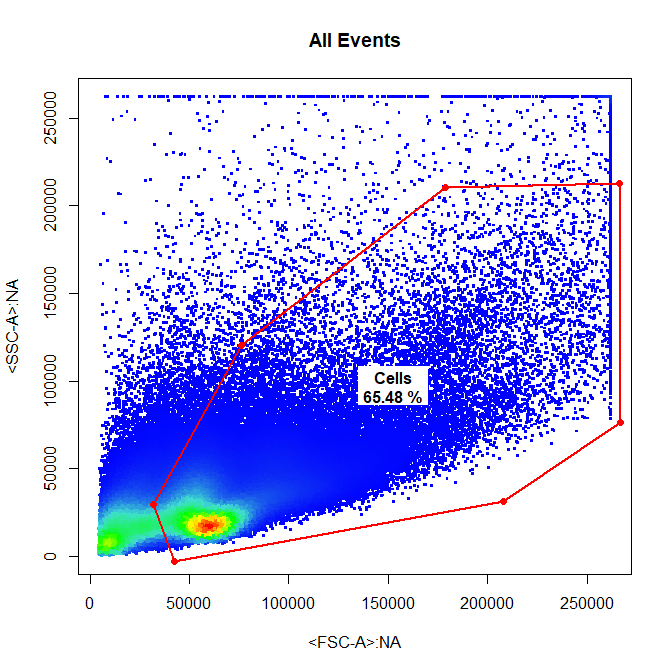
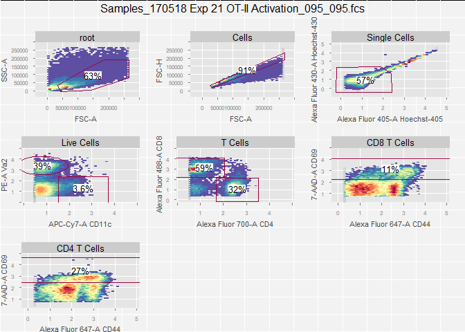

**cytoSuite**
=============

Compensation & Gating Routines for Analysis of Flow Cytometry Data.

**Installation**
================

**cytoSuite** can be installed from Github.

GitHub
------

``` r
library(devtools)
install_github("DillonHammill/cytoSuite")
```

**Demonstration**
=================

Load in Required Packages
-------------------------

``` r
library(cytoSuite)
```

Load in Samples into flowSet
----------------------------

``` r
# Here we will use the Activation samples included in cytoSuite and assign them to object called fs
data(Activation, package = "cytoSuite")
fs <- Activation
```

Annotate flowSet with pData and Markers
---------------------------------------

``` r
# pData entries will be used later to construct gates using specific samples
pData(fs)$Samples <- c("Activated","Control")

# Marker names can be used for gating and will be included in plot outputs - see ?Activation for details
# To get a list of fluorescent channels use getChannels()
fluor <- getChannels(fs)
chnls <- c("Alexa Fluor 405-A","Alexa Fluor 430-A","APC-Cy7-A", "PE-A", "Alexa Fluor 488-A", "Alexa Fluor 700-A", "Alexa Fluor 647-A", "7-AAD-A") 
markers <- c("Hoechst-405", "Hoechst-430", "CD11c", "Va2", "CD8", "CD4", "CD44", "CD69")
names(markers) <- chnls
markernames(fs) <- markers
```

Add Samples to GatingSet for Gating
-----------------------------------

``` r
gs <- GatingSet(fs)
```

Apply Compensation
------------------

``` r
# Use spillover matrix attached to samples
spill <- fs[[1]]@description$SPILL
gs <- compensate(gs, spill)

# Refer to ?computeSpillover and ?editSpillover to modify spillover matrix
```

Apply Logicle Transformation to Fluorescent Channels
----------------------------------------------------

``` r
trans <- estimateLogicle(gs[[1]], fluor)
gs <- transform(gs, trans)
```

Gate Samples Using drawGate
---------------------------

**drawGate** is a convenient wrapper for the gating functions in cytoSuite which constructs drawn gates, applies the gate(s) directly to the and saves the gate(s) to the csv file for future use.

``` r
# Cells
drawGate(gs, parent = "root", alias = "Cells", channels = c("FSC-A","SSC-A"), gate_type = "polygon", gtfile = "gatingTemplate.csv")

# Single Cells
drawGate(gs, parent = "Cells", alias = "Single Cells", channels = c("FSC-A","FSC-H"), gate_type = "polygon", gtfile = "gatingTemplate.csv")

# Live Cells
drawGate(gs, parent = "Single Cells", alias = "Live Cells", channels = c("Alexa Fluor 405-A","Alexa Fluor 430-A"), gate_type = "polygon", gtfile = "gatingTemplate.csv")

# Dendritic Cells & T cells
drawGate(gs, parent = "Live Cells", alias = c("Dendritic Cells", "T Cells"), channels = c("APC-Cy7-A","PE-A"), gate_type = c("rectangle","ellipse"), gtfile = "gatingTemplate.csv")

# CD4 & CD8 T Cells
drawGate(gs, parent = "T Cells", alias = c("CD4 T Cells", "CD8 T Cells"), channels = c("Alexa Fluor 700-A","Alexa Fluor 488-A"), gate_type = "rectangle", gtfile = "gatingTemplate.csv")

# CD69+ CD4 T Cells
drawGate(gs, parent = "CD4 T Cells", alias = c("CD69+ CD4 T Cells"), channels = c("Alexa Fluor 647-A","7-AAD-A"), gate_type = "interval", axis = "y", gtfile = "gatingTemplate.csv")

# CD69+ CD8 T Cells
drawGate(gs, parent = "CD8 T Cells", alias = c("CD69+ CD8 T Cells"), channels = c("Alexa Fluor 647-A","7-AAD-A"), gate_type = "interval", axis = "y", gtfile = "gatingTemplate.csv")
```

      

Apply Saved Gates to Samples (Future Analyses)
----------------------------------------------

``` r
# Add samples to GatingSet, apply compensation, transform channels and apply gates
gs <- GatingSet(fs)
```

    ## ..done!

``` r
gs <- compensate(gs, spill)
gs <- transform(gs, trans)

# Apply saved gates
gt <- gatingTemplate("gatingTemplate.csv")
```

    ## Adding population:Cells
    ## Adding population:Single Cells
    ## Adding population:Live Cells
    ## Adding population:Dendritic Cells
    ## Adding population:T Cells
    ## Adding population:CD4 T Cells
    ## Adding population:CD8 T Cells
    ## Adding population:CD69+ CD4 T Cells
    ## Adding population:CD69+ CD8 T Cells

``` r
gating(gt, gs)
```

    ## Loading required package: parallel
    ## Gating for 'Cells'
    ## done.
    ## Gating for 'Single Cells'
    ## done.
    ## Gating for 'Live Cells'
    ## done.
    ## Gating for 'T Cells'
    ## done.
    ## Gating for 'CD8 T Cells'
    ## done.
    ## Gating for 'CD69+ CD8 T Cells'
    ## done.
    ## Gating for 'CD4 T Cells'
    ## done.
    ## Gating for 'CD69+ CD4 T Cells'
    ## done.
    ## Gating for 'Dendritic Cells'
    ## done.
    ## finished.

``` r
# Check gates have been applied
getNodes(gs)
```

    ##  [1] "root"                                                                
    ##  [2] "/Cells"                                                              
    ##  [3] "/Cells/Single Cells"                                                 
    ##  [4] "/Cells/Single Cells/Live Cells"                                      
    ##  [5] "/Cells/Single Cells/Live Cells/T Cells"                              
    ##  [6] "/Cells/Single Cells/Live Cells/T Cells/CD8 T Cells"                  
    ##  [7] "/Cells/Single Cells/Live Cells/T Cells/CD8 T Cells/CD69+ CD8 T Cells"
    ##  [8] "/Cells/Single Cells/Live Cells/T Cells/CD4 T Cells"                  
    ##  [9] "/Cells/Single Cells/Live Cells/T Cells/CD4 T Cells/CD69+ CD4 T Cells"
    ## [10] "/Cells/Single Cells/Live Cells/Dendritic Cells"

``` r
plotGate(gs[[1]])
```

 

Dillon Hammill, BMedSci (Hons) <br /> Ph.D. Scholar <br /> The Parish Group – Cancer & Vascular Biology <br /> ACRF Department of Cancer Biology and Therapeutics <br /> The John Curtin School of Medical Research <br /> ANU College of Medicine, Biology and the Environment <br /> The Australian National University <br /> Acton ACT 2601 <br /> <Dillon.Hammill@anu.edu.au>
