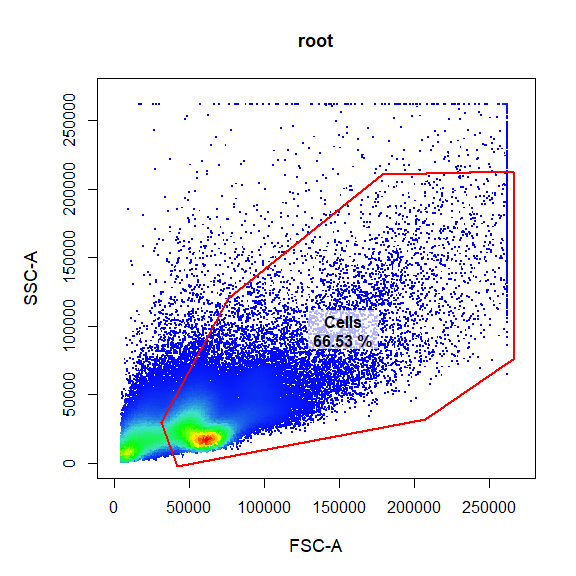
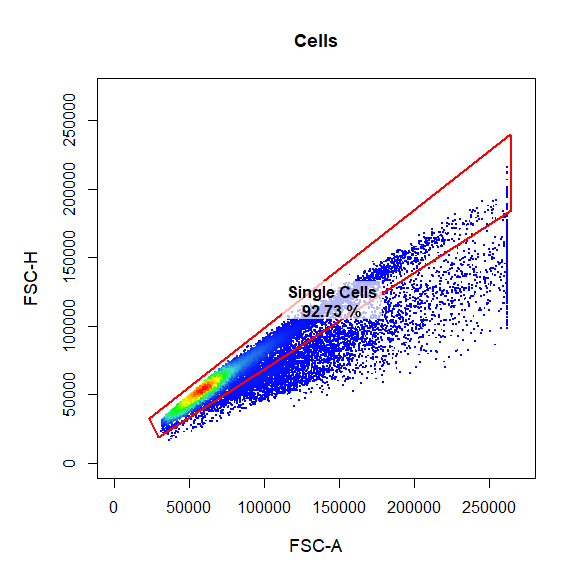
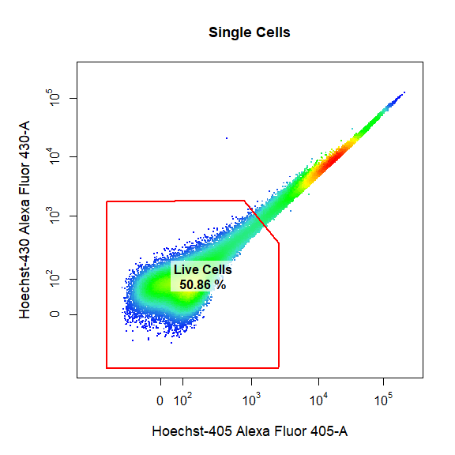
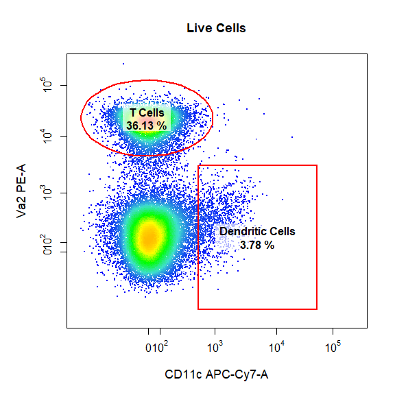
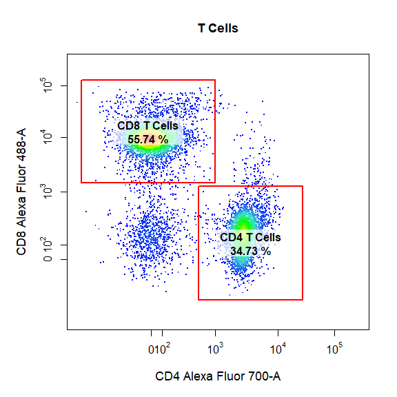
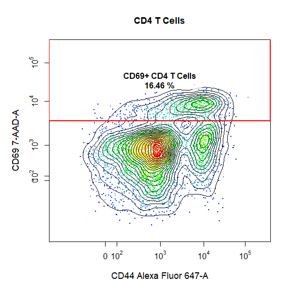
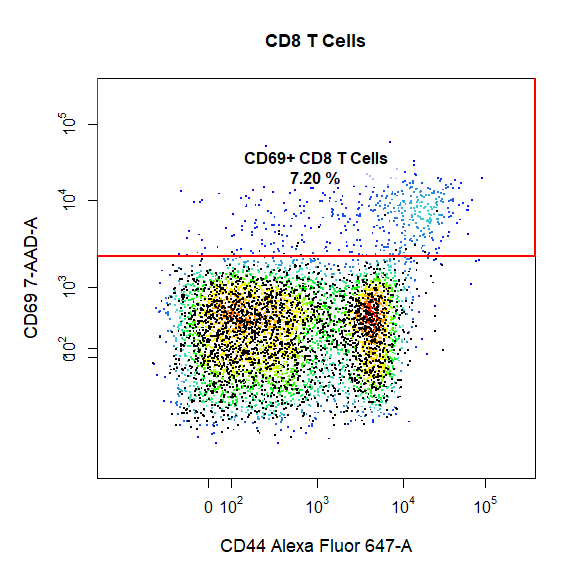
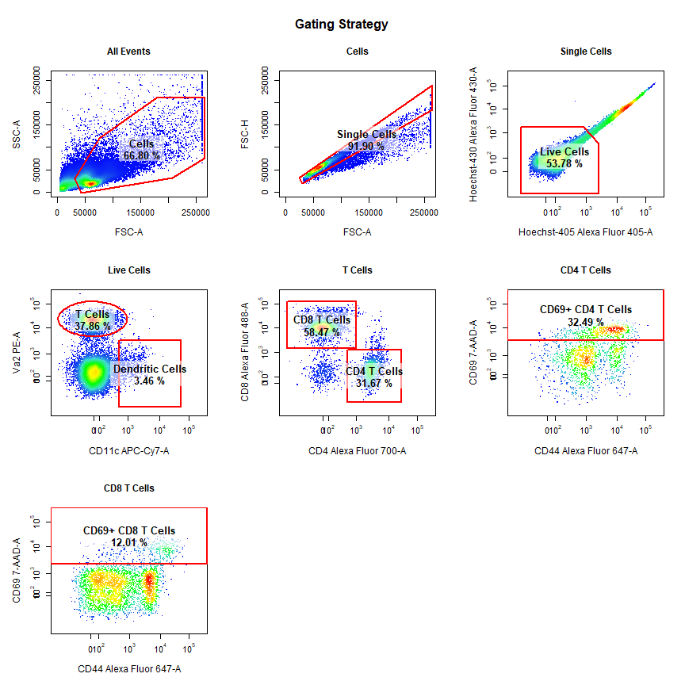
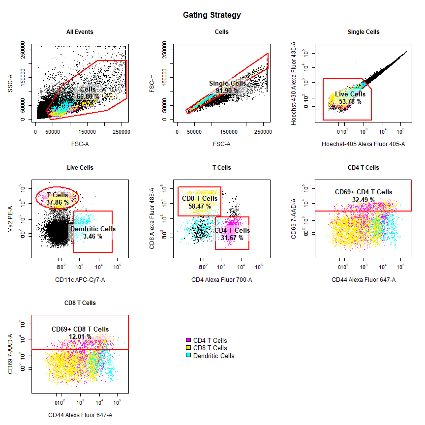

**cytoRSuite**
--------------

Compensation, Gating & Visualisation Toolkit for Analysis of Flow Cytometry Data.

**Installation**
----------------

**cytoRSuite** can be installed from Github.

### GitHub

``` r
library(devtools)
install_github("DillonHammill/cytoRSuite")
```

**Overview**
------------

**cytoRSuite** provides an interactive interface for analysis of flow cytometry data. Some key features include:

-   user guided automatic compensation using **computeSpillover**
-   interactively modify spillover matrices using **editSpillover**
-   visualise compensation in all channels using **plotCytoComp**
-   manual gate drawing using **drawGate**
-   ability to edit drawn gates using **editGate**
-   remove gates using **removeGate**
-   gate saving to an openCyto **gatingTemplate**
-   visualisation of flowFrames, flowSets, GatingHierarchies and GatingSets using **plotCyto**
-   visualisation of complete gating strategies using **plotCytoGates**
-   visualisation of marker expression in all channels using **plotCytoExprs**
-   export population level statistics using **computeStats**

For more details please refer to the vignettes which document all of these features in more detail.

**Demonstration**
-----------------

To give you a taste of what **cytoRSuite** can do, here we will demonstrate the use of **drawGate** to analyse some in vitro T cell activation data supplied with the package. For more details on this dataset see **?Activation**. The Activation dataset is comprised of two separate files:

1.  Unactivated sample
2.  Activated sample

Feel free to run the below code chunks in your R session so that you see how easy it is to draw gates using **drawGate** and visualise gating strategies using **plotCytoGates**!

### Load in Required Packages

``` r
library(cytoRSuite)
```

### Load in Samples into flowSet

``` r
# Here we will use the Activation samples included in cytoRSuite and assign them to object called fs
data(Activation, package = "cytoRSuite")
fs <- Activation
```

### Annotate flowSet with pData and Markers

To help with downstream analyses let's add marker names to the channels that we are using in the experiment.

``` r
# pData entries will be used later to construct gates using specific samples
pData(fs)$Samples <- c("Control","Activated")

# Marker names can be used for gating and will be included in plot outputs - see ?Activation for details
# To get a list of fluorescent channels use getChannels()
fluor <- getChannels(fs)
chnls <- c("Alexa Fluor 405-A","Alexa Fluor 430-A","APC-Cy7-A", "PE-A", "Alexa Fluor 488-A", "Alexa Fluor 700-A", "Alexa Fluor 647-A", "7-AAD-A") 
markers <- c("Hoechst-405", "Hoechst-430", "CD11c", "Va2", "CD8", "CD4", "CD44", "CD69")
names(markers) <- chnls
markernames(fs) <- markers
```

### Add Samples to GatingSet for Gating

``` r
gs <- GatingSet(fs)
```

### Apply Compensation

**cytoRSuite** provides three distinct functions to aid in compensation of fluorescence spillover:

-   **computeSpillover** provides an automated approach to calculating the percentage of fluorescent spillover using the algorithm described by Bagwell & Adams 1993.
-   **editSpillover** utilises an interactive Shiny interface to allow realtime visualisation of changes in spillover percentages and is designed to aid in manual manipulation of spilllover matrices.
-   **plotCytoComp** displays each compensation control in all channels to easily identify any potential compensation issues.

These features will be documentaed in a separate compensation vignette, if you are interested in these functions see **?computeSpillover**, **?editSpillover** and **?plotCytoComp** for more details.

For brevity we will use the spillover matrix attached to each flowFrame in the Activation dataset for fluorescence compensation.

``` r
# Use spillover matrix attached to samples
spill <- fs[[1]]@description$SPILL
gs <- compensate(gs, spill)

# Refer to ?computeSpillover and ?editSpillover to modify spillover matrix
```

### Apply Logicle Transformation to Fluorescent Channels

In order to appropriately visualise the data, we first need to transform all fluorescent channels post-compensation. Currently, **cytoRSuite** only supports the logicle transformation documented in the **flowCore** package. Below we use **estimateLogicle** to get parameter estimates for each fluorescent channel and apply these transformations to the GatingSet using the **transform** function from **flowCore**.

``` r
# Get a list of the fluorescent channels
channels <- getChannels(gs)

trans <- estimateLogicle(gs[[2]], channels)
gs <- transform(gs, trans)
```

### Manual Gate Drawing Using drawGate

**drawGate** is a convenient wrapper for the gating functions in cytoRSuite which constructs drawn gates, applies the gate(s) directly to the **GatingSet** and saves the gate(s) to an **openCyto gatingTemplate** csv file for future use. **drawGate** will pool the data and plot it in an interactive plotting window which will allow the user to draw gates around the population of interest. The type of gate is determined by the **gate\_type** argument. Below we will demonstrate some of the key features of drawGate, for details on specific gate types please refer to the gating functions vignette.

Here we will gate a population "Cells" within the parent population "root" in FSC-A and SSC-A channels using a polygon gate. The gate will be automatically applied to the GatingSet and saved in a gatingTemplate csv called "Example gatingTemplate.csv" in the current working directory.

``` r
# Cells
drawGate(gs, 
         parent = "root", 
         alias = "Cells", 
         channels = c("FSC-A","SSC-A"), 
         type = "polygon", 
         gtfile = "Example-gatingTemplate.csv")
```



Here we will gate a population "Single Cells" within the parent population "Cells" in FSC-A and FSC-H channels using a polygon gate. Notice how this gate is added as a row to the gatingTemplate csv file.

``` r
# Single Cells
drawGate(gs, 
         parent = "Cells", 
         alias = "Single Cells", 
         channels = c("FSC-A","FSC-H"), 
         type = "polygon", 
         gtfile = "Example-gatingTemplate.csv")
```



Here we will gate a population "Live Cells" within the parent population "Single Cells" in Alexa Fluor 405-A and Alexa Fluor 430-A channels using a polygon gate. Notice how the axes have been transformed appropriately on the plot as these are fluorescent channels which were transformed with the logicle transformation earlier.

``` r
# Live Cells
drawGate(gs, 
         parent = "Single Cells", 
         alias = "Live Cells", 
         channels = c("Alexa Fluor 405-A","Alexa Fluor 430-A"), 
         type = "polygon", 
         gtfile = "Example-gatingTemplate.csv")
```



Next we will demonstrate the ability to draw multiple gates (of the same or different type) onto the same plot. Here we will gate both the "Dendritic Cells" and "T Cells" populations within the parent population "Live Cells" in APC-Cy7-A and PE-A channels using a rectangle and an ellipsoid gate. To gate multiple populations on the same plot simply suppply multiple names to the alias argument wrapped inside c(). Notice how we can use the marker names rather than the channel names if they are supplied in the original flowSet.

``` r
# Dendritic Cells & T cells
drawGate(gs, 
         parent = "Live Cells", 
         alias = c("Dendritic Cells", "T Cells"), 
         channels = c("CD11c","Va2"), 
         type = c("rectangle","ellipse"), 
         gtfile = "Example-gatingTemplate.csv")
```



Here we will gate both the "CD4 T Cells" and "CD8 T Cells" populations within the parent population "T Cells" in Alexa Fluor 700-A and Alexa Fluor 488-A channels using a rectangle gates. Notice how gate\_type can also be abbreviated as the first letter of the gate type (e.g. "r" for "rectangle"). Be sure to draw the gates in the order that they are listed in the alias argument.

``` r
# CD4 & CD8 T Cells
drawGate(gs, 
         parent = "T Cells", 
         alias = c("CD4 T Cells", "CD8 T Cells"), 
         channels = c("CD4","CD8"), 
         type = "r", 
         gtfile = "Example-gatingTemplate.csv")
```



Here we will demonstrate the use of a different gate\_type called "interval" which gates populations based on a defined lower and upper bound. Interval gates are traditionally used in a single dimension, but interval gates are fully supported for 2-dimensional plots on either the x or y axis. Notice how we have indicated which axis we would like to gate using the axis argument. In this case we will be gating the population based on a lower and upper y axis bounds. We will also add some contour lines to aid in gating.

``` r
# CD69+ CD4 T Cells
drawGate(gs, 
         parent = "CD4 T Cells", 
         alias = c("CD69+ CD4 T Cells"), 
         channels = c("CD44","CD69"), 
         type = "interval", 
         axis = "y", 
         gtfile = "Example-gatingTemplate.csv",
         contours = 15)
```



To finish things off lets make a similar gate on the CD8 T Cells as well. This time we will overlay the unactivated control in black and use it to determine where gate should be drawn.

``` r
# Extract the CD8 T Cells from Sample 1 for overlay
CD8 <- getData(gs, "CD8 T Cells")[[1]]

# CD69+ CD8 T Cells
drawGate(gs, 
         parent = "CD8 T Cells", 
         alias = c("CD69+ CD8 T Cells"), 
         channels = c("CD44","CD69"), 
         type = "interval", 
         axis = "y", 
         gtfile = "Example-gatingTemplate.csv",
         overlay = CD8)
```



### Apply Saved Gates to Samples (Future Analyses)

Since all the drawn gates have been saved to the gatingTemplate, next time you visit the data there is no need to re-draw gates! Simply apply the existing gatingTemplate to the data and you are right where you left off!

``` r
# Add samples to GatingSet
gs <- GatingSet(fs)
```

    ## ..done!

``` r
# Apply compensation
gs <- compensate(gs, spill)

# Transform fluorescent channels
gs <- transform(gs, trans)

# Apply saved gates to GatingSet
gt <- gatingTemplate("Example-gatingTemplate.csv")
```

    ## Adding population:Cells
    ## Adding population:Single Cells
    ## Adding population:Live Cells
    ## Adding population:Dendritic Cells
    ## Adding population:T Cells
    ## Adding population:CD4 T Cells
    ## Adding population:CD8 T Cells
    ## Adding population:CD69+ CD4 T Cells
    ## Adding population:CD69+ CD8 T Cells

``` r
gating(gt, gs)
```

    ## Gating for 'Cells'
    ## done.
    ## Gating for 'Single Cells'
    ## done.
    ## Gating for 'Live Cells'
    ## done.
    ## Gating for 'T Cells'
    ## done.
    ## Gating for 'CD8 T Cells'
    ## done.
    ## Gating for 'CD69+ CD8 T Cells'
    ## done.
    ## Gating for 'CD4 T Cells'
    ## done.
    ## Gating for 'CD69+ CD4 T Cells'
    ## done.
    ## Gating for 'Dendritic Cells'
    ## done.
    ## finished.

``` r
# Check gates have been applied
getNodes(gs)
```

    ##  [1] "root"                                                                
    ##  [2] "/Cells"                                                              
    ##  [3] "/Cells/Single Cells"                                                 
    ##  [4] "/Cells/Single Cells/Live Cells"                                      
    ##  [5] "/Cells/Single Cells/Live Cells/T Cells"                              
    ##  [6] "/Cells/Single Cells/Live Cells/T Cells/CD8 T Cells"                  
    ##  [7] "/Cells/Single Cells/Live Cells/T Cells/CD8 T Cells/CD69+ CD8 T Cells"
    ##  [8] "/Cells/Single Cells/Live Cells/T Cells/CD4 T Cells"                  
    ##  [9] "/Cells/Single Cells/Live Cells/T Cells/CD4 T Cells/CD69+ CD4 T Cells"
    ## [10] "/Cells/Single Cells/Live Cells/Dendritic Cells"

``` r
# Plot gating strategy using plotCytoGates
plotCytoGates(gs[[2]])
```



``` r
# plotCytoGates Back-Gating Support
plotCytoGates(gs[[2]], overlay = c("CD4 T Cells","CD8 T Cells","Dendritic Cells"), col = "black")
```



Dillon Hammill, BMedSci (Hons) <br /> Ph.D. Scholar <br /> The Parish Group Cancer & Vascular Biology <br /> ACRF Department of Cancer Biology and Therapeutics <br /> The John Curtin School of Medical Research <br /> ANU College of Medicine, Biology and the Environment <br /> The Australian National University <br /> Acton ACT 2601 <br /> <Dillon.Hammill@anu.edu.au>
