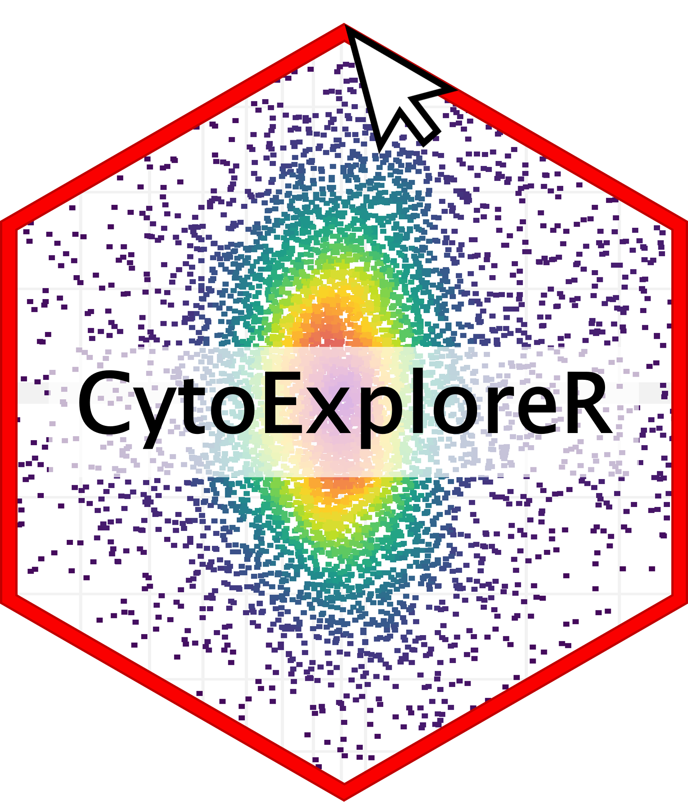

<!-- README.md is generated from README.Rmd. Please edit that file -->

# CytoRSuite 

[](https://travis-ci.org/DillonHammill/CytoRSuite)
[](https://ci.appveyor.com/project/DillonHammill/CytoRSuite)
[](https://codecov.io/github/DillonHammill/CytoRSuite?branch=master)
[](https://www.tidyverse.org/lifecycle/#maturing)

CytoRSuite is designed to provide an interactive interface for the
analysis of flow cytometry data in R. You can see CytoRSuite in action
at **link to final website**. Learn more in vignette(“CytoRSuite”) or
articles tab.

# Installation

CytoRSuite is built on the existing flow cytometry infrastructure for R
developed by the [RGLab](https://github.com/RGLab). To install
CytoRSuite, users should first install the latest versions of
[flowCore](https://github.com/RGLab/flowCore),
[flowWorkspace](https://github.com/RGLab/flowWorkspace) and
[openCyto](https://github.com/RGLab/openCyto) from Bioconductor and
GitHUb.

## flowCore

``` r
# Bioconductor
install.packages("BiocManager")

# flowCore Bioconductor release version
BiocManager::install("flowCore")

# GitHub
install.packages("devtools")

# flowCore development version on GitHub
devtools::install_github("RGLab/flowCore", ref = "trunk")
```

## flowWorkspace

flowWorkspace requires additional C++ libraries to build from source
using Rtools for windows users. Windows users should follow these
[instructions](https://github.com/RGLab/flowWorkspace/blob/trunk/INSTALL)
before proceeding.

``` r
# flowWorkspace Bioconductor release version
BiocManager::install("flowWorkspace")

# flowWorkspace development version on GitHub
devtools::install_github("RGLab/flowWorkspace", ref = "trunk")
```

## openCyto

``` r
# openCyto Bioconductor release version
BiocManager::install("openCyto")

# openCyto development version on GitHub
devtools::install_github("RGLab/openCyto", ref = "trunk")
```

## CytoRSuite

Once these packages are installed users can install **CytoRSuite** from
GitHub. Users should also install CytoRSuiteData which contains example
datasets that will be used in the vignettes to demonstrate the features
of CytoRSuite.

``` r
# CytoRSuite development version on GitHub
devtools::install_github("DillonHammill/CytoRSuite")

# CytoRSuiteData development version on GitHub
devtools::install_github("DillonHammill/CytoRSuiteData")
```

# Overview

**CytoRSuite** provides an interactive interface for analysis of flow
cytometry data. Some key features include:

  - user guided automatic compensation using **spillover\_compute**
  - interactively modify spillover matrices using **spillover\_edit**
  - visualise compensation in all channels using
    **cyto\_plot\_compensation**
  - easliy associate experimental details with each file using
    **cyto\_annotate**
  - manual gate drawing using **gate\_draw**
  - ability to edit drawn gates using **gate\_edit**
  - remove gates using **gate\_remove**
  - gate saving directly to an openCyto **gatingTemplate** for future
    use
  - support for using both manual and automated gating approaches
    through linking to **openCyto**
  - visualisation of flowFrames, flowSets, GatingHierarchies and
    GatingSets using **cyto\_plot**
  - visualisation of complete gating strategies with back-gating and/or
    gate tracking using **cyto\_plot\_gating\_scheme**
  - visualisation of marker expression in all channels using
    **cyto\_plot\_profile**
  - export population level statistics using **cyto\_stats\_compute**

# Usage

The full details of how CytoRSuite works will be tackled individually in
the package vignettes, but a succinct usage outline is described below:

1.  Compensation of fluorecent spillover
    
    1.1 Load compensation controls into a `ncdfFlowSet`
    
    ``` r
    library(CytoRSuite)
    library(CytoRSuiteData)
    
    # Save .fcs files to folder "Compensation Controls" in working directory
    files <- list.files(path = "Compensation Controls", full.names = TRUE)
    fs <- read.ncdfFlowSet(files = files)
    ```
    
    1.2 Load compensation controls into `GatingSet` for gating
    
    ``` r
    # Gate Cells
    gate_draw(gs, 
              parent = "root",
              alias = "Cells",
              channels = c("FSC-A","SSC-A"),
              type = "polygon",
              gatingTemplate = "Compensation-gatingTemplate.csv")
    
    # Gate Single Cells
        gate_draw(gs, 
              parent = "Cells",
              alias = "Single Cells",
              channels = c("FSC-A","FSC-H"),
              type = "polygon",
              gatingTemplate = "Compensation-gatingTemplate.csv")
    ```
    
    <!-- -->
    
    1.3 Compute fluorescent spillover matrix using `spillover_compute`
    
    ``` r
    spillover_compute(gs, 
                      parent = "Single Cells")
    ```
    
    1.4 Interactively edit computed spillover matrix using
    `spillover_edit`
    
    ``` r
    spillover_edit(gs, 
                   parent = "Single Cells", 
                   channel_match = "Compensation-Channels.csv", 
                   spillover = "Spillover-Matrix.csv")
    ```
    
    

2.  Analyse samples
    
    2.1 Load samples into a `ncdfFlowSet`
    
    ``` r
    # Save samples to folder "Samples" in working directory
    files <- list.files(path = "Samples", full.names = TRUE)
    fs <- read.ncdfFlowSet(files = files)
    ```
    
    2.2 Annotate samples with markers using
    `cyto_markers`
    
    ``` r
    cyto_markers(fs)
    ```
    
    
    
    2.3 Annotate samples with experimental details using
    `cyto_annotate`
    
    ``` r
    cyto_annotate(fs)
    ```
    
    
    
    2.4 Add samples to GatingSet
    
    ``` r
    gs <- GatingSet(fs)
    ```
    
    2.4 Apply fluorescent compensation
    
    ``` r
    # Load in spillover matrix
    spill <- read.csv("Spillover-Matrix.csv", 
                      header = TRUE, 
                      row.names = 1)
    colnames(spill) <- rownames(spill)
    
    # Apply compensation to samples
    gs <- compensate(gs, spill)
    ```
    
    2.5 Transform fluorescent channels for gating
    
    ``` r
    # Fluorescent channels
    chans <- cyto_fluor_channels(gs)
    
    # Logicle transformation
    trans <- estimateLogicle(gs[[4]], chans)
    gs <- transform(gs, trans)
    ```
    
    2.6 Build gating scheme using `gate_draw`
    
    ``` r
    # Cells
    gate_draw(gs,
              parent = "Cells",
              alias = "Cells",
              channels = c("FSC-A","SSC-A"),
              gatingTemplate = "Example-gatingTemplate.csv")
    
    # Copy above & edit to add new population(s)
    # Repeat until gating scheme is complete
    ```


3.  Visualise gating schemes using
`cyto_plot_gating_scheme`

<!-- end list -->

``` r
cyto_plot_gating_scheme(gs[[4]], back_gate = TRUE)
```


4.  Export population-level statistics using `cyto_stats_compute`

<!-- end list -->

``` r
cyto_stats_compute(gs,
                   alias = c("CD4 T Cells","CD8 T Cells"),
                   channels = c("CD44","CD69"),
                   stat = "median")
```

    #> $`CD4 T Cells`
    #>                 OVAConc Alexa Fluor 647-A   7-AAD-A
    #> Activation1.fcs   0.000          675.1999  606.7077
    #> Activation2.fcs   0.005          720.3611  656.8873
    #> Activation3.fcs   0.050          971.4868  744.3725
    #> Activation4.fcs   0.500         1503.4010 1233.6546
    #> 
    #> $`CD8 T Cells`
    #>                 OVAConc Alexa Fluor 647-A  7-AAD-A
    #> Activation1.fcs   0.000          414.2267 260.0531
    #> Activation2.fcs   0.005          410.1949 248.5102
    #> Activation3.fcs   0.050          454.0508 312.6521
    #> Activation4.fcs   0.500          552.0260 382.5721

# News

There is a ChangeLog for the GitHub master branch which will reflect any
updates made to improve the stability, usability or plenitude of the
package.

# Credits

CytoRSuite would not be possible without the existing flow cytometry
infrastructure developed by the RGLab. CytoRSuite started out as simple
plugin for openCyto to facilitate gate drawing but has evolved into a
fully-fledged flow cytometry analysis package thanks to the support and
guidance of members of the RGLab. Please take the time to check out
their work on [GitHub](https://github.com/RGLab).

# Development

CytoRSuite is a maturing package which will continue to be sculpted by
the feedback of users. The GitHub  branch will always contain the most
stable build of the package. New features and updates will be made to a
separate branch and merged to the `master` branch when stable and
tested. The changelog will reflect any changes made to the `master`
branch and it is recommended that users visit this prior to installing
newer versions of the package. Feature requests are welcome.

# Getting help

The Get started and Articles tabs on the CytoRSuite website are your
first port of call if you require any help. For problems with the
functioning of the package refer to the package issues to see if another
user has experienced/rectified the issue you are experiencing. Otherwise
feel free to post a new issue on the GitHub page so any potential issues
can be rectified.
