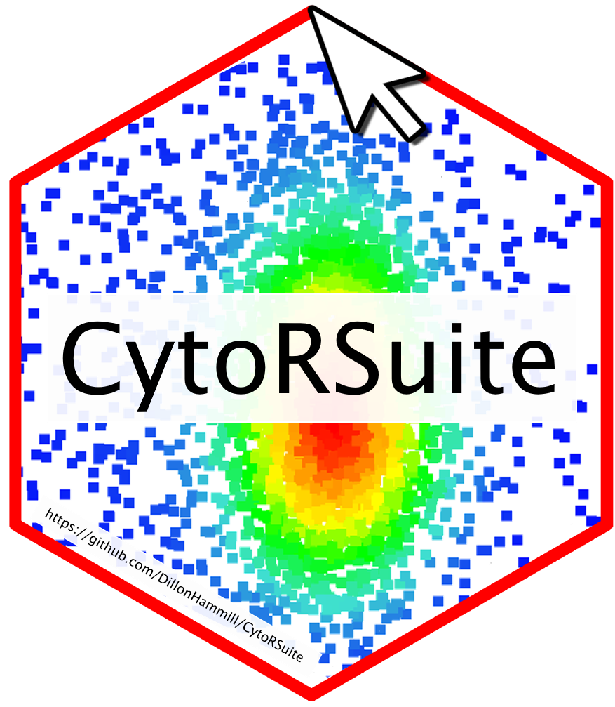

```{r, include = FALSE}
knitr::opts_chunk$set(
  collapse = TRUE,
  comment = "#>"
)
```

# 

# 1. Introduction
***

**CytoExploreR** contains a variety of tools to assist in the compensation of fluorescent spillover for flow cytometry datasets. The main compensation functions are outlined below:

- user-driven automated compensation using `cyto_spillover_compute`.
- interactively edit spillover matrices in realtime using `cyto_spillover_edit`.
- visualise compensated and uncompensated data using `cyto_plot_compensation` to identify compensation issues.

# 2. Demonstration
***

## 2.1 Prepare Compensation Controls

To demonstrate appropriate usage of these compensation tools, users will need to download the set of compensation controls shipped with **CytoExploreRData**. If you have not already done so, you can easily download these FCS files as outlined below:

```{r, eval = FALSE}
library(CytoExploreRData)
library(CytoExploreR)

# Compensation dataset
Compensation

# Save Compensation dataset to FCS files
cyto_save(Compensation, "Compensation-Samples")
```

Now that we have the FCS files saved locally, let's load in the compensation controls and setup a new gatingTemplate using `cyto_setup`.

```{r, eval = FALSE}
# Compensation GatingSet
gs <- cyto_setup("Compensation-Samples",
                 gatingTemplate = "Compensation-gatingTemplate.csv")
```

It is recommended that the compensation controls be appropriately transformed before proceeding. Let's transform all the fluorescent channels using `cyto_transform`. Remember, `cyto_transform` will automatically apply the logicle transform to all fluorescent channels by default.

```{r, eval = FALSE}
# Apply logicle transformations
gs <- cyto_transform(gs)
```

## 2.2 Gate Compensation Controls

To acheive the most accurate spillover values it is recommended that the compensation controls be gated to at least remove doublets and debris. Let's gate down to single cells using `cyto_gate_draw`. It is recommended to back-gate using a live/dead control to eliminate as many dead cells as possible.

```{r, eval = FALSE}
cyto_gate_draw(gs,
               parent = "root",
               alias = "Cells",
               channels = c("FSC-A", "SSC-A"))
```

```{r, eval = FALSE}
cyto_gate_draw(gs,
               parent = "Cells",
               alias = "Single Cells",
               channels = c("FSC-A", "SSC-A"))
```

## 2.3 Automated Computation of Spillover Matrix


