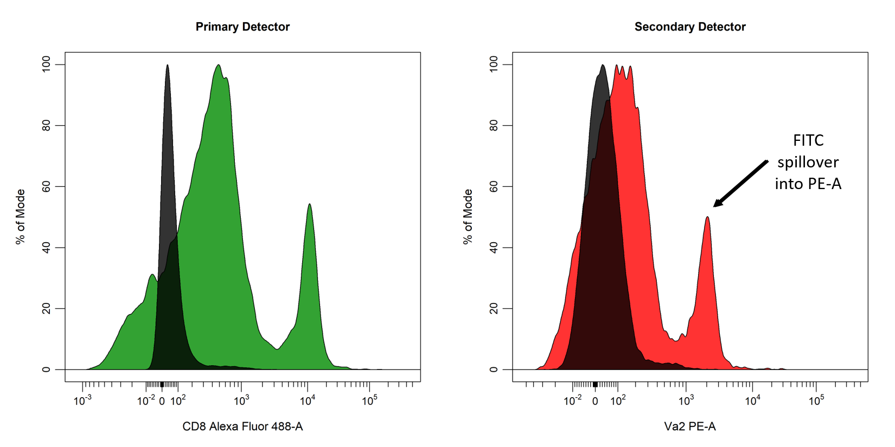

```{r, include = FALSE}
knitr::opts_chunk$set(
  collapse = TRUE,
  comment = "#>"
)
```

# Introduction

<div style="line-height: 1.8em;"> In conventional flow cytometry, cells are labelled with fluorophore-conjugated antibodies and interrogated with a series of lasers which emit light of specific wavelengths. Thes fluorophores are excited by these lasers to emit photons of multiple energies and wavelengths, which are sorted by a series of optical filters to direct photons of the same wavelength to a specific detector. As a result, photons emitted from the excited fluorophores will be mostly collected by a single detctor (primary detector) but will also be collected by other detectors (secondary detectors). For example, photons emitted by a sample stained with only a FITC-conjugated antibody (FITC single colour control) will mostly be collected by the Alexa Fluor 488 primary detector, but there will also be collection by the PE secondary detector. When we compare the signal of our FITC single colour control relative to our unstained control (black) in these channels, it becomes clear that a proportion of the FITC signal is being collected by the PE detector. Clearly, this fluorescent spillover is not desirable, if we stained cells with both FITC and PE-conjugated antibodies it would be difficult to determine which events were truely labelled with our PE-conjugated antibodies. </div>

<br>

```{r echo = FALSE, fig.align="center", out.width = '100%'}

```

<br>

<div style="line-height: 1.8em;"> Fortunately, it is relatively simple to compensate for fluorescent spillover into secondary detectors post data acquisition, using an unstained autofluorescence control and separate controls each labelled with a single fluorophore (single colour controls). Each single colour control is used to determine the proportion of the signal in the primary detector that is being collected by secondary detectors. This percentage spillover into secondary detectors is used to reduce the signal in the secondary detectors to ensure that each fluorophore is only detected by its primary detector. This can be a cumbersome process when performed manually, as this process must be repeated for each fluorophore and every detector. The end result of compensation is that any signal in PE detector is reduced such that the FITC signal is restricted to the Alexa Fluor 488 detector as shown below: </div>

<br>

```{r echo = FALSE, fig.align="center", out.width = '100%'}
knitr::include_graphics('Compensation/Compensation-Intro-2.png')
```

<br>

<div style="line-height: 1.8em;"> In this vignette, we will explore the collection of compensation tools in **CytoExploreR** and demonstrate their appropriate use to accurately compensate for fluorescent spillover. The following functions will be explored in detail in this vignette:
- `cyto_spillover_compute` to automatically compute spillover matrices using the method outlined by Bagwell & Adams 1993.
- `cyto_spillover_edit` to interactively edit spillover matrices in realtime to manually fine tune spillover values.
- `cyto_plot_compensation` to visualise compensated and uncompensated data in all fluorescent channels to identify any compensation issues. </div>

<br>

# Demonstration

## Prepare Compensation Controls

To demonstrate appropriate usage of these compensation tools, users will need to download the set of compensation controls shipped with **CytoExploreRData**. If you have not already done so, you can easily download these FCS files as outlined below:

```{r, eval = FALSE}
library(CytoExploreRData)
library(CytoExploreR)

# Compensation dataset
Compensation

# Save Compensation dataset to FCS files
cyto_save(Compensation, "Compensation-Samples")
```

Now that we have the FCS files saved locally, let's load in the compensation controls and setup a new gatingTemplate using `cyto_setup`.

```{r, eval = FALSE}
# Compensation GatingSet
gs <- cyto_setup("Compensation-Samples",
                 gatingTemplate = "Compensation-gatingTemplate.csv")
```

It is recommended that the compensation controls be appropriately transformed before proceeding. Let's transform all the fluorescent channels using `cyto_transform`.

```{r, eval = FALSE}
# Apply logicle transformations
gs <- cyto_transform(gs,
                     type = "logicle")
```

To acheive the most accurate spillover values it is recommended that the compensation controls be gated to at least remove doublets and debris. Let's gate down to single cells using `cyto_gate_draw`. It is recommended to back-gate using a live/dead control to eliminate as many dead cells as possible.

```{r, eval = FALSE}
cyto_gate_draw(gs,
               parent = "root",
               alias = "Cells",
               channels = c("FSC-A", "SSC-A"))
```

```{r echo = FALSE, fig.align="center", out.width = '75%'}
knitr::include_graphics('Compensation/Compensation-Gating-1.png')
```

```{r, eval = FALSE}
cyto_gate_draw(gs,
               parent = "Cells",
               alias = "Single Cells",
               channels = c("FSC-A", "SSC-A"))
```

```{r echo = FALSE, fig.align="center", out.width = '75%'}
knitr::include_graphics('Compensation/Compensation-Gating-2.png')
```

## Automated Computation of Spillover Matrix

Now that our compensation controls have been transformed and pre-gated, we can move on to automatically computing the spillover matrix using `cyto_spillover_compute`. This function will guide the user through the following steps:

- selection of a fluorescent channel for each compensation control.
- gating of the positive (and negative) signal for each compensation control
- spillover matrix computed and returned

```{r, eval = FALSE}
spill <- cyto_spillover_compute(gs,
                                parent = "Single Cells",
                                spillover = "Spillover-Matrix.csv")
```

## Manual Editing of Spillover Matrix

```{r, eval = FALSE}
spill <- cyto_spillover_edit(gs,
                             parent = "Single Cells",
                             spillover = "Spillover-Matrix.csv",
                             channel_match = "Compensation-Channels.csv")
```

## Visualise Compensation

```{r, eval = FALSE}
cyto_plot_compensation(gs,
                       parent = "Single Cells",
                       spillover = "Spillover-Matrix.csv",
                       compensate = TRUE)
```

## Apply Compensation to Samples

```{r, eval = FALSE}
gs <- cyto_compensate(gs,
                      spillover = "Spillover-Matrix.csv")
```

