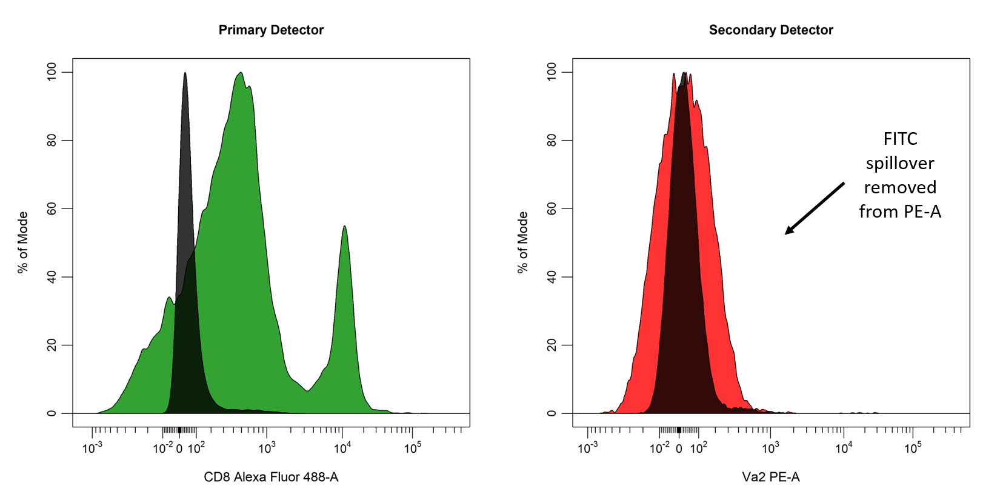
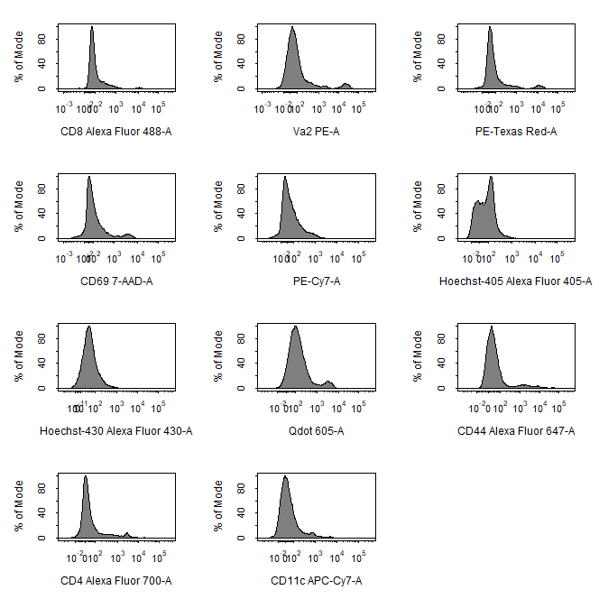
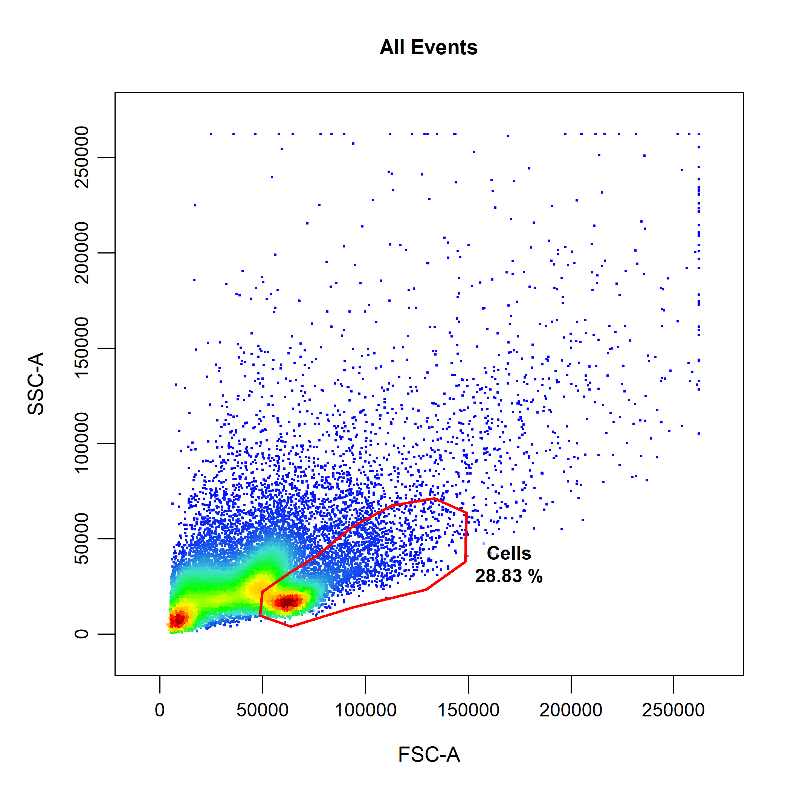
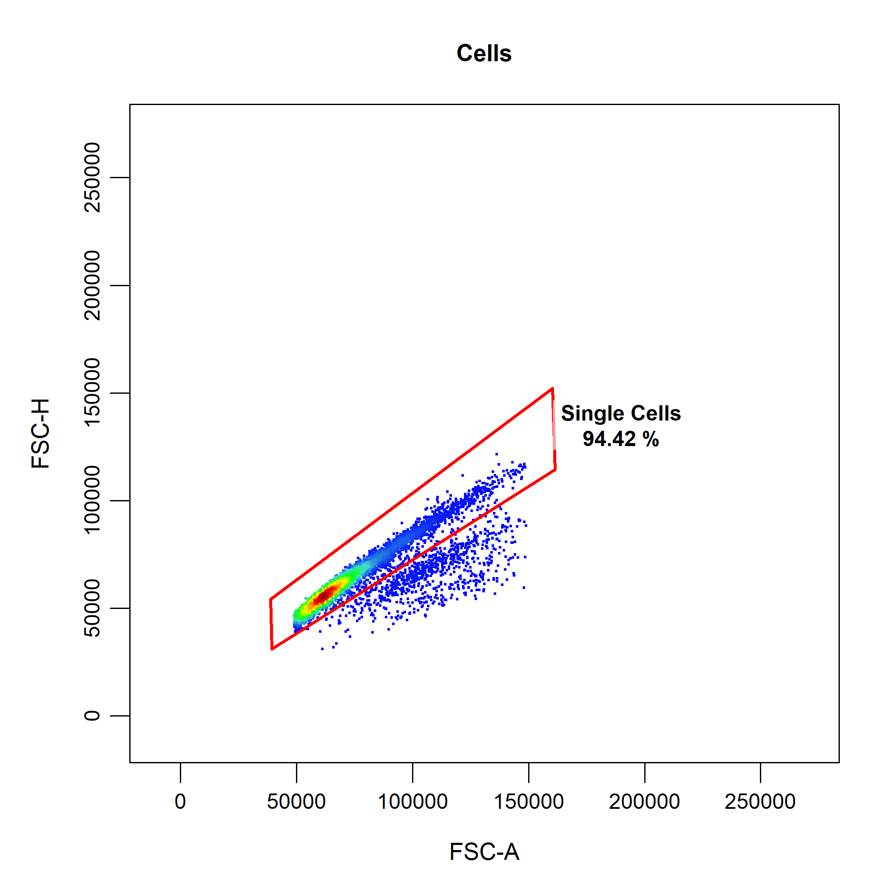
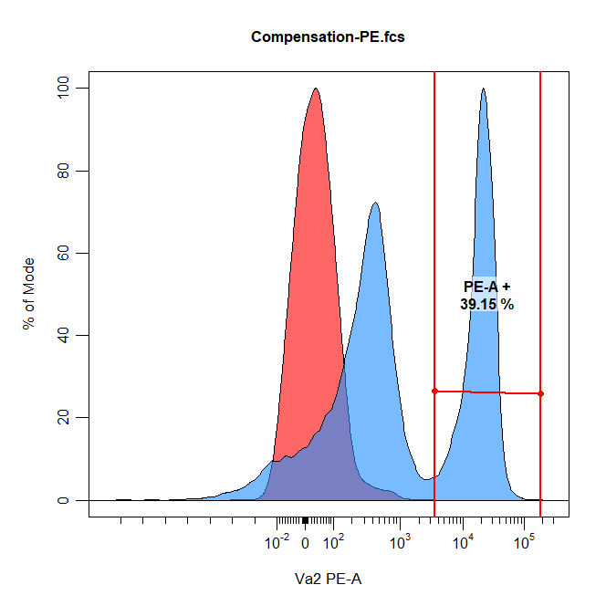
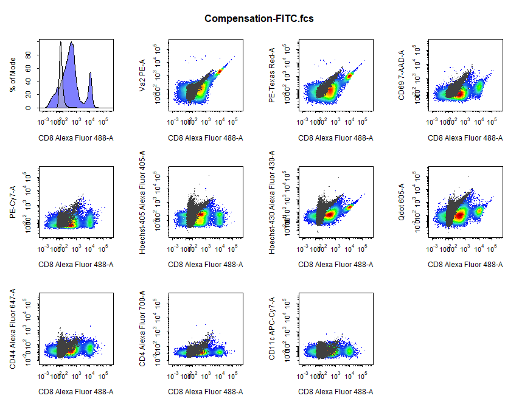
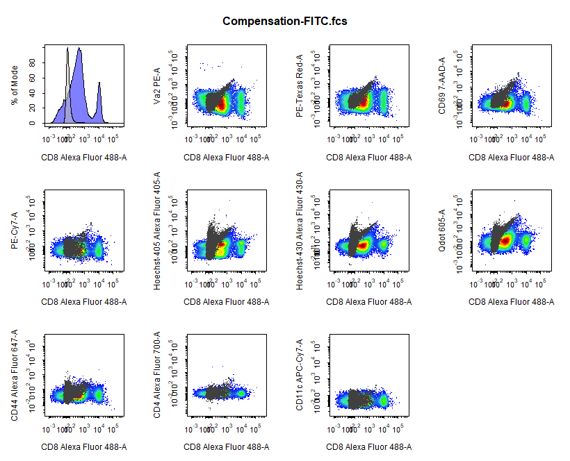

```{r, include = FALSE}
knitr::opts_chunk$set(
  collapse = TRUE,
  comment = "#>"
)
```

# Introduction

<div style="line-height: 1.8em;"> In conventional flow cytometry, cells are labelled with fluorophore-conjugated antibodies and interrogated with a series of lasers which emit light of specific wavelengths. Thes fluorophores are excited by these lasers to emit photons of multiple energies and wavelengths, which are sorted by a series of optical filters to direct photons of the same wavelength to a specific detector. As a result, photons emitted from the excited fluorophores will be mostly collected by a single detctor (primary detector) but will also be collected by other detectors (secondary detectors). For example, photons emitted by a sample stained with only a FITC-conjugated antibody (FITC single colour control) will mostly be collected by the Alexa Fluor 488 primary detector, but there will also be collection by the PE secondary detector. When we compare the signal of our FITC single colour control relative to our unstained control (black) in these channels, it becomes clear that a proportion of the FITC signal is being collected by the PE detector. Clearly, this fluorescent spillover is not desirable, if we stained cells with both FITC and PE-conjugated antibodies it would be difficult to determine which events were truely labelled with our PE-conjugated antibodies. </div>

<br>

```{r echo = FALSE, fig.align="center", out.width = '100%'}
knitr::include_graphics('Compensation/Compensation-Intro-1.png')
```

<br>

<div style="line-height: 1.8em;"> Fortunately, it is relatively simple to compensate for fluorescent spillover into secondary detectors post data acquisition, using an unstained autofluorescence control and separate controls each labelled with a single fluorophore (single colour controls). Each single colour control is used to determine the proportion of the signal in the primary detector that is being collected by secondary detectors. This percentage spillover into secondary detectors is used to reduce the signal in the secondary detectors to ensure that each fluorophore is only detected by its primary detector. This can be a cumbersome process when performed manually, as this process must be repeated for each fluorophore and every detector. The end result of compensation is that any signal in PE detector is reduced such that the FITC signal is restricted to the Alexa Fluor 488 detector as shown below: </div>

<br>

```{r echo = FALSE, fig.align="center", out.width = '100%'}

```

<br>

<div style="line-height: 1.8em;"> In this vignette, we will explore the collection of compensation tools in **CytoExploreR** and demonstrate their appropriate use to accurately compensate for fluorescent spillover. The following functions will be explored in detail in this vignette:

- `cyto_spillover_compute` to automatically compute spillover matrices using the method outlined by [Bagwell & Adams 1993](https://nyaspubs.onlinelibrary.wiley.com/doi/abs/10.1111/j.1749-6632.1993.tb38775.x?sid=nlm%3Apubmed).
- `cyto_spillover_edit` to interactively edit spillover matrices in realtime to manually fine tune spillover values.
- `cyto_plot_compensation` to visualise compensated and uncompensated data in all fluorescent channels to identify any compensation issues. </div>

<br>

# Demonstration

## Prepare Compensation Controls

<div style="line-height: 1.8em;"> To demonstrate appropriate usage of these compensation tools, users will need to download the set of compensation controls shipped with **CytoExploreRData**. If you have not already done so, you can easily download these FCS files to a folder in your current working directory as outlined below: </div>

```{r, eval = FALSE}
# Load required packages
library(CytoExploreRData)
library(CytoExploreR)

# Compensation dataset
Compensation

# Save Compensation dataset FCS files to Compensation-Samples folder
cyto_save(Compensation, save_as = "Compensation-Samples")
```

<div style="line-height: 1.8em;"> Now that we have the FCS files saved locally, let's load in the compensation controls and setup a new gatingTemplate using `cyto_setup`. Users should enter in the marker assignments in the table editor, this ensures that the antibody panel used for the experiment is saved to a csv file for future reference. This Experiment-Markers.csv file will be automatically applied when loading in the fully stained samples. Later on in this vignette, **CytoExploreR** will ask us to assign a fluorescent channel to each single colour control to determine the degree of spillover into secondary detectors. Users may wish to enter these channels manually in the experiment details table editor by adding a "channel" column and typing in a channel name for each compensation control (entries for unstained controls should be left empty). Typing out names of fluorescent channels manually can lead to typing errors, so for the purpose of this vignette I will show you how you can select these channels from a drop down menu instead. </div>

```{r, eval = FALSE}
# Compensation GatingSet
gs <- cyto_setup("Compensation-Samples",
                 gatingTemplate = "Compensation-gatingTemplate.csv")
```

```{r echo = FALSE, fig.align="center", out.width = '40%'}
knitr::include_graphics('Compensation/Compensation-Markers.png')
```

<div style="line-height: 1.8em;"> It is recommended that the compensation controls be appropriately transformed before proceeding. **CytoExploreR** will detect if the data has not been transformed and automatically apply the biexponential transformation to each of the fluorescent channels. The default parameters for these transformations may not be perfect for all channels, so it recommended that these transformations be optimised manually by the user. For more information on data transformation types and implementation, refer to the Transformations vignette where this is explained in detail. For now, let's use the more robust logicle transformation and apply it to all the fluorescent channels using `cyto_transform`. All fluorescent channels be transformed by default unless specific channels or markers are passed through the channels argument. </div>

```{r, eval = FALSE}
# Apply logicle transformation to fluorescent channels
gs <- cyto_transform(gs,
                     type = "logicle")
```

```{r echo = FALSE, fig.align="center", out.width = '75%'}

```

<div style="line-height: 1.8em;"> Next, we should gate the compensation controls to remove debris and doublets to yield the most accurate spillover values. Let's manually gate down to single cells using `cyto_gate_draw`. Back gating can prove extrmemely useful in cleaning up the data. For example, we could gate the dead cells using our Hoechst control and overly this population on our initial FSC/SSC gate to adjust the gate to avoid dead cells. For brevity this approach will not be demonstrated here, but I will document this process in an issue for those who are interested. </div>

```{r, eval = FALSE}
cyto_gate_draw(gs,
               parent = "root",
               alias = "Cells",
               channels = c("FSC-A", "SSC-A"))
```

```{r echo = FALSE, fig.align="center", out.width = '60%'}

```

```{r, eval = FALSE}
cyto_gate_draw(gs,
               parent = "Cells",
               alias = "Single Cells",
               channels = c("FSC-A", "SSC-A"))
```

```{r echo = FALSE, fig.align="center", out.width = '60%'}

```

## Automated Computation of Spillover Matrix

<div style="line-height: 1.8em;"> Now that our compensation controls have been transformed and pre-gated, we can move on to automatically computing the spillover matrix using `cyto_spillover_compute`. All we need to do is supply the prepared compensation controls, indicate which population we want to use for the calculation and supply a name of csv file to which the computed matrix will be saved. The computed spillover matrix will also be returned as an R object, so let's assign this to `spill` so that we can use it later on. </div>

```{r, eval = FALSE}
# Automated compensation
spill <- cyto_spillover_compute(gs,
                                parent = "Single Cells",
                                spillover = "Spillover-Matrix.csv")
```

<div style="line-height: 1.8em;"> `cyto_spillover_compute` will guide the user through the following steps to automatically compute the spillover matrix:

- **Selection of a fluorescent channel for each compensation control from a drop menu.** Channel selection can also be bypassed by manually adding a "channel" column using `cyto_details_edit` as outlined above, or by supplying a `channel_match` csv file containing a "name" and "channel" column. Channel match files can be manually created using `cyto_channel_match` if desired.

```{r echo = FALSE, fig.align="center", out.width = '75%'}
knitr::include_graphics('Compensation/Compensation-Auto-1.png')
```

- **Gating of the positive (and negative) signal for each compensation control in the assigned channel.** In order to properly compute the spillover values, **CytoExploreR** requires an appropriate unstained reference population. This reference population can take the form of a universal unstained control (as demonstrated below) or unstained events within each compensation control. When using a universal unstained control, the unstained control will be overlaid onto the plot and users be asked to gate the positive signal for each of the compensation controls. Otherwise, users will be asked to gate the negative and then the positive signal for each compensation control. The accuracy of the spillover calculation is heavily dependant on where these gates are positioned, with practice it will become clear that it is best to retain the final peak and tail in the positive gates.

```{r echo = FALSE, fig.align="center", out.width = '60%'}

```

- **Computation and saving of the computed spillover matrix.** It is that simple! `cyto_spillover_compute` will take of the computations internally, return the computed spillover matrix and save the matrix to a named csv file for downstream use. </div>

```{r, eval = FALSE}
# Computed spillover matrix
spill
```

```{r echo = FALSE, fig.align="center", out.width = '100%'}
knitr::include_graphics('Compensation/Compensation-Auto-3.png')
```

<div style="line-height: 1.8em;"> To aid in the calculation of accurate spillover values, `cyto_spillover_compute` also supports the use of different populations for each compensation control to ensure proper autofluorescence correction. For example, we compensating for a marker such as CD11b it would be desirable to isolate just the myeloid cells and use this population for the spillover computation. This can be important, as myeloid cells may have a distinct autofluorescence profile compared to other cell types in the sample, which will influence the computed spillover value. For this reason, try to make sure that the composition of the populations in negative and positive populations are the same. To use a different parent population for each compensation control, users can manually supply a vector of population names to the `parent` argument, or manually enter this information into a `parent` column of `cyto_details` using `cyto_details_edit`. </div>

## Interactively Edit Spillover Matrices

<div style="line-height: 1.8em;"> As described above, automatically computing the spillover matrix is heavily dependant on how the populations are gated prior to computing the spillover matrix. As a result, `cyto_spillover_compute` may not always get the degree of compensation exactly correct and manual adjustment will be required. Luckily, **CytoExploreR** has a fantastic interactive spillover matrix editor that allows editing of spillover values in realtime. To start up the spillover matrix editor we can simply change `compute` from the `cyto_spillover_compute` call to `edit`. </div>

```{r, eval = FALSE}
# Open CytoExploreR spillover matrix editor
spill <- cyto_spillover_edit(gs,
                             parent = "Single Cells",
                             spillover = "Spillover-Matrix.csv")
```

<div style="line-height: 1.8em;"> In the **Editor** tab, users will encounter series of dropdown menus to select controls and channels, an interactive spillover matrix and some plots to track changes to the data in realtime as the spillover values are edited. In this case, we want to edit the computed spillover matrix saved to "Spillover-Matrix.csv" but it is also possible to edit the spillover matrix attached to each control by removing the `spillover` argument. In the 2D scatter plot, we can see a horizontal red line through the median of the unstained control as well as a purple line which tracks the median through the stained control. By definition, the correct spillover value is reached once these two lines cross in the positive population and the medFI of stained population matches that of the unstained population in secondary detectors. As you can see below it looks like we need to remove some more of the FITC signal from the PE detector. </div>

```{r echo = FALSE, fig.align="center", out.width = '100%'}
knitr::include_graphics('Compensation/Compensation-Edit-1.png')
```

<div style="line-height: 1.8em;"> Changing the spillover values is as easy as selecting and replacing the value that you would like to edit. The plots below the matrix will automatically update whenever changes are made to the matrix. The spillover values can then be fine tuned such that the medFI of the stained and unstained populations are the same. Compare the figure below to previous one to see how changing the spillover value of Alexa Fluor 488 into PE to 18.16 alters the plots and medFIs. Changing spillover values manually will affect other secondary detectors, so this must be repeated for all secondary detectors by changing the selected channel in the y axis dropdown menu. Remember, `cyto_spillover_edit` accepts all `cyto_plot` arguments so it is possible to make the points bigger or add contour lines to aid in setting accurate spillover values.  </div>

```{r echo = FALSE, fig.align="center", out.width = '100%'}
knitr::include_graphics('Compensation/Compensation-Edit-2.png')
```

<div style="line-height: 1.8em;"> Identifying compensation issues in large dataset can be an extremely tedious process, this where the the **Plots** tab can help. If you switch over to the plots tab, users can select a compensation control and display the signal in the primary detector against all secondary detectors. To highlight any compensation issues, the compensated and unstained data are overlaid onto the uncompensated data. Very quickly we can identify any lingering issues and return to the editor tab to make appropriate adjustments. Finally, the changes made to the spillover matrix can be saved by selecting the `save` button on the `editor` tab. The updated spillover matrix will be returned as an R object and updated in the csv file. </div>

```{r echo = FALSE, fig.align="center", out.width = '100%'}
knitr::include_graphics('Compensation/Compensation-Edit-3.png')
```

## Visualise Compensation

<div style="line-height: 1.8em;"> It is also possible to generate the plots in the plots tab externally of the spillover matrix editor using `cyto_plot_compensation`. This is a special plotting function that can perform inline compensation, so that you don't have to worry about inversing transformations, applyig the compensation and re-transforming the data to check whether the compensation is correct. Simply set `compensate` to TRUE and `cyto_plot_compensation` will plot the compensated data for each compensation control in all fluorescent channels. As before, if no spillover matrix is supplied to the `spillover` argument, the matrix attached to each of the compensation controls will be applied. Of course this function inherits from `cyto_plot_theme` and accepts all `cyto_plot` arguments so that you can customise it to your heart's content. </div>

```{r, eval = FALSE}
cyto_plot_compensation(gs,
                       parent = "Single Cells")
```

```{r echo = FALSE, fig.align="center", out.width = '100%'}

```

```{r, eval = FALSE}
cyto_plot_compensation(gs,
                       parent = "Single Cells",
                       spillover = "Spillover-Matrix.csv",
                       compensate = TRUE)
```

```{r echo = FALSE, fig.align="center", out.width = '100%'}

```

<div style="line-height: 1.8em;"> As you can see from the above plots, **CytoExploreR** does a pretty great job at appropriately compensating the data. Now that we have our fine tuned spillover matrix, we are done with our compensation controls and all we need to do is apply the saved spillover matrix to our samples. </div>

## Apply Compensation to Samples

<div style="line-height: 1.8em;"> For completeness, I will demonstrate how we can apply the saved spillover matrix to our gated and transformed compensation controls. It is important to remember that compenstion of fluorescent spillover must occur prior to data transformations. Since our compensation controls have been transformed, we will need to load in the samples again, compensate the samples with the saved spillover matrix, re-apply the data transformations and finally re-apply any gates. These are the same steps that will be used to load, compensate, transform and gate our samples during downstream analyses. </div>

```{r, eval = FALSE}
# Compensation GatingSet
gs <- cyto_setup("Compensation-Samples",
                 gatingTemplate = "Compensation-gatingTemplate.csv")

# Apply compensation
gs <- cyto_compensate(gs,
                      spillover = "Spillover-Matrix.csv")

# Data transformations
gs <- cyto_transform(gs,
                     type = "logicle")

# Apply gates
cyto_gatingTemplate_apply(gs,
                          gatingTemplate = "Compensation-gatingTemplate.csv")
```

## Summary

<div style="line-height: 1.8em;"> **CytoExploreR** has a powerful suite of compensation tools to ensure that your flow cytometry data is appropriately compensated prior to analysis. Here are the key points that were outlined in this vignette:

- Compensation of fluorescent spillover must be applied to samples prior to data transformations. If your data looks strange or unchanged after applying compensation it is likely that you are trying to compensate transformed data. 

- Automated compensation will always perform well if your compensation controls are appropriately gated. It is also important to try and ensure that the composition (cell types) of your negative and positive populations are the same to minimise autofluorescence issues. 

- The best way to use the spillover matrix editor is to first look at the plots tab to identify issues and then switch over to the editor tab to address these issues. It is not recommended that spillover matrices be edited from scratch as changes can have unexpected consequences. The spillover matrix editor is designed to be a tool to fine tune the spillover values automatically computed by `cyto_spillover_compute`. This approach will save you a lot of time!

</div>