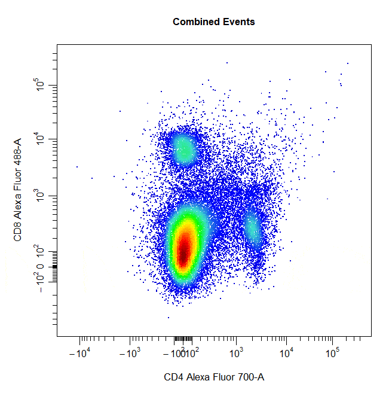
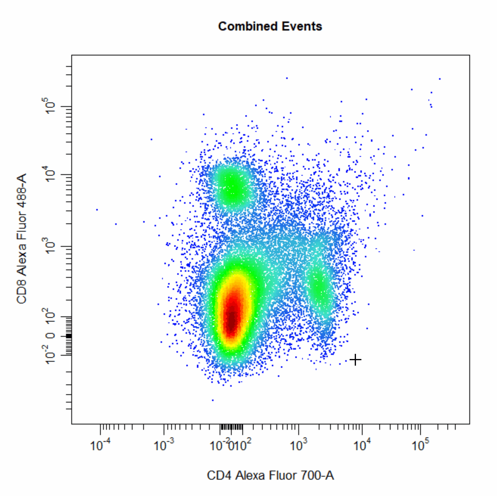
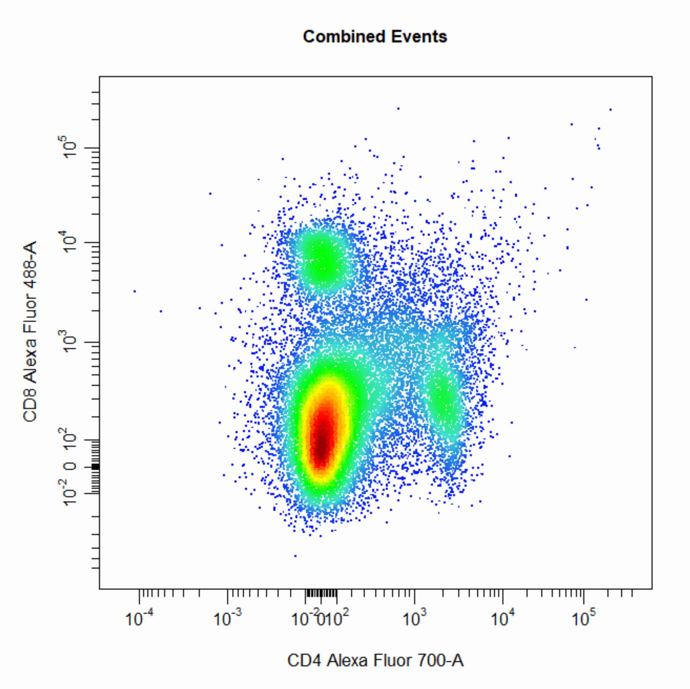
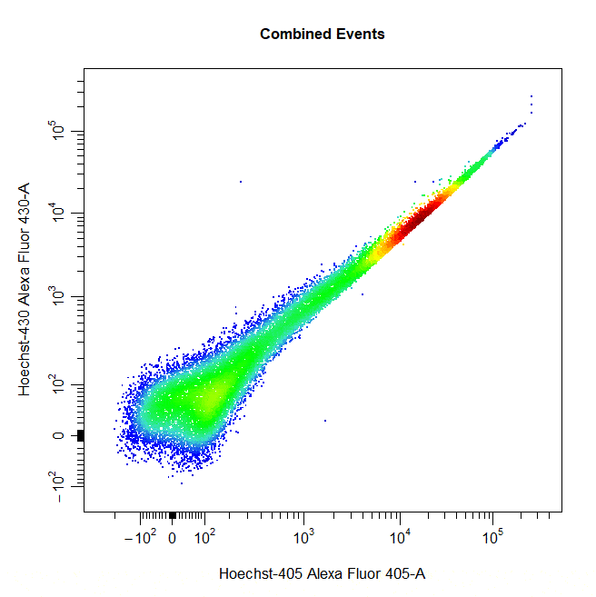

```{r, include = FALSE}
knitr::opts_chunk$set(
  collapse = TRUE,
  comment = "#>"
)
```

# Overview

<div style="line-height: 1.8em;"> Cytometry data analysis typically involves a process of manual gating to separate cells into discrete populations based on shared marker expression. To date, manual gating has largely been restricted to commercially available software due to its requirement for a graphical user interface (GUI). **CytoExploreR** makes manual gating freely accessible to users by bringing support for manual gating to R. The purpose of this vignette is purely to demostrate how to draw different types of gates around populations using `cyto_gate_draw`. </div> 

# Demonstration

<div style="line-height: 1.8em;"> To demonsrate the each of these `cyto_gate_draw` gate types, users will need to download and setup the `Activation` dataset shipped with **CytoExploreRData**. This vignette is for demonstration purposes only, we will not be gating the GatingSet directly as we will be gating random populations. </div>

```{r, eval = FALSE}
# Load required packages
library(CytoExploreR)

# Setup Activation samples
gs <- cyto_setup("Activation-Samples",
                 gatingTemplate = "Manual-Gating.csv")

# Apply compensation
gs <- cyto_compensate(gs)

# Transform fluorescent channels
trans <- cyto_transformer_logicle(gs)
gs <- cyto_transform(gs,
                     trans = trans)

# Extract root cytoset
cs <- cyto_extract(gs, "root")
```

## Boundary Gates

<div style="line-height: 1.8em;"> Boundary gates are used to exclude events above a certain threshold in 1D or 2D plots. To draw a boundary gate, simply select the uppermost limit of the gate and all events below the selected boundary will be included in a rectangle gate. </div>

```{r, eval = FALSE}
cyto_gate_draw(cs,
               alias = "Cells",
               channels = c("FSC-A","SSC-A"),
               type = "boundary")
```

```{r, echo=FALSE, fig.align="center", out.width = '60%'}
knitr::include_graphics('Gating/Manual-Gating-1.gif')
```

```{r, eval = FALSE}
cyto_gate_draw(cs,
               alias = "Cells",
               channels = "FSC-A",
               type = "boundary")
```

```{r, echo=FALSE, fig.align="center", out.width = '60%'}
knitr::include_graphics('Gating/Manual-Gating-2.gif')
```

## Rectangle Gates

<div style="line-height: 1.8em;"> Rectangle gates can be drawn around populations in 2D scatter plots. To draw a rectangle gate, simply select two diagonal points that define the limits of the population and a rectangle will constructed around the population. </div>

```{r, eval = FALSE}
# Rectangle gate
cyto_gate_draw(cs,
               alias = "CD4 T Cells",
               channels = c("CD4", "CD8"),
               type = "rectangle",
               axes_trans = trans)
```

```{r, echo=FALSE, fig.align="center", out.width = '60%'}
knitr::include_graphics('Gating/Manual-Gating-3.gif')
```

## Polygon Gates

<div style="line-height: 1.8em;"> Polygon gates are the default gate type for 2D plots. To draw a polygon gate around a population, simply select the points that define the boundary of the population and right click to close the gate. Windows users will need to select "stop" from the dropdown menu. </div>

```{r, eval = FALSE}
# Polygon gate
cyto_gate_draw(cs,
               alias = "Cells",
               channels = c("FSC-A", "SSC-A"),
               type = "polygon")
```

```{r, echo=FALSE, fig.align="center", out.width = '60%'}
knitr::include_graphics('Gating/Manual-Gating-4.gif')
```

## Ellipsoid Gates

<div style="line-height: 1.8em;"> Ellipsoid gates are supported for populations visible in 2D plots. To draw an ellipsoid gate around the population, simply select four points that encompass the population and an ellipse will be constructed around the population. Currently, ellipsoid gates are only supported for channels on the scale (i.e. both channels must be either linear or transformed). </div>

```{r, eval = FALSE}
# Ellipse gate
cyto_gate_draw(cs,
               alias = "CD8 T Cells",
               channels = c("CD4", "CD8"),
               type = "ellipse",
               axes_trans = trans)
```

```{r, echo=FALSE, fig.align="center", out.width = '60%'}
knitr::include_graphics('Gating/Manual-Gating-5.gif')
```

## Interval Gates

<div style="line-height: 1.8em;"> Interval gates can be used to gate a population in 1D or 2D plots which lies between an upper and lower limit. To draw an interval gate around a population, simply select the lower and upper boundary of the population and a rectangle gate will be constructed around the population. </div>

```{r, eval = FALSE}
# Interval gate
cyto_gate_draw(cs,
               alias = "T Cells",
               channels = c("CD44", "Va2"),
               type = "interval",
               axes_trans = trans)
```

```{r, echo=FALSE, fig.align="center", out.width = '60%'}
knitr::include_graphics('Gating/Manual-Gating-6.gif')
```

```{r, eval = FALSE}
# Interval gate
cyto_gate_draw(cs,
               alias = "T Cells",
               channels = "Va2",
               type = "interval",
               axes_trans = trans)
```

```{r, echo=FALSE, fig.align="center", out.width = '60%'}
knitr::include_graphics('Gating/Manual-Gating-7.gif')
```

## Threshold Gates

<div style="line-height: 1.8em;"> Threshold gates can be used to gate a population in 1D or 2D plots that lies above a certain threshold. To draw a threshold gate around a population, simply select the lowermost limit of the population to construct a rectangle gate around the events above this threshold. </div>

```{r, eval = FALSE}
# Threshold gate
cyto_gate_draw(cs,
               alias = "Dead Cells",
               channels = c("Hoechst-405", "Hoechst-430"),
               type = "threshold",
               axes_trans = trans)
```

```{r, echo=FALSE, fig.align="center", out.width = '60%'}
knitr::include_graphics('Gating/Manual-Gating-8.gif')
```

```{r, eval = FALSE}
# Threshold gate
cyto_gate_draw(cs,
               alias = "T Cells",
               channels = "Va2",
               type = "threshold",
               axes_trans = trans)
```

```{r, echo=FALSE, fig.align="center", out.width = '60%'}
knitr::include_graphics('Gating/Manual-Gating-9.gif')
```

## Quadrant Gates

<div style="line-height: 1.8em;"> Quadrant gates can be used to gate four distinct populations in 2D plots. To draw a quadrant gate around these populations, simply select the centermost point between these populations to position the quadrant gate crosshair. Population names should be passed to the alias argument in top left, top right, bottom right and bottom left order (clockwise). </div>

```{r, eval = FALSE}
# Quadrant gate
cyto_gate_draw(cs,
               alias = c("A","B","C","D"),
               channels = c("CD4","CD8"),
               type = "quadrant",
               axes_trans = trans)
```

```{r, echo=FALSE, fig.align="center", out.width = '60%'}

```

## Web Gates (Experimental)

<div style="line-height: 1.8em;"> Web gates are an experimetal version of quadrant gates that allow gating of multiple populations located around a central point. To contruct a web gate around populations, simply select the centermost point and surrounding points to draw a polygon gate around each poulation. The current implementation of web gates does not account for events shared between gates and for this reason has been flagged as an experimental feature until this issue has been addressed. </div>

```{r, eval = FALSE}
# Web gate
cyto_gate_draw(cs,
               alias = c("A","B","C","D"),
               channels = c("CD4","CD8"),
               type = "web",
               axes_trans = trans)
```

```{r, echo=FALSE, fig.align="center", out.width = '60%'}

```

## Multiple Gates

<div style="line-height: 1.8em;"> Multiple gates can be easily constructed by supplying multiple population names to the alias argument. </div>

```{r, eval = FALSE}
# Multiple gates
cyto_gate_draw(cs,
               alias = c("CD4","CD8"),
               channels = c("CD4","CD8"),
               type = "rectangle",
               axes_trans = trans)
```

```{r, echo=FALSE, fig.align="center", out.width = '60%'}

```

## Mixed Gates

<div style="line-height: 1.8em;"> Multiple populations can also be gated using different gate types by supplying a vector of gate types to the type argument. </div>

```{r, eval = FALSE}
# Multiple gates
cyto_gate_draw(cs,
               alias = c("CD4","CD8"),
               channels = c("CD4","CD8"),
               type = c("rectangle", "ellipse"),
               axes_trans = trans)
```

```{r, echo=FALSE, fig.align="center", out.width = '60%'}

```

## Negated Gates

<div style="line-height: 1.8em;"> Negated gates can be used to gate populations outside of the constructed gate by setting the negate argument to TRUE. The name of the negated population must always be supplied last to the alias argument. </div>

```{r, eval = FALSE}
# Multiple gates
cyto_gate_draw(cs,
               alias = c("Dead Cells","Live Cells"),
               channels = c("Hoechst-405","Hoechst-430"),
               type = "rectangle",
               negate = TRUE,
               axes_trans = trans)
```

```{r, echo=FALSE, fig.align="center", out.width = '60%'}

```
