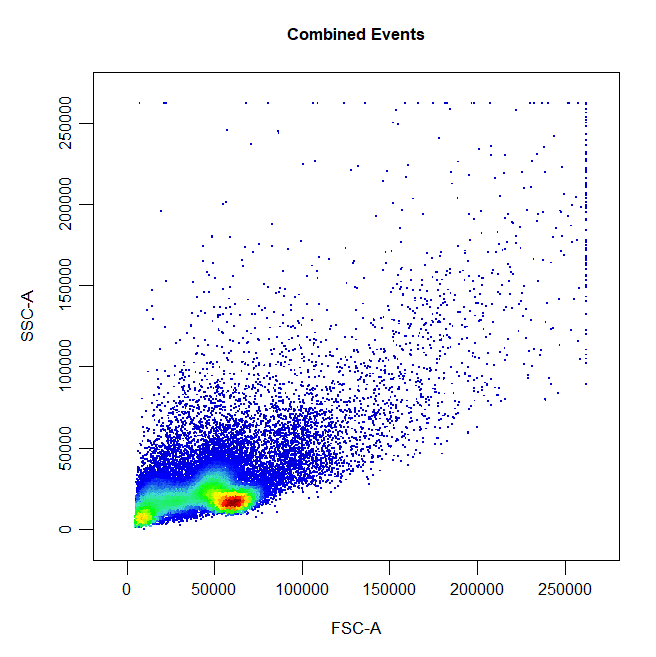
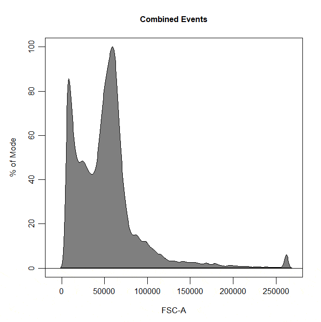
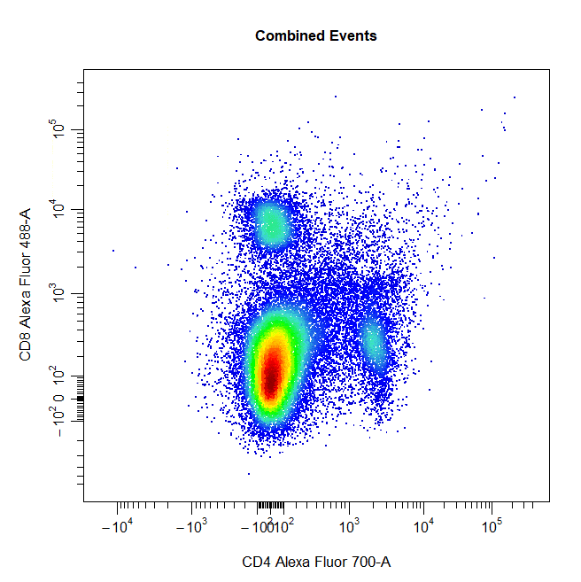
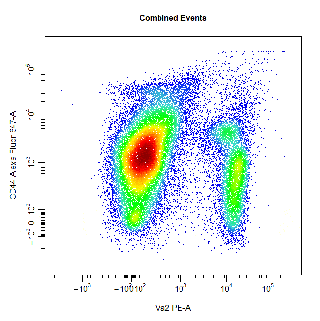
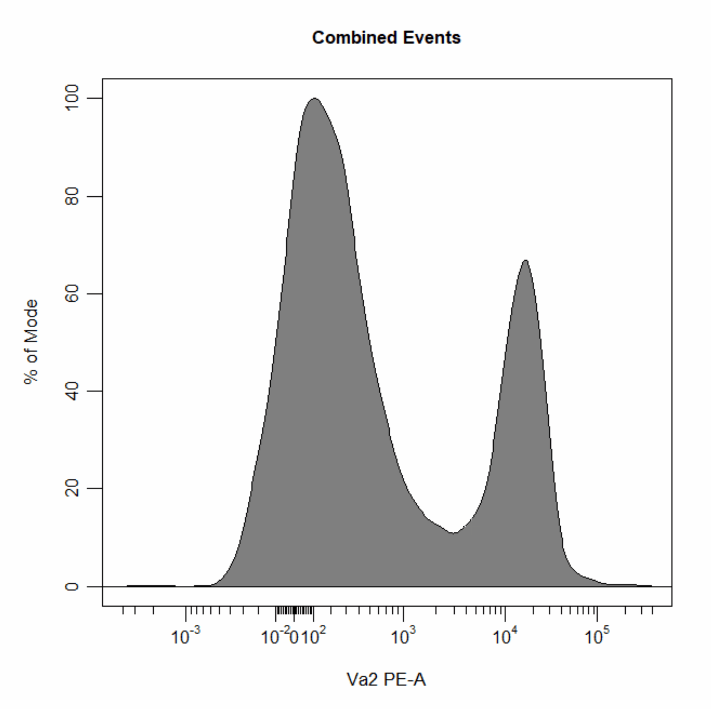
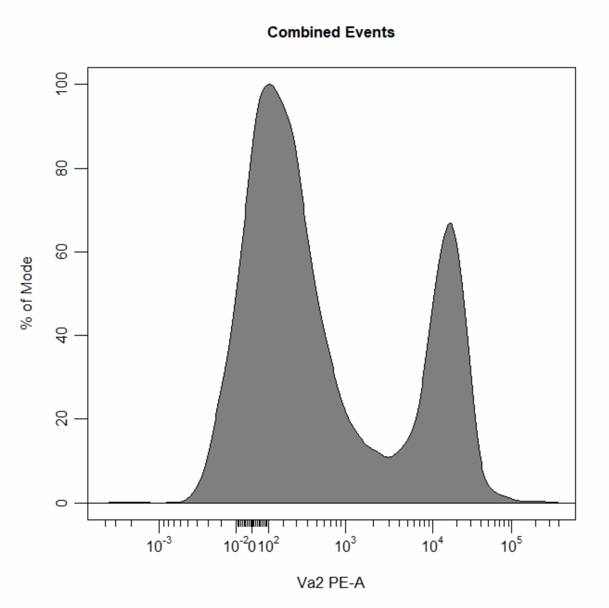

```{r, include = FALSE}
knitr::opts_chunk$set(
  collapse = TRUE,
  comment = "#>"
)
```

# Overview

<div style="line-height: 1.8em;"> Cytometry data analysis typically involves a process of manual gating to separate cells into discrete populations based on shared marker expression. To date, manual gating has largely been restricted to commercially available software due to its requirement for a graphical user interface (GUI). **CytoExploreR** makes manual gating freely accessible to users by bringing support for manual gating to R. The purpose of this vignette is purely to demostrate how to draw different types of gates around populations using `cyto_gate_draw`. </div> 

# Demonstration

<div style="line-height: 1.8em;"> To demonsrate the each of these `cyto_gate_draw` gate types, users will need to download and setup the `Activation` dataset shipped with **CytoExploreRData**. </div>

```{r, eval = FALSE}
# Load required packages
library(CytoExploreR)

# Setup Activation samples
gs <- cyto_setup("Activation-Samples",
                 gatingTemplate = "Manual-Gating.csv")

# Apply compensation
gs <- cyto_compensate(gs)

# Transform fluorescent channels
trans <- cyto_transformer_logicle(gs)
gs <- cyto_transform(gs,
                     trans = trans)

# Extract root cytoset
cs <- cyto_extract(gs, "root")
```

## Boundary Gates

Boundary gates are used to exclude events above a certain threshold. Boundary gates are supported for both 2D scatter plots and 1D density distributions. 2D boundary gates can be drawn by selecting the uppermost limit of the gate.

```{r, eval = FALSE}
cyto_gate_draw(cs,
               alias = "Cells",
               channels = c("FSC-A","SSC-A"),
               type = "boundary")
```

```{r, echo=FALSE, fig.align="center", out.width = '60%'}

```

```{r, eval = FALSE}
cyto_gate_draw(cs,
               alias = "Cells",
               channels = "FSC-A",
               type = "boundary")
```

```{r, echo=FALSE, fig.align="center", out.width = '60%'}

```

## Rectangle Gates

```{r, eval = FALSE}
# Rectangle gate
cyto_gate_draw(cs,
               alias = "CD4 T Cells",
               channels = c("CD4", "CD8"),
               type = "rectangle",
               axes_trans = trans)
```

```{r, echo=FALSE, fig.align="center", out.width = '60%'}

```

## Polygon Gates

```{r, eval = FALSE}
# Polygon gate
cyto_gate_draw(cs,
               alias = "Cells",
               channels = c("FSC-A", "SSC-A"),
               type = "polygon")
```

```{r, echo=FALSE, fig.align="center", out.width = '60%'}

```

## Ellipsoid Gates

```{r, eval = FALSE}
# Ellipse gate
cyto_gate_draw(cs,
               alias = "CD8 T Cells",
               channels = c("CD4", "CD8"),
               type = "ellipse",
               axes_trans = trans)
```

```{r, echo=FALSE, fig.align="center", out.width = '60%'}

```

## Interval Gates

```{r, eval = FALSE}
# Interval gate
cyto_gate_draw(cs,
               alias = "T Cells",
               channels = c("CD44", "Va2"),
               type = "interval",
               axes_trans = trans)
```

```{r, echo=FALSE, fig.align="center", out.width = '60%'}

```

```{r, eval = FALSE}
# Interval gate
cyto_gate_draw(cs,
               alias = "T Cells",
               channels = "Va2",
               type = "interval",
               axes_trans = trans)
```

```{r, echo=FALSE, fig.align="center", out.width = '60%'}

```

## Threshold Gates

```{r, eval = FALSE}
# Threshold gate
cyto_gate_draw(cs,
               alias = "Dead Cells",
               channels = c("Hoechst-405", "Hoechst-430"),
               type = "threshold",
               axes_trans = trans)
```

```{r, echo=FALSE, fig.align="center", out.width = '60%'}

```

```{r, eval = FALSE}
# Threshold gate
cyto_gate_draw(cs,
               alias = "T Cells",
               channels = "Va2",
               type = "threshold",
               axes_trans = trans)
```

```{r, echo=FALSE, fig.align="center", out.width = '60%'}

```

## Quadrant Gates


## Web Gates (Experimental)

## Multiple Gates

## Mixed Gates
