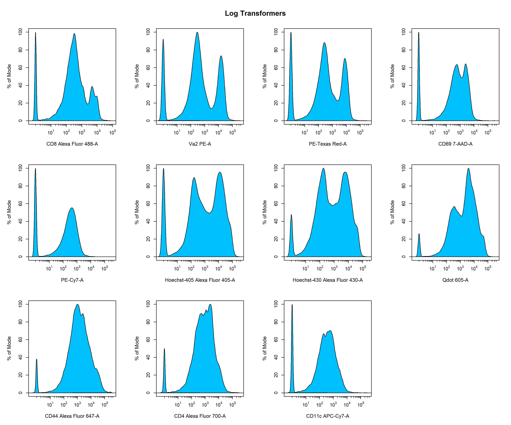
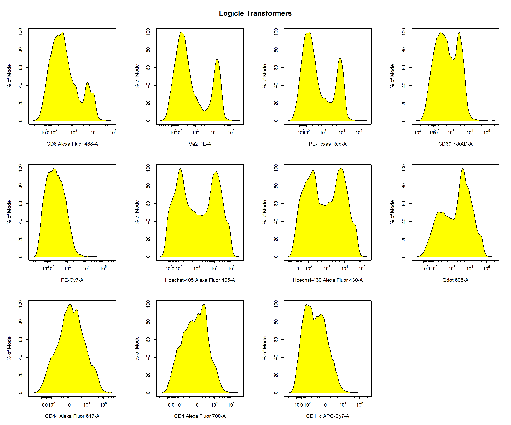

```{r, include = FALSE}
knitr::opts_chunk$set(
  collapse = TRUE,
  comment = "#>"
)
```

# Introduction

<div style="line-height: 1.8em;"> Data transformations are essential for appropriately visualising cytometry data. This requirement for data transformations is due to the large dynamic range of cytometry data makes it difficult visualise both positive and negative events on a linear scale. As you can see below, the values for flow cytometry extend from 0 to 262144 which is an enormous range for fluorescent intensity values. Clearly, visualising the data on this scale is not going to allow us to identify discrete negative and positive populations.

<br>

```{r echo = FALSE, fig.align="center", out.width = '60%'}
knitr::include_graphics('Transformations/Transformations-1.png')
```

<br>

To overcome this visulisation problem, traditionally cytometry data has been transformed using log transformations to improve visualisation and separation of negative and positive events into discrete populations. As you can see below, log transformations handle high fluorescent intensity values quite well, but struggle with values approaching zero. This results in these lower values being dumped on the lower end of the scale, which makes it appear as though the data contains three distinct populations based on fluorescent intensity. This problem is further highlighted when applying compensation to the data as it introduces more values that approach zero and below.

<br>

```{r echo = FALSE, fig.align="center", out.width = '60%'}
knitr::include_graphics('Transformations/Transformations-2.png')
```

<br>

Recently, more sophisticated transformations such as the hyperbolic arcsine, biexponential and logicle transformations have been used to overcome the limitations of the log transformation. The result of applying these transformations using the default parameters to the Alexa Fluor 488 channel is shown below for easy comparison. As you can see, all the transformations seem to handle the higher fluorescent intensity values in a similar manner, but differ in their approach to dealing with values nearing zero. For flow cytometry data, the biexponential and logicle transformations seem to provide the best visualisation of the data as discrete negative and positive populations are clearly visible. It is important to note that the optimal transformation for each parameter is data-dependant and users should explore the different transformation types to obtain the best visualisation of the data. This process will be documented later in this vignette.  

<br>

```{r echo = FALSE, fig.align="center", out.width = '100%'}
knitr::include_graphics('Transformations/Transformations-3.png')
```

<br>

**CytoExploreR** has full support for log, arcsinh, biexponential and logicle transformations implemented in the flowWorkspace package. In this vignette we will demonstrate how **CytoExploreR** facilitates fine tuning of transformation parameters and how these optimised transformations can be applied cytometry data. For consistency with the RGLab suite of cytometry data analysis packages, **CytoExploreR** uses a series of wrapper functions to add support for these transformations and adds new features to improve customisation and user friendliness. Below is a list of the key functions that you will encounter in this vignette: 

- `cyto_transformer_log` implements the `flowjo_log_trans` version of the log transformation used in the flowWorkspace package. 
- `cyto_transformer_arcsinh` implements the `asing_Gml2` version of the arcsinh transformation used in the flowWorkspace package.
- `cyto_transformer_biex` implements the `flowjo_biexp` version of the biexponential transformation used in the flowWorkspace package.
- `cyto_transformer_logicle` implements the `estimateLogicle` version of the logicle transformation used in the flowWorkspace package.
- `cyto_transformer_combine` combines individual transformations into a single list of transformers that can be applied to the data using `cyto_transform`.
- `cyto_transform` automatically computes transformers and applies a list of transformers to the data. </div>

# Demonstration

<div style="line-height: 1.8em;"> To demonstrate the use of the transformation functions, we will need to download the Activation FCS files shipped with **CytoExploreRData**. If you have not already done so, these FCS files can be easily downloaded to a folder in your current working directory as outlined below: </div>

```{r, eval = FALSE}
# Load required packages
library(CytoExploreR)
library(CytoExploreRData)

# Activation dataset 
Activation

# Save Activation dataset FCS files to Activation-Samples folder
cyto_save(Activation, save_as = "Activation-Samples")
```

<div style="line-height: 1.8em;"> Now hat we have the FCS files stored locally, let's setup up the Activation GatingSet using `cyto_setup`. It is recommended that experiment details be filled in at this point as this information can be used to easily select samples to use when customising transformations. If your computer struggles with applying the transformations, it is recommended that you set the **restrict** argument to TRUE in `cyto_setup` to restrict the data to only the parameters for which markers have been assigned. Although not required for this vignette, it is always a good idea to ensure that the data has been compensated prior to data transformations. The spillover matrices attached to each of the files can be applied using `cyto_compensate`. </div>

```{r, eval = FALSE}
# Activation GatingSet
gs <- cyto_setup("Activation-Samples")

# Apply compensation
gs <- cyto_compensate(gs)
```

<div style="line-height: 1.8em;"> Next we will demonstrate the use of the different `cyto_transformer` functions to obtain optimised transformation definitions for each of the fluorescent channels. These transformer functions will automatically pool the supplied data, apply the transformation using the specified parameters to the specified channels and plot the resultant transformed data using `cyto_plot`. The definition of the transformation can be altered by changing the arguments of the underlying flowWorkspace transformer function. It is important to note that these `cyto_transformer` functions do not apply these transformers to the data, they are purely used to optimise the transformers prior to applying the combined transformers to the data using `cyto_transform`. </div>

<br>

## Batch Transform Fluorescent Channels

<div style="line-height: 1.8em;"> To make things a little easier, all these `cyto_transformer` functions will automatically generate transformers for all fluorescent channels. To obtain transformers for a specific set of parameters. simply supply the names of these channels/markers to the **channels** argument. To use a specific subset of the data to visualise and customise the transformations, users can supply specific slection criteria to the **select** argument. Next we will explore each of these `cyto_transformer` functions to obtain transformation definitions for all the fluorescent channels. </div> 

## Log Transformation


```{r, eval = FALSE}
# Default log transformer
trans_log <- cyto_transformer_log(gs)
```

```{r echo = FALSE, fig.align="center", out.width = '75%'}

```

## Arcsinh Transformation

```{r, eval = FALSE}
# Default arcsinh transformer
trans_arcsinh <- cyto_transformer_arcsinh(gs)
```

```{r echo = FALSE, fig.align="center", out.width = '75%'}
knitr::include_graphics('Transformations/Transformations-5.png')
```

## Biexponential Transformation

```{r, eval = FALSE}
# Default biexponentail transformer
trans_biex <- cyto_transformer_biex(gs)
```

```{r echo = FALSE, fig.align="center", out.width = '75%'}
knitr::include_graphics('Transformations/Transformations-6.png')
```

## Logicle Transformation

```{r, eval = FALSE}
# Default biexponentail transformer
trans_logicle <- cyto_transformer_logicle(gs)
```

```{r echo = FALSE, fig.align="center", out.width = '75%'}

```

## Optimisation of Transformation Parameters

<div style="line-height: 1.8em;"> In the examples above, we showed how we can quickly apply different types of transformations to all the fluorescent channels to identify which transformation type to use for each fluorescent channel. Based on these plots, it seems as though the logicle transformation provides the best overall result when using the default settings. In my experience, I find the logicle transformation to perform consistently the best for flow cytometry data, and it often does not even require optimisation. </div>

<br>

<div style="line-height: 1.8em;"> For the purpose of demonstration, I will therefore switch over to the biexponential transformations to show you how we can optimise these transformation parameters to better visualise the data. Based on the plots above (green) it seems as if we can improve the transformer definitions for the PE-A and 7-AAD-A parameters. Firstly, let's remove the unwanted transformer definitions from `trans_biex` which contains our transformation definitions. </div>

```{r, eval = FALSE}
# Remove PE-A & 7-AAD-A transformers 
trans_biex <- trans_biex[-match(c("PE-A", "7-AAD-A"), names(trans_biex))]

# Check transformers have been removed
trans_biex
```

<div style="line-height: 1.8em;">  </div>

```{r, eval = FALSE}
# default PE transformer
PE_biex <- cyto_transformer_biex(gs,
                                 channels = "PE-A")
```

```{r, eval = FALSE}
# PE transformer
PE_biex <- cyto_transformer_biex(gs,
                                 channels = "PE-A",.
                                 widthBasis = -100)
```

```{r, eval = FALSE}
# PE transformer
PE_biex <- cyto_transformer_biex(gs,
                                 channels = "PE-A",.
                                 widthBasis = -1000)
```

```{r, eval = FALSE}
# Combine transformer definitions
trans <- cyto_transformer_combine(trans_biex, 
                                  PE_biex, 
                                  trans_logicle["7-AAD-A"])

# All transformer definitions
trans
```

## Apply Manually-Optimised Transformers to Data

```{r, eval = FALSE}
# Apply transformers to data
gs <- cyto_transform(gs,
                     trans = trans)

```

## Apply Default Transformers to Data

```{r, eval= FALSE}
# Activation GatingSet
gs <- cyto_setup("Activation-Samples")

# Apply compensation
gs <- cyto_compensate(gs)

# Apply transformers
gs <- cyto_transform(gs)
```

# Summary

