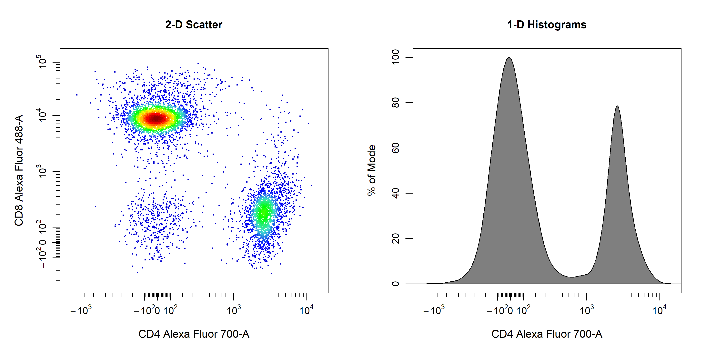
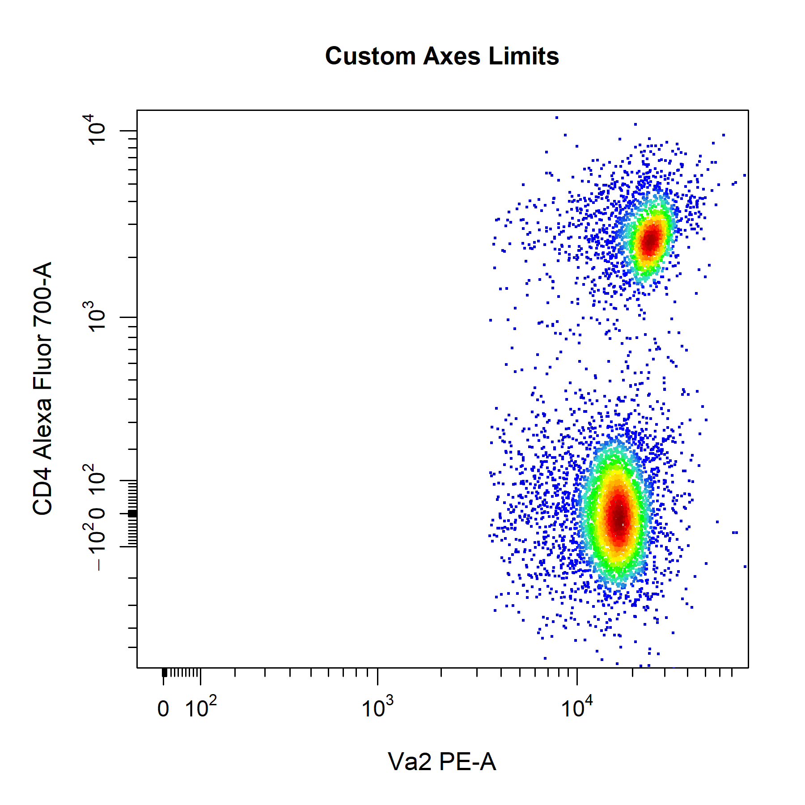
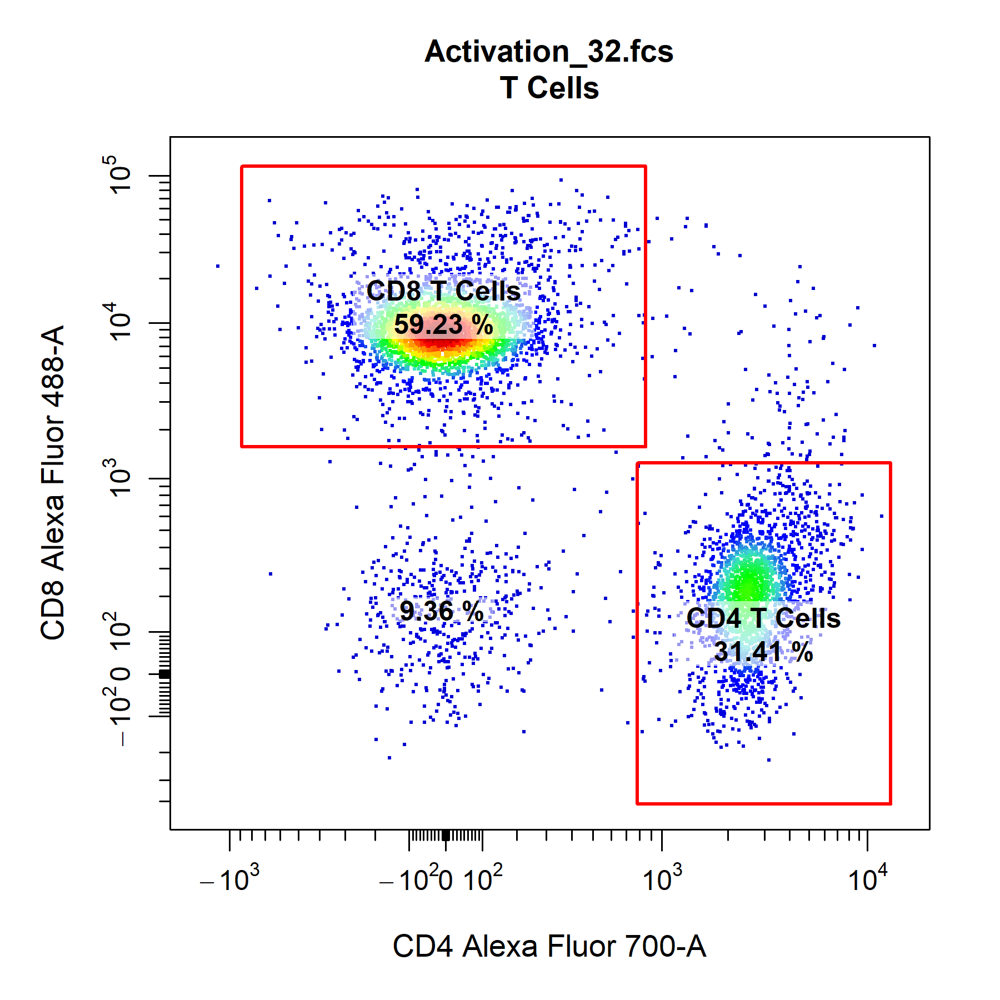
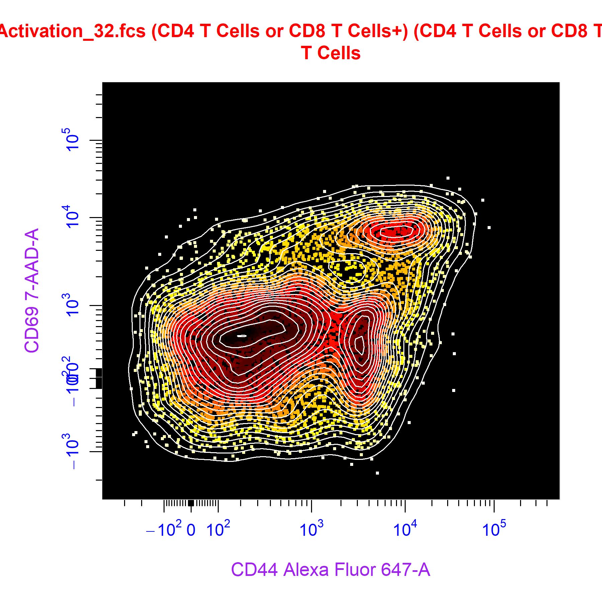

```{r, include = FALSE}
knitr::opts_chunk$set(
  collapse = TRUE,
  comment = "#>"
)
```

# Overview

<div style="line-height: 1.8em;"> Visualisation of high dimensional cytometry data requires powerful and robust tools to explore the data. To address this need, **CytoExploreR** comes with its own custom base plotting function called `cyto_plot`. `cyto_plot` is an essential component of this package and is deployed whenever data visualisations are required. This means that any function in **CytoExploreR** which generates a plot accepts all of the `cyto_plot` arguments as well. Learning the inner workings of `cyto_plot` is therefore essential to users getting the most out of **CytoExploreR** and their cytometry data.

<br>

To demonstrate some the key features of `cyto_plot` we will use the `Activation` dataset shipped with **CytoExploreRData**. To prepare this dataset users will need to download the FCS files, load in the files, apply compensation, transform the fluorescent channels and apply the gatingTemplate. </div>

```{r, eval = FALSE}
# Load required packages
library(CytoExploreR)
library(CytoExploreRData)

# Load Activation GatingSet
gs <- cyto_setup("Activation-Samples")

# Apply compensation
gs <- cyto_compensate(gs)

# Apply transformations
gs <- cyto_transform(gs)

# Apply gates
cyto_gatingTemplate_apply(gs, Activation_gatingTemplate)
```

<br>

# Key Principles

<div style="line-height: 1.8em;"> At its most basic level, `cyto_plot` takes on cytometry data and plots the data in the specified channels or markers. The type of plot generated by `cyto_plot` is determined by the number of channels or markers supplied to the `channels` argument. A single channel will result in the construction of a 1D density histogram, whilst input of two channels will construct a 2D scatter plot. `cyto_plot` is particularly useful for plotting multiple samples, as these samples are automatically arranged in an appropriately sized grid. </div>    

```{r, eval = FALSE, echo = FALSE}
cyto_plot_save("Visualisations-11.png",
               height = 6,
               width = 12)
cyto_plot_custom(1,2)
```

```{r, eval = FALSE}
# 2D scatter plot
cyto_plot(gs[[32]],
          parent = "T Cells",
          channels = c("CD4","CD8"))

# 1D density distribution
cyto_plot(gs[[32]],
          parent = "T Cells",
          channels = "CD4")
```

```{r, eval = FALSE, echo = FALSE}
cyto_plot_complete()
```

```{r echo = FALSE, fig.align="center", out.width = '98%',}

```

<br>

# Key Features

<div style="line-height: 1.8em;"> It is extrememly difficult to comprehensively describe `cyto_plot` in a single vignette. Nevertheless, here we will explore some of the key features that will be useful for routine analyses. We will start with features that are common to all plot types (e.g. titles, labels, axes and legends) and then move on to features that are for specific plot types (e.g. points, contour lines, densities and gates). </div>

<br>

## Titles

<div style="line-height: 1.8em;"> `cyto_plot` will automatically label plots with the sample name and name of the parent population which has been plotted. Titles can be removed by setting the `title` argument to NA. </div>

```{e, eval = FALSE, echo = FALSE}
cyto_plot_save("Visualisations-16.png", 
               height = 6,
               width = 6)
```

```{r, eval = FALSE}
# Custom title
cyto_plot(gs[[32]],
          parent = "T Cells",
          channels = c("CD44","CD69"),
          title = "Custom Title",
          title_text_font = 2,
          title_text_size = 2,
          title_text_col = "blue")
```

```{r echo = FALSE, fig.align="center", out.width = '60%',}
knitr::include_graphics('Visualisations/Visualisations-16.png')
```

<br>

## Axes Labels

<div style="line-height: 1.8em;"> `cyto_plot` will automatically label axes with the marker and channel names. Axes labels can be manually supplied through the `xlab` and `ylab` arguments. Axes text can be customised but the same customisation is applied to both the x and y axes. </div>

```{r, eval = FALSE, echo = FALSE}
cyto_plot_save("Visualisations-6.png",
               height = 6,
               width = 6)
```

```{r, eval = FALSE}
# Customise axes labels
cyto_plot(gs[[32]],
          parent = "T Cells",
          channels = c("CD4", "CD8"),
          xlab = "CD4",
          ylab = "CD8",
          axes_label_text_font = 2,
          axes_label_text_size = 2,
          axes_label_text_col = "red",
          title = "Custom Axes Labels")
```

```{r echo = FALSE, fig.align="center", out.width = '60%',}
knitr::include_graphics('Visualisations/Visualisations-6.png')
```

<br>

## Axes Transformations

<div style="line-height: 1.8em;"> `cyto_plot` does not perform in-line transformations, this means that the data must be appropriately transformed prior to plotting. The list of applied transformers will be extracted directly from the GatingSet or GatingHierarchy to ensure that the axes are appropriately displayed. Since flowFrame and flowSet objects do not retain these transformation definitions, users will need to manually supply the list of transformers to the `axes_trans` argument when plotting these objects. </div>

```{r, eval = FALSE, echo = FALSE}
cyto_plot_save("Visualisations-5.png",
               height = 6,
               width = 12)
```

```{r, eval = FALSE}
# Pull transformers from GatingSet
trans <- cyto_transformer_extract(gs)

# Pull out T Cells flowSet
T_Cells <- cyto_extract(gs, "T Cells")

# Axes on current scale
cyto_plot(T_Cells[[32]],
          channels = c("CD4","CD8"),
          title = "Transformers Missing")

# Axes appropriately transformed
cyto_plot(T_Cells[[32]],
          channels = c("CD4","CD8"),
          axes_trans = trans,
          title = "Transformers Supplied")
```

```{r, eval = FALSE, echo = FALSE}
cyto_plot_complete(1,1)
```

```{r echo = FALSE, fig.align="center", out.width = '98%',}

```

<br>

## Axes Text

<div style="line-height: 1.8em;"> The `axes_text` arguments controls whether to include axes text for the x or y axes on the plot. The default is set to c(TRUE, TRUE) to display axes text on the x and y axes respectively. Setting either of these values to FALSE will remove the axes text from the respective axis. </div> 

```{r, eval = FALSE, echo = FALSE}
cyto_plot_save("Visualisations-14.png",
               height = 6,
               width = 6)
```

```{r, eval = FALSE}
# Customise axes_text
cyto_plot(gs[[32]],
          parent = "T Cells",
          channels = c("CD4","CD8"),
          axes_text = c(TRUE, FALSE), # remove y axis text
          axes_text_font = 1,
          axes_text_size = 1.4,
          axes_text_col = "purple",
          title = "Custom Axes Text")
```

```{r echo = FALSE, fig.align="center", out.width = '60%',}
knitr::include_graphics('Visualisations/Visualisations-14.png')
```

<br>

## Axes Limits

<div style="line-height: 1.8em;"> In **CytoExploreR** you never have to worry about data being cut off in plots, as `cyto_plot` will automatically calculate axes limits that encompass all the plotted and gated data. `cyto_plot` comes with three preset `axes_limits` options which provide a quick way to optimise the axes limits of plots without manual adjustment. </div>

<br>

<div style="line-height: 1.8em;"> The **"machine"** option displays the entire axes range (i.e. complete range of values detectable by the cytometer). This setting is used throughout **CytoExploreR** to display complete axes ranges when visualising expression profiles, transformations or gating populations. </div>

```{r, eval = FALSE, echo = FALSE}
cyto_plot_save("Visualisations-1.png",
               height = 6,
               width = 6)
```

```{r, eval = FALSE}
# Machine axes limits
cyto_plot(gs[[32]],
          parent = "T Cells",
          channels = c("Va2", "CD4"),
          axes_limits = "machine",
          title = "Machine Limits")
```

```{r echo = FALSE, fig.align="center", out.width = '60%',}
knitr::include_graphics('Visualisations/Visualisations-1.png')
```

<br>

<div style="line-height: 1.8em;"> The **"data"** option restricts the axes to the range of values which are in the data. This means that if the data lacks negative events the axes limits will be set to remove this space on the plot. This setting is therefore best for minimising whitespace and zooming into populations when gating. </div>

```{r, eval = FALSE, echo = FALSE}
cyto_plot_save("Visualisations-2.png",
               height = 6,
               width = 6)
```

```{r, eval = FALSE}
# Data axes limits
cyto_plot(gs[[32]],
          parent = "T Cells",
          channels = c("Va2", "CD4"),
          axes_limits = "data",
          title = "Data Limits")
```

```{r echo = FALSE, fig.align="center", out.width = '60%',}
knitr::include_graphics('Visualisations/Visualisations-2.png')
```

<br>

<div style="line-height: 1.8em;"> The **"auto"** option is a combination of the machine and data settings which sets the upper axes limit to that of the data and anchors the lower axes limit to zero. This setting provides the best overall visualisation of the data and has therefore been set as the default `axes_limits` setting in `cyto_plot`. </div>

```{r, eval = FALSE, echo = FALSE}
cyto_plot_save("Visualisations-3.png",
               height = 6,
               width = 6)
```

```{r, eval = FALSE}
# Auto axes limits
cyto_plot(gs[[32]],
          parent = "T Cells",
          channels = c("Va2", "CD4"),
          axes_limits = "auto",
          title = "Auto Limits")
```

```{r echo = FALSE, fig.align="center", out.width = '60%',}
knitr::include_graphics('Visualisations/Visualisations-3.png')
```

<br>

<div style="line-height: 1.8em;"> To ensure that all the data is clearly visible, `cyto_plot` will automatically add a 3% buffer onto either end of the axes for the above settings. The degree of buffering can be altered by supplying a decimal percentage to the `axes_limits_buffer` argument. Of course, you can also manually adjust the axes limits by supplying specific values to the `xlim` and `ylim` arguments to modify the x and y axes limits respectively. Values supplied through these arguments will always override those specified by the `axes_limits` argument. </div>

```{r, eval = FALSE, echo = FALSE}
cyto_plot_save("Visualisations-4.png",
               height = 6,
               width = 6)
```

```{r, eval = FALSE}
# Custom axes limits
cyto_plot(gs[[32]],
          parent = "T Cells",
          channels = c("Va2", "CD4"),
          xlim = c(-10, 65000),
          ylim = c(-500, 10000),
          title = "Custom Axes Limits")
```

```{r echo = FALSE, fig.align="center", out.width = '60%',}

```

<br>

## Display

<div style="line-height: 1.8em;"> To increase plotting speed and prevent overcrowding, `cyto_plot` has a `display` argument which can be used to display a proportion of the total events. To indicate the amount of events to display, users can set `display` to 1 to display all events, less than 1 to specify a percentage of events to display or a numeric greater than 1 to specify the number of events to display. To improve performance, the `display` argument is set to 25000 events by default in `cyto_plot`. `cyto_plot` will automatically adjust the level of sampling for overlays to ensure that event ratios are maintained. For example, if we have a total of 5000 T Cells of which we display 2000 events in the plot. If we overlay the CD4 T Cells (2500 total events), 1000 events (instead of the indicated 2000 events) will be displayed to maintain the original ratio to the T Cells population. The only case where the same sampling is applied to overlays is when the overlaid data comes a different sample to the base layer. For example, plotting an unactivated sample and overlaying an activated one, will result in the same sampling being applied to both layers (e.g. 2000 events). </div>

```{r, eval = FALSE, echo = FALSE}
cyto_plot_save("Visualisations-12.png",
               height = 12, 
               width = 12)
cyto_plot_custom(2,2)
```

```{r, eval = FALSE}
# Display all events
cyto_plot(gs[[32]],
          parent = "root",
          channels = c("FSC-A", "SSC-A"),
          display = 1,
          title = "All Events")

# Display 5000 events
cyto_plot(gs[[32]],
          parent = "root",
          channels = c("FSC-A", "SSC-A"),
          display = 5000,
          title = "5000 Events")

# Display 20% of events
cyto_plot(gs[[32]],
          parent = "root",
          channels = c("FSC-A", "SSC-A"),
          display = 0.2,
          title = "20% of Events")

# Display default 25000 events
cyto_plot(gs[[32]],
          parent = "root",
          channels = c("FSC-A", "SSC-A"),
          title = "Default 25000 Events")
```

```{r, eval = FALSE, echo = FALSE}
cyto_plot_complete(1,1)
```

```{r echo = FALSE, fig.align="center", out.width = '98%',}
knitr::include_graphics('Visualisations/Visualisations-12.png')
```

<br>

## Legends

<div style="line-height: 1.8em;"> Legends can be added to `cyto_plot` by setting the legend argument to TRUE. `cyto_plot` will automatically populate the legend with the name of the samples or populations where appropriate. The text in the legend can be altered by supplying a vector of character strings to the `legend_text` argument in bottom-up order. </div>

```{r, eval = FALSE, echo = FALSE}
cyto_plot_save("Visualisations-15.png",
               height = 6,
               width = 8)
```

```{r, eval = FALSE}
# Custom legend
cyto_plot(gs[[32]],
          parent = "T Cells",
          channels = c("CD4", "CD8"),
          overlay = "descendants",
          legend = TRUE,
          legend_text = c("T Cells",
                          "CD8 T Cells",
                          "CD69+ CD8 T Cells", # not required 
                          "CD4 T Cells",
                          "CD69+ CD4 T Cells"),
          legend_text_font = 1,
          legend_text_size = 1,
          legend_text_col = "black",
          title = "Custom Legend")
```

```{r echo = FALSE, fig.align="center", out.width = '60%',}
knitr::include_graphics('Visualisations/Visualisations-15.png')
```

<br>

## Borders

<div style="line-height: 1.8em;"> Plot borders and backgrounds are customisable in `cyto_plot` through supplying colours to the `border_line_col` and `border_fill` arguments respectively. </div>

```{r, eval = FALSE, echo = FALSE}
cyto_plot_save("Visualisations-13.png",
               height = 6,
               width = 6)
```

```{r, eval = FALSE}
# Custom border
cyto_plot(gs[[32]],
          parent = "T Cells",
          channels = c("CD4","CD8"),
          overlay = "descendants",
          border_fill = "black",
          border_fill_alpha = 1,
          border_line_type = 1,
          border_line_col = "red",
          border_line_width = 3,
          title = "Custom Borders")
```

```{r echo = FALSE, fig.align="center", out.width = '60%',}

```

<br>

## Pop-up Windows

<div style="line-height: 1.8em;"> To construct the plot in a pop-up window simply set the `popup` argument to TRUE. The `popup` argument is set to FALSE by default to plot in the RStudio graphics device. </div>

```{r, eval = FALSE}
# Plot in popup window
cyto_plot(gs[[32]],
          parent = "T Cells",
          channels = c("CD4","CD8"),
          popup = TRUE)
```

<br>

## Layouts

<div style="line-height: 1.8em;"> `cyto_plot` will automatically arrange samples in an appropriately sized square grid when multiple samples are supplied for plotting. The number of plots to include on each page can be manually controlled through the `layout` argument, which expects a vector indicating the number of rows and columns to use. </div>

```{r, eval = FALSE, echo = FALSE}
cyto_plot_save("Visualisations-18.png",
               height = 4.5,
               width = 13.5)
```

```{r, eval = FALSE}
# Custom layout
cyto_plot(gs[30:32],
          parent = "CD4 T Cells",
          channels = c("CD44", "CD69"),
          point_size = 3,
          contour_lines = 15,
          layout = c(1,3))
```

```{r echo = FALSE, fig.align="center", out.width = '98%'}

```

<br>

## Points

<div style="line-height: 1.8em;"> `cyto_plot` allows customisation of points per data layer, the base layer will automatically use a colour gradient whilst colours for upper layers will be selected from a colour palette created from the colours supplied to `point_cols`. Point colours can also be manually supplied for each layer through the `point_col` argument. </div>

```{r, eval = FALSE, echo = FALSE}
cyto_plot_save("Visualisations-10.png",
               height = 6,
               width = 6)
```

```{r, eval = FALSE}
# Point colour palette
cyto_plot(gs[[32]],
          parent = "T Cells",
          channels = c("CD4","CD8"),
          overlay = "descendants",
          point_col = "black", # base layer - override density gradient
          point_cols = c("red",
                         "orange",
                         "yellow",
                         "green", # upper layers
                         "blue",
                         "purple"),
          title = "Point Colour Palette")
```

```{r echo = FALSE, fig.align="center", out.width = '60%',}

```

<br>

<div style="line-height: 1.8em;"> The density colour scale for the base layer can also be customised by passing a vector of colours through the `point_col_scale` argument. </div>

```{r, eval = FALSE, echo = FALSE}
cyto_plot_save("Visualisations-9.png",
               height = 6,
               width = 6)
```

```{r, eval = FALSE}
# Point colour scale
cyto_plot(gs[[32]],
          parent = "T Cells",
          channels = c("CD4","CD8"),
          point_col_scale = c("black",
                              "brown",
                              "red",
                              "orange",
                              "yellow",
                              "white"),
          title = "Point Colour Scale")
```

```{r echo = FALSE, fig.align="center", out.width = '60%',}

```

<br>

<div style="line-height: 1.8em;"> There also additional arguments to modify the shape, size and colour transparency of the points for each data layer. Introducing some transparency through the `point_col_alpha` argument is particularly useful in retaining some density features when a single colour is supplied. </div>

```{r, eval = FALSE, echo = FALSE}
cyto_plot_save("Visualisations-8.png",
               height = 6,
               width = 6)
```

```{r, eval = FALSE}
# Customise points
cyto_plot(gs[[32]], 
          parent = "T Cells",
          channels = c("CD4", "CD8"),
          point_shape = ".",
          point_size = 3,
          point_col = "red",
          point_col_alpha = 0.4)
```

```{r echo = FALSE, fig.align="center", out.width = '60%',}
knitr::include_graphics('Visualisations/Visualisations-8.png')
```

<br>

## Contour Lines

<div style="line-height: 1.8em;"> `cyto_plot` layers contour lines on top of the underlying data points such that all data is clearly visible. To add contour lines to plot, simply specify the number of contour levels to the `contour_lines` argument. Contour lines are fully cusomisable and supported for each data layer in the plot. To add contour lines to overlaid data simply a vector of levels for each layer to the `contour_lines` argument. </div>

```{r, eval = FALSE, echo = FALSE}
cyto_plot_save("Visualisations-7.png",
               height = 6,
               width = 6)
```

```{r, eval = FALSE}
# Contour lines
cyto_plot(gs[[32]],
          parent = "T Cells",
          channels = c("CD4", "CD8"),
          contour_lines = 25,
          contour_line_type = 1,
          contour_line_width = 1.2,
          contour_line_col = "black",
          contour_line_alpha = 0.8,
          title = "Contour Lines")
```

```{r echo = FALSE, fig.align="center", out.width = '60%',}
knitr::include_graphics('Visualisations/Visualisations-7.png')
```

<br>

## Density Distributions

<div style="line-height: 1.8em;"> `cyto_plot` contains a number of customisation options for 1D density distributions. Unlike 2D scatterplots, all samples are plotted onto the same plot. The degree of stacking can be controlled through `density_stack` and the number of layers to include per plot can be specified through `density_layers`. Note that each plot must contain the same number of layers (i.e. total layers must be divisible by the number of layers per plot). The density distributions are normalised to the mode by default to aid in appropriate visualisation when stacking samples. To plot the raw densities, users can set `density_modal` argument to FALSE. Both the line borders and fill colours of the density distributions are fully customisable through the set of `density_fill` and `density_line` arguments. As with 2D scatterplots, legends can be included by setting the `legend` argument to TRUE. The default legend will use the `fill` colour, but users can change this to use the `line` colours by setting the `legend` argument to `"line"`. </div>

```{r, eval = FALSE, echo = FALSE}
cyto_plot_save("Visualisations-21.png",
               height = 6,
               width = 10)
```

```{r, eval = FALSE}
# Density distributions
cyto_plot(gs[25:32],
          parent = "T Cells",
          channels = "CD8",
          density_layers = 4, # 4 samples per plot
          density_stack = 0.5, # 50% stacking
          density_modal = TRUE,
          density_fill = rep(c("red",
                           "blue",
                           "green",
                           "magenta"), 2),
          density_fill_alpha = c(rep(0, 4),
                                 0.2, 
                                 0.4,
                                 0.8,
                                 1),
          density_line_type = c(1,2,3,4,rep(1, 4)),
          density_line_width = c(rep(2, 4),
                                 rep(1, 4)),
          density_line_col = c("red",
                               "blue",
                               "green",
                               "magenta",
                               rep("black", 4)))
```

```{r echo = FALSE, fig.align="center", out.width = '98%',}
knitr::include_graphics('Visualisations/Visualisations-21.png')
```

<br>

## Gates

<div style="line-height: 1.8em;"> `cyto_plot` is capable of plotting all major flowCore gate classes including rectangleGates, polygonGates and ellipsoidGates. Gates applied to GatingSet objects can be plotted by passing the name of the gated population to the `alias` argument. Users can also set `alias` to an empty character string (i.e. "") to automatically plot any gates constructed in the specified channels. Alternatively, constructed flowCore gate objects can be passed through the `gate` argument for plotting. **CytoExploreR** now has the ability to plot statistics for negated populations (i.e. events outside gates) when the `negate` argument is set to TRUE. The default statistic for gated population is frequency, and the label is positioned in the center of the gate by default. Gate borders and fill are completely customisable through the set of `gate_line` and `gate_fill` arguments. </div>

```{r, eval = FALSE, echo = FALSE}
cyto_plot_save("Visualisations-22.png",
               height = 6,
               width = 6)
```

```{r, eval = FALSE}
# Plot gates
cyto_plot(gs[[32]],
          parent = "T Cells",
          alias = "", # same as c("CD4 T Cells", "CD8 T Cells")
          channels = c("CD4", "CD8"),
          negate = TRUE, # statistic for events outside gates
          gate_line_type = 1,
          gate_line_width = 2,
          gate_line_col = "red",
          gate_fill = "white",
          gate_fill_alpha = 0)
```

```{r echo = FALSE, fig.align="center", out.width = '60%',}

```

<br>

<div style="line-height: 1.8em;"> `cyto_plot` can also plot any 2D gate object in a 1D plot, it simply uses the minimum and maximum coordinates for the gate in the specified channel. Since statistics are computed in-line, `cyto_plot` will re-compute statistics using the newly constructed 1D gate. With **CytoExploreR** it is also possible to gate stacked density distributions and display the specified statistic for each data layer. </div>

```{r, eval = FALSE, echo = FALSE}
cyto_plot_save("Visualisations-23.png",
               height = 6,
               width = 6)
```

```{r, eval = FALSE}
cyto_plot(gs[29:32],
          parent = "CD4 T Cells",
          alias = "CD69+ CD4 T Cells",
          channels = "CD69",
          density_stack = 0.7)
```

```{r echo = FALSE, fig.align="center", out.width = '60%',}

```

<br>

## Labels

<div style="line-height: 1.8em;"> Perhaps one of the best features of `cyto_plot` is its ability to label data layers with text and statistics. Plotted gates are automatically labelled by default but labels can also be added without gates by supplying a vector text to `label_text`. Users can add statistics to labels by specifying a vector of desired statistics to the `label_stat` argument. Supported statistics include count, frequency, CV, mean, geometric mean and median. The location of the labels can be set by mouse click by setting `label_position` to `"manual"` or by specifying the label co-ordinates manually through the `label_text_x` and `label_text_y` arguments. The labels will automatically be positioned on the mode of each data layer when no coordinates are selected or supplied. `cyto_plot` will automatically position labels to minimise overlap. </div>

```{r, eval = FALSE, echo = FALSE}
cyto_plot_save("Visualisations-26.png",
               height = 6,
               width = 6)
```

```{r, eval = FALSE}
# Labels
cyto_plot(gs[29:32], 
          parent = "CD4 T Cells",
          channels = "CD69",
          density_stack = 0.5,
          axes_limits = "machine",
          label_text = c("Label A",
                         "Label B",
                         "Label C",
                         "Label D"),
          label_stat = rep("median", 4),
          label_text_x = rep(75000, 4), 
          label_text_font = 2,
          label_text_size = 0.8,
          label_text_col = "red",
          label_fill = "white",
          label_fill_alpha = 0.6,
          title = "Custom Labels")
```

```{r echo = FALSE, fig.align="center", out.width = '60%',}
knitr::include_graphics('Visualisations/Visualisations-26.png')
```

<br>

## Overlays

<div style="line-height: 1.8em;"> `cyto_plot` makes it easy to overlay data or populations onto plots through the `overlay` argument. Simply supply the names of the populations to `overlay` to include them on the plot. The data is plotted in bottom-up order, it is easy to decipher which layer is which by setting the `legend` argument to TRUE. To make things a little easier, you can also set `overlay` to `"descendants"` or `"children"` to automatically overlay all descendant or child populations of the parent population. </div>

```{r, eval = FALSE, echo = FALSE}
cyto_plot_save("Visualisations-25.png",
               height = 6,
               width = 8)
```

```{r, eval = FALSE}
# Overlay 
cyto_plot(gs[[32]],
          parent = "T Cells",
          overlay = "descendants",
          channels = c("CD44", "CD69"),
          legend = TRUE,
          title = "Overlays")
```

```{r echo = FALSE, fig.align="center", out.width = '60%',}
knitr::include_graphics('Visualisations/Visualisations-25.png')
```

<br>

<div style="line-height: 1.8em;"> `cyto_plot` also allows the overlay of flowFrame or flowSet objects onto plots to easily make comparisons between samples. This feature is particulary useful in `cyto_gate_draw` as it allows users to overlay FMO controls and appropriate set gate co-ordinates. </div>

```{r, eval = FALSE, echo = FALSE}
cyto_plot_save("Visualisations-26.png",
               height = 6,
               width = 6)
```

```{r, eval = FALSE}
# Extract unactivated sample
naive <- cyto_extract(gs, parent = "CD4 T Cells")[[27]]

# Manual overlays
cyto_plot(gs[32],
          parent = "CD4 T Cells",
          overlay = naive,
          channels = c("CD44", "CD69"),
          point_size = 3)
```

```{r echo = FALSE, fig.align="center", out.width = '60%',}
knitr::include_graphics('Visualisations/Visualisations-26.png')
```

<br>

## Groupings

<div style="line-height: 1.8em;"> At time it can be challenging to succinctly display results of an experiment which contain a large number of samples. Traditionally, this issue has been overcome by selecting and plotting samples which best represent the trends observed in the data (optimistically speaking). Although this is fully supported in **CytoExploreR**, there is a much better way to do things using the enhanced capabilities of `cyto_plot`. With `cyto_plot` users can group and merge samples into experiment groups prior to plotting. This means that any displayed statistics are calculated using all the available data, and that these statistics represent the mean for each experimental group. This makes it easy to summarise a large amount of data in a succinct way that is easy interpret and understand. Of course, this grouping can also be applied to density distributions and overlays, go ahead and give it a try! The days of cherry-picking samples are over! </div>

```{r, eval = FALSE, echo = FALSE}
cyto_plot_save("Visualisations-24.png",
               height = 12,
               width = 12)
```

```{r, eval = FALSE}
# Experiment variables (if not entered in cyto_setup)
cyto_details(gs)$Treatment <- c(rep("Stim-A", 8), rep("Stim-B", 8), rep("Stim-C", 8), rep("Stim-D", 8), NA)
cyto_details(gs)$OVAConc <- c(rep(c(0, 0, 5, 5, 50, 50, 500, 500), 4), 0)
# Grouping
cyto_plot(gs[1:32],
          parent = "CD4 T Cells",
          alias = "",
          channels = c("CD44","CD69"),
          group_by = c("Treatment", "OVAConc"),
          contour_lines = 15,
          label_text_y = 39000)
```

```{r echo = FALSE, fig.align="center", out.width = '98%',}
knitr::include_graphics('Visualisations/Visualisations-24.png')
```

<br>

## Custom Themes

<div style="line-height: 1.8em;"> Custom themes are supported for `cyto_plot` through the `cyto_plot_theme` function. Users can specific plot characteristics within a `cyto_plot_theme` call which will be automatically inherited by all downstream `cyto_plot` calls. An issue will be created for users to share their favourite custom cyto_plot theme, the best themes will be shipped with **CytoExploreR** so that they are available to other users. To see what arguments can be altered through `cyto_plot_theme`, have a look at the output of `cyto_plot_theme_args()`. The theme can be reset by making a call to `cyto_plot_theme_reset()`. </div>

```{r, eval = FALSE, echo = FALSE}
cyto_plot_save("Visualisations-17.png",
               height = 6,
               width = 6)
```

```{r, eval = FALSE}
# Available theme arguments
cyto_plot_theme_args()

# Custom cyto_plot theme
cyto_plot_theme(contour_lines = 25,
                contour_line_col = "white",
                point_size = 3,
                point_col_scale = c("white",
                                    "yellow",
                                    "orange",
                                    "red",
                                    "darkred",
                                    "black"),
                border_fill = "black",
                border_line_col = "grey",
                title_text_col = "red",
                axes_text_col = "blue",
                axes_label_text_col = "purple",
                axes_limits = "machine")

# Theme automatically inherited
cyto_plot(gs[[32]],
          parent = "T Cells",
          channels = c("CD44", "CD69"))

# Reset theme to default
cyto_plot_theme_reset()
```

```{r echo = FALSE, fig.align="center", out.width = '60%',}

```

<br>

## Save High Resolution Images

<div style="line-height: 1.8em;"> **CytoExploreR** makes it easy to save high resolution images for publication through the `cyto_plot_save` function. Once you are satisfied with a plot that you would like to save, simply call `cyto_plot_save` and re-run the `cyto_plot` call. `cyto_plot_save` can save images to png, tiff, jpeg, pdf and svg file formats. The desired file format is indicated by the extension of the file name passed to the `save_as` argument. The default resolution has been set to 300 dpi to ensure saving of high resolution images, this value can be altered through the `res` argument. The dimensions of the saved image can be altered by specifying the desired `height` and `width` in the specified `units`. </div>

```{r, eval = FALSE}
# Call cyto_plot_save
cyto_plot_save("Plot.png",
               height = 7,
               width = 7,
               units = "in",
               res = 300)

# cyto_plot call
cyto_plot(gs[29:32],
          parent = "CD4 T Cells",
          alias = "CD69+ CD4 T Cells",
          channels = c("CD44", "CD69"),
          contour_lines = 15,
          title = c("0 nM OVA",
                    "5 nM OVA",
                    "50 nM OVA",
                    "500 nM OVA"),
          point_size = 3,
          point_col = c("cyan",
                        "deepskyblue",
                        "blue",
                        "navyblue"),
          point_col_alpha = 0.5,
          label_fill_alpha = 0,
          label_text_y = 39000,
          label_text_size = 0.7)
```

```{r echo = FALSE, fig.align="center", out.width = '98%'}
knitr::include_graphics('Visualisations/Visualisations-19.png')
```

<br>

## Custom Plot Layouts

<div style="line-height: 1.8em;"> Users can contruct their own custom plot layouts to combine any number of `cyto_plot` plots using `cyto_plot_custom`. `cyto_plot_custom` will let **CytoExploreR** know that you are taking control over setting the plot layout and allow you to set the layout manually by supplying the desired number of rows and columns. `cyto_plot_custom` also talks to `cyto_plot_save` to save the custom plot, it is therefore important to let `cyto_plot_save` know when you are ready to save the plot by making a call to `cyto_plot_complete`. `cyto_plot_complete` will also tell **CytoExploreR** that you are no longer creating a custom plot, so it is important to run this even if you are not saving the plot. Through `cyto_plot_complete`, users can also indicate the desired number of rows and columns to reset the graphics device. </div>

```{r, eval = FALSE}
# Call cyto_plot_save
cyto_plot_save("Plot2.png")

# Tell CytoExploreR we are going rogue and set custom layout
cyto_plot_custom(2,2)

# cyto_plot calls
cyto_plot(gs[[32]],
          parent = "CD4 T Cells",
          alias = "CD69+ CD4 T Cells",
          channels =  c("CD44", "CD69"),
          title = "CD4 T Cells",
          contour_lines = 15,
          label_text_size = 0.7,
          label_text_y = 39000,
          label_fill_alpha = 0)

cyto_plot(gs[29:32],
          parent = "CD4 T Cells",
          alias = "CD69+ CD4 T Cells",
          channels = "CD69",
          density_stack = 0.5,
          title = "CD4 T Cells",
          label_text = NA) # remove text in labels

cyto_plot(gs[[32]],
          parent = "CD8 T Cells",
          alias = "CD69+ CD8 T Cells",
          channels =  c("CD44", "CD69"),
          title = "CD8 T Cells",
          contour_lines = 15,
          label_text_size = 0.7,
          label_text_y = 39000,
          label_fill_alpha = 0)

cyto_plot(gs[29:32],
          parent = "CD8 T Cells",
          alias = "CD69+ CD8 T Cells",
          channels = "CD69",
          density_stack = 0.5,
          title = "CD8 T Cells",
          label_text = NA) # remove text in labels

# Tell CytoExploreR plot is complete for saving & turn off custom plotting
cyto_plot_complete(1,1)
```

```{r echo = FALSE, fig.align="center", out.width = '98%'}
knitr::include_graphics('Visualisations/Visualisations-20.png')
```

<br>

# Useful cyto_plot Wrappers

<div style="line-height: 1.8em;"> To take `cyto_plot` to the next level, there are also a series of `cyto_plot` wrapper functions that can provide powerful visualisations of your data. The use of these function will be scattered throughout the package vignettes, but a brief description of each function is provided below:

- `cyto_plot_compensation` to visualise compensation for flow cytometry data in all fluorescent channels.
- `cyto_plot_explore` to plot 2D scatter plots of the data in all channels to quickly explore the data. 
- `cyto_plot_profile` to plot 1D density distributions of the data in all channels to highlight expression profiles.
- `cyto_plot_gating_scheme` to plot entire gating schemes in a grid for analysis summaries or reports.
- `cyto_plot_gating_tree` to plot an interactive gating tree which shows relationships between gated populations. </div>

<br>

# Reporting Issues

<div style="line-height: 1.8em;"> `cyto_plot` is an essential component of **CytoExploreR** and is used throughout the package. If you notice any instances where `cyto_plot` does not perform as expected, please create a new issue so that the problem may be addressed. Likewise, if you have any feature requests or suggestions for improvements, please let me know by creating a new issue so that we can work together to implement these changes. </div>
