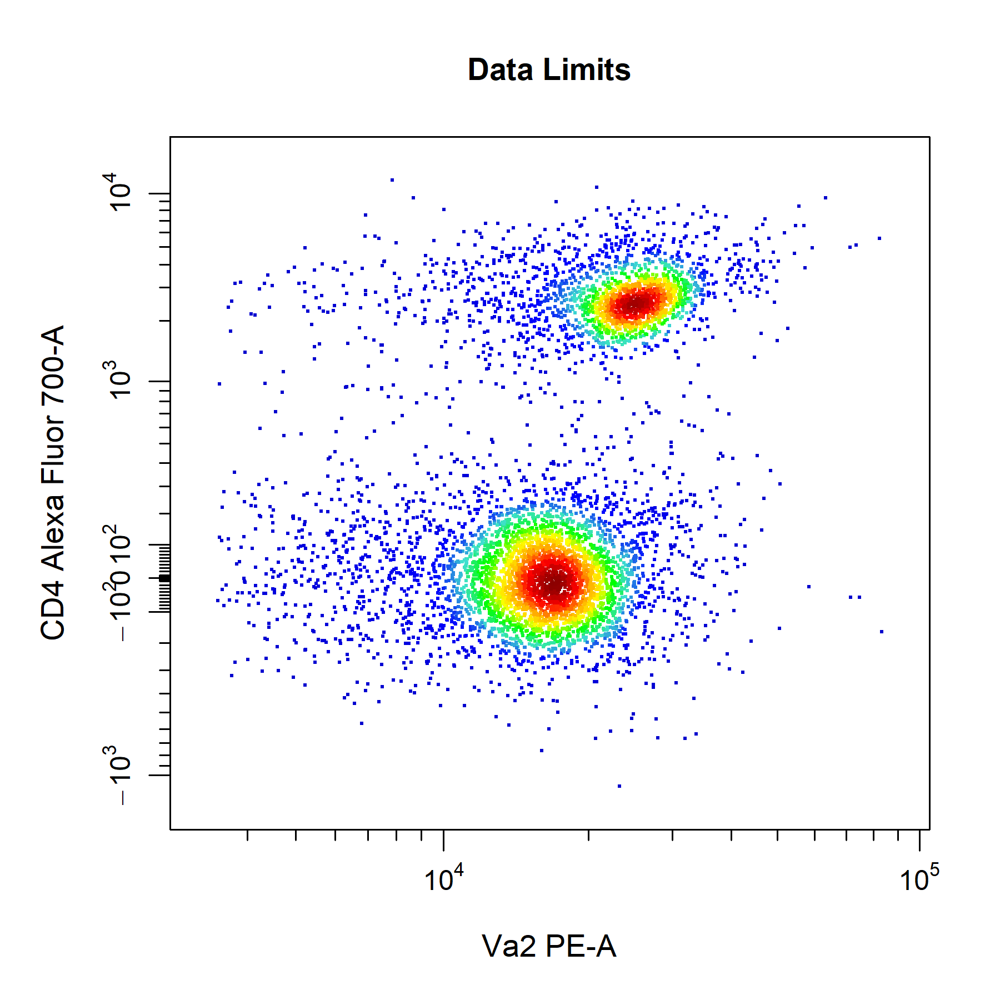
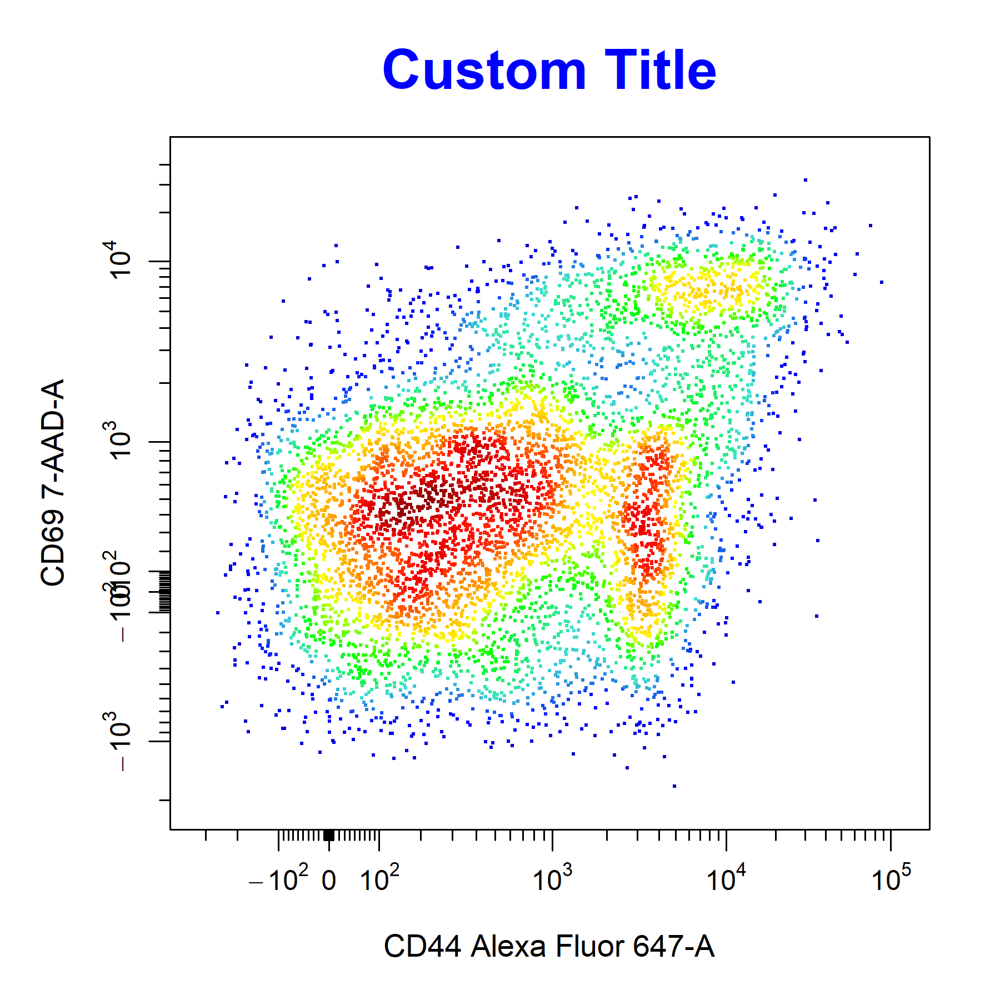
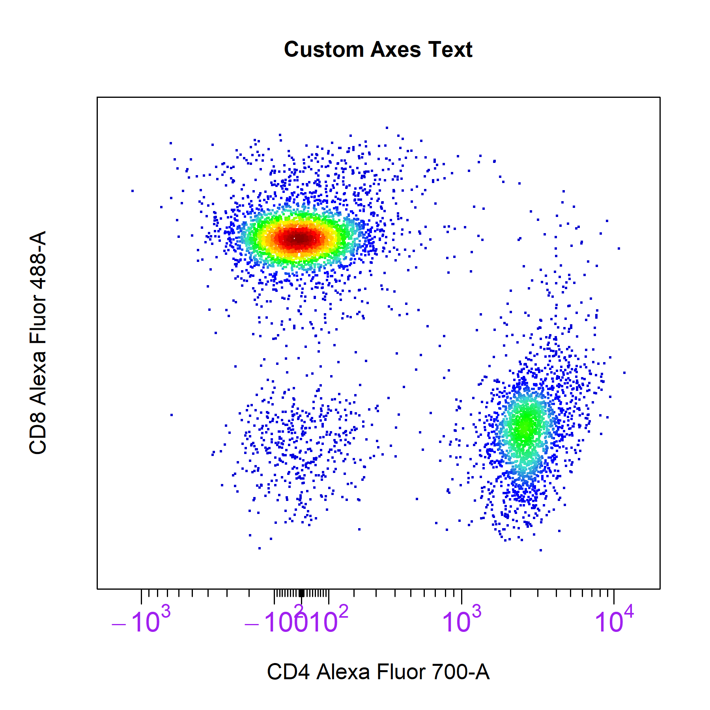

```{r, include = FALSE}
knitr::opts_chunk$set(
  collapse = TRUE,
  comment = "#>"
)
```

# Overview

<div style="line-height: 1.8em;"> ** CytoExploreR** is all about providing the necessary tools to efficiently explore and visualise cytometry data.

```{r, eval = FALSE}
# Load required packages
library(CytoExploreR)
library(CytoExploreRData)

# Load Activation GatingSet
gs <- cyto_setup("Activation-Samples")

# Apply compensation
gs <- cyto_compensate(gs)

# Apply transformations
gs <- cyto_transform(gs)

# Apply gates
cyto_gatingTemplate_apply(gs, Activation_gatingTemplate)
```

General use - channels argument. Layouts?

```{r, eval = FALSE, echo = FALSE}
cyto_plot_save("Visualisations-11.png",
               height = 6,
               width = 12)
cyto_plot_custom(1,2)
```

```{r, eval = FALSE}
# 2D scatter plot
cyto_plot(gs[[32]],
          parent = "T Cells",
          channels = c("CD4","CD8"))

# 1D density distribution
cyto_plot(gs[[32]],
          parent = "T Cells",
          channels = "CD4")
```

```{r, eval = FALSE, echo = FALSE}
cyto_plot_complete()
```

```{r echo = FALSE, fig.align="center", out.width = '98%',}
knitr::include_graphics('Visualisations/Visualisations-11.png')
```

<br>

# Key Features


## Axes Limits

<div style="line-height: 1.8em;"> In **CytoExploreR** you never have to worry about data being cut off in plots, as `cyto_plot` will automatically calculate axes limits that encompass all the plotted and gated data. `cyto_plot` comes with three preset `axes_limits` options which provide a quick way to optimise the axes limits of plots without manual adjustment.

<br>

The **machine** option displays the entire axes range (i.e. complete range of values detectable by the cytometer). This setting is used through **CytoExploreR** to display complete axes ranges when visualising transformations or gating populations.

```{r, eval = FALSE, echo = FALSE}
cyto_plot_save("Visualisations-1.png",
               height = 6,
               width = 6)
```

```{r, eval = FALSE}
# Machine axes limits
cyto_plot(gs[[32]],
          parent = "T Cells",
          channels = c("Va2", "CD4"),
          axes_limits = "machine",
          title = "Machine Limits")
```

```{r echo = FALSE, fig.align="center", out.width = '60%',}
knitr::include_graphics('Visualisations/Visualisations-1.png')
```

The **data** option restricts the axes to the range of values which are in the data. This means that if the data lacks negative events the axes limits will be set to remove this space on the plot. This setting is therefore best for minimising whitespace and zooming into populations when gating.

```{r, eval = FALSE, echo = FALSE}
cyto_plot_save("Visualisations-2.png",
               height = 6,
               width = 6)
```

```{r, eval = FALSE}
# Data axes limits
cyto_plot(gs[[32]],
          parent = "T Cells",
          channels = c("Va2", "CD4"),
          axes_limits = "data",
          title = "Data Limits")
```

```{r echo = FALSE, fig.align="center", out.width = '60%',}

```

The **auto** option is a combination of the machine and data settings which sets the upper axes limit to that of the data and anchors the lower axes limit to zero. This setting provides the best overall visualisation of the data and has therefore been set as the default `axes_limits` setting in `cyto_plot`.

```{r, eval = FALSE, echo = FALSE}
cyto_plot_save("Visualisations-3.png",
               height = 6,
               width = 6)
```

```{r, eval = FALSE}
# Auto axes limits
cyto_plot(gs[[32]],
          parent = "T Cells",
          channels = c("Va2", "CD8"),
          axes_limits = "auto",
          title = "Auto Limits")
```

```{r echo = FALSE, fig.align="center", out.width = '60%',}
knitr::include_graphics('Visualisations/Visualisations-3.png')
```

To ensure that all the data is clearly visible, `cyto_plot` will automatically add a 3% buffer onto either end of the axes for the above settings. The degree of buffering can be altered by supplying a decimal percentage to the `axes_limits_buffer` argument. Of course, you can also manually adjust the axes limits by supplying specific values to the `xlim` and `ylim` arguments to modify the x and y axes limits respectively. Values supplied through these arguments will always override those specified by the `axes_limits` argument. 

```{r, eval = FALSE, echo = FALSE}
cyto_plot_save("Visualisations-4.png",
               height = 6,
               width = 6)
```

```{r, eval = FALSE}
# Custom axes limits
cyto_plot(gs[[32]],
          parent = "T Cells",
          channels = c("Va2", "CD8"),
          xlim = c(-10, 65000),
          ylim = c(-100, 65000),
          title = "Custom Axes Limits")
```

```{r echo = FALSE, fig.align="center", out.width = '60%',}
knitr::include_graphics('Visualisations/Visualisations-4.png')
```

## Axes Transformations

`cyto_plot` does not perform in-line transformations, this means that the data must be appropriately transformed prior to plotting. The list of applied transformers will be extracted directly from the GatingSet or GatingHierarchy to ensure that the axes are appropriately displayed. Since flowFrame and flowSet objects do not retain these transformation definitions, users will need to manually supply the list of transformers to the `axes_trans` argument when plotting these objects. 

```{r, eval = FALSE, echo = FALSE}
cyto_plot_save("Visualisations-5.png",
               height = 6,
               width = 12)
```

```{r, eval = FALSE}
# Pull transformers from GatingSet
trans <- cyto_transformer_extract(gs)

# Pull out T Cells flowSet
T_Cells <- cyto_extract(gs, "T Cells")

# Axes on current scale
cyto_plot(T_Cells[[32]],
          channels = c("CD4","CD8"),
          title = "Transformers Missing")

# Axes appropriately transformed
cyto_plot(T_Cells[[32]],
          channels = c("CD4","CD8"),
          axes_trans = trans,
          title = "Transformers Supplied")
```

```{r, eval = FALSE, echo = FALSE}
cyto_plot_complete(1,1)
```

```{r echo = FALSE, fig.align="center", out.width = '98%',}
knitr::include_graphics('Visualisations/Visualisations-5.png')
```

## Axes Labels

`cyto_plot` will automatically label axes with the marker and channel names. Axes labels can be manually supplied through the `xlab` and `ylab` arguments. Axes text can be customised but the same customisation is applied to both the x and y axes. 

```{r, eval = FALSE, echo = FALSE}
cyto_plot_save("Visualisations-6.png",
               height = 6,
               width = 6)
```

```{r, eval = FALSE}
# Customise axes labels
cyto_plot(gs[[32]],
          parent = "T Cells",
          channels = c("CD4", "CD8"),
          xlab = "CD4",
          ylab = "CD8",
          axes_label_text_font = 2,
          axes_label_text_size = 2,
          axes_label_text_col = "red",
          title = "Custom Axes Labels")
```

```{r echo = FALSE, fig.align="center", out.width = '60%',}
knitr::include_graphics('Visualisations/Visualisations-6.png')
```

## Contour Lines

`cyto_plot` layers contour lines on top of the underlying data points such that all data is clearly visible. To add contour lines to plot, simply specify the number of contour levels to the `contour_lines` argument. Contour lines are fully cusomisable and supported for each data layer in the plot. To add contour lines to overlaid data simply a vector of levels for each layer to the `contour_lines` argument.

```{r, eval = FALSE, echo = FALSE}
cyto_plot_save("Visualisations-7.png",
               height = 6,
               width = 6)
```

```{r, eval = FALSE}
# Contour lines
cyto_plot(gs[[32]],
          parent = "T Cells",
          channels = c("CD4", "CD8"),
          contour_lines = 25,
          contour_line_type = 1,
          contour_line_width = 1.2,
          contour_line_col = "magenta",
          contour_line_alpha = 0.8,
          title = "Contour Lines")
```

```{r echo = FALSE, fig.align="center", out.width = '60%',}
knitr::include_graphics('Visualisations/Visualisations-7.png')
```

## Points

`cyto_plot` allows customisation of points per data layer, the base layer will automatically use a colour gradient whilst colours for upper layers will be selected from a colour palette created from the colours supplied to `point_cols`. Point colours can also be manually supplied for each layer through the `point_col` argument.

```{r, eval = FALSE, echo = FALSE}
cyto_plot_save("Visualisations-10.png",
               height = 6,
               width = 6)
```

```{r, eval = FALSE}
# Point colour palette
cyto_plot(gs[[32]],
          parent = "T Cells",
          channels = c("CD4","CD8"),
          overlay = "descendants",
          point_col = "black", # base layer - override density gradient
          point_cols = c("red",
                         "orange",
                         "yellow",
                         "green", # upper layers
                         "blue",
                         "purple"),
          title = "Point Colour Palette")
```

```{r echo = FALSE, fig.align="center", out.width = '60%',}
knitr::include_graphics('Visualisations/Visualisations-10.png')
```

The density colour scale for the base layer can also be customised by passing a vector of colours through the `point_col_scale` argument.

```{r, eval = FALSE, echo = FALSE}
cyto_plot_save("Visualisations-9.png",
               height = 6,
               width = 6)
```

```{r, eval = FALSE}
# Point colour scale
cyto_plot(gs[[32]],
          parent = "T Cells",
          channels = c("CD4","CD8"),
          point_col_scale = c("black",
                              "brown",
                              "red",
                              "orange",
                              "yellow",
                              "white"),
          title = "Point Colour Scale")
```

```{r echo = FALSE, fig.align="center", out.width = '60%',}
knitr::include_graphics('Visualisations/Visualisations-9.png')
```

There also additional arguments to modify the shape, size and colour transparency of the points for each data layer. Introducing some transparency through the `point_col_alpha` argument is particularly useful in retaining some density features when a single colour is supplied.

```{r, eval = FALSE, echo = FALSE}
cyto_plot_save("Visualisations-8.png",
               height = 6,
               width = 6)
```

```{r, eval = FALSE}
# Customise points
cyto_plot(gs[[32]], 
          parent = "T Cells",
          channels = c("CD4", "CD8"),
          point_shape = ".",
          point_size = 3,
          point_col = "red",
          point_col_alpha = 0.8)
```

```{r echo = FALSE, fig.align="center", out.width = '60%',}
knitr::include_graphics('Visualisations/Visualisations-8.png')
```

## Density Distributions

`cyto_plot` contains a number of customisation options for 1D density distributions. Unlike 2D scatterplots, all samples are plotted onto the same plot. The degree of stacking can be controlled through `density_stack` and the number of layers to include per plot can be specified through `density_layers`. Note that each plot must contain the same number of layers (i.e. total layers must be divisible by the number of layers per plot). The density distributions are normalised to the mode by default to aid in appropriate visualisation when stacking samples. To plot the raw densities, users can set `density_modal` argument to FALSE. Both the line borders and fill colours of the density distributions are fully customisable through the set of `density_fill` and `density_line` arguments. As with 2D scatterplots, legends can be included by setting the `legend` argument to TRUE. The default legend will use the `fill` colour, but users can change this to use the `line` colours by setting the `legend` argument to `"line"`.

```{r, eval = FALSE, ech0 = FALSE}
cyto_plot_save("Visualisations-21.png",
               height = 6,
               width = 10)
```

```{r, eval = FALSE}
# Density distributions
cyto_plot(gs[25:32],
          parent = "T Cells",
          channels = "CD8",
          density_layers = 4, # 4 samples per plot
          density_stack = 0.5, # 50% stacking
          density_modal = TRUE,
          density_fill = rep(c("red",
                           "blue",
                           "green",
                           "magenta"), 2),
          density_fill_alpha = c(rep(0, 4),
                                 0.2, 
                                 0.4,
                                 0.8,
                                 1),
          density_line_type = c(1,2,3,4,rep(1, 4)),
          density_line_width = c(rep(2, 4),
                                 rep(1, 4)),
          density_line_col = c("red",
                               "blue",
                               "green",
                               "magenta",
                               rep("black", 4)))
```

```{r echo = FALSE, fig.align="center", out.width = '98%',}

```

## Gates


## Labels

## Overlays

```{r, eval = FALSE}
# Overlay 
```

## Pop-up Window

To construct the plot in a pop-up window simply set the `popup` argument to TRUE. The `popup` argument is set to FALSE by default to plot in the RStudio graphics device.

```{r, eval = FALSE}
# Plot in popup window
cyto_plot(gs[[32]],
          parent = "T Cells",
          channels = c("CD4","CD8"),
          popup = TRUE)
```

## Display

To increase plotting speed and prevent overcrowding, `cyto_plot` has a `display` argument which can be used to display a proportion of the total events. To indicate the amount of events to display, users can set `display` to 1 to display all events, less than 1 to specify a percentage of events to display or a numeric greater than 1 to specify the number of events to display. To improve performance, the `display` argument is set to 25000 events by default in `cyto_plot`. `cyto_plot` will automatically adjust the level of sampling for overlays to ensure that event ratios are maintained. For example, if we have a total of 5000 T Cells of which we display 2000 events in the plot. If we overlay the CD4 T Cells (2500 total events), 1000 events (instead of the indicated 2000 events) will be displayed to maintain the original ratio to the T Cells population. The only case where the same sampling is applied to overlays is when the overlaid data comes a different sample to the base layer. For example, plotting an unactivated sample and overlaying an activated one, will result in the same sampling being applied to both layers (e.g. 2000 events).

```{r, eval = FALSE, echo = FALSE}
cyto_plot_save("Visualisations-12.png",
               height = 12, 
               width = 12)
cyto_plot_custom(2,2)
```

```{r, eval = FALSE}
# Display all events
cyto_plot(gs[[32]],
          parent = "root",
          channels = c("FSC-A", "SSC-A"),
          display = 1,
          title = "All Events")

# Display 5000 events
cyto_plot(gs[[32]],
          parent = "root",
          channels = c("FSC-A", "SSC-A"),
          display = 5000,
          title = "5000 Events")

# Display 20% of events
cyto_plot(gs[[32]],
          parent = "root",
          channels = c("FSC-A", "SSC-A"),
          display = 0.2,
          title = "20% of Events")

# Display default 25000 events
cyto_plot(gs[[32]],
          parent = "root",
          channels = c("FSC-A", "SSC-A"),
          title = "Default 25000 Events")
```

```{r, eval = FALSE, echo = FALSE}
cyto_plot_complete(1,1)
```

```{r echo = FALSE, fig.align="center", out.width = '98%',}
knitr::include_graphics('Visualisations/Visualisations-12.png')
```

## Title

`cyto_plot` will automatically label plots with the sample name and name of the parent population which has been plotted. Titles can be removed by setting the `title` argument to NA. 

```{e, eval = FALSE, echo = FALSE}
cyto_plot_save("Visualisations-16.png", 
               height = 6,
               width = 6)
```

```{r, eval = FALSE}
# Custom title
cyto_plot(gs[[32]],
          parent = "T Cells",
          channels = c("CD44","CD69"),
          title = "Custom Title",
          title_text_font = 2,
          title_text_size = 2,
          title_text_col = "blue")
```

```{r echo = FALSE, fig.align="center", out.width = '60%',}

```

## Legend

Legends can be added to `cyto_plot` by setting the legend argument to TRUE. `cyto_plot` will automatically populate the legend with the name of the samples or populations where appropriate. The text in the legend can be altered by supplying a vector of character strings to the `legend_text` argument in bottom-up order.

```{r, eval = FALSE, echo = FALSE}
cyto_plot_save("Visualisations-15.png",
               height = 6,
               width = 8)
```

```{r, eval = FALSE}
# Custom legend
cyto_plot(gs[[32]],
          parent = "T Cells",
          channels = c("CD4", "CD8"),
          overlay = "descendants",
          legend = TRUE,
          legend_text = c("T Cells",
                          "CD8 T Cells",
                          "CD69+ CD8 T Cells", # not required 
                          "CD4 T Cells",
                          "CD69+ CD4 T Cells"),
          legend_text_font = 1,
          legend_text_size = 1,
          legend_text_col = "black",
          title = "Custom Legend")
```

```{r echo = FALSE, fig.align="center", out.width = '60%',}

```

## Axes Text

The `axes_text` arguments controls whether to include axes text for the x or y axes on the plot. The default is set to c(TRUE, TRUE) to display axes text on the x and y axes respectively. Setting either of these values to FALSE will remove the axes text from the respective axis. 

```{r, eval = FALSE, echo = FALSE}
cyto_plot_save("Visualisations-14.png",
               height = 6,
               width = 6)
```

```{r, eval = FALSE}
# Customise axes_text
cyto_plot(gs[[32]],
          parent = "T Cells",
          channels = c("CD4","CD8"),
          axes_text = c(TRUE, FALSE), # remove y axis text
          axes_text_font = 1,
          axes_text_size = 1.4,
          axes_text_col = "purple",
          title = "Custom Axes Text")
```

```{r echo = FALSE, fig.align="center", out.width = '60%',}

```

## Borders

`cyto_plot` also supports customisation of plot borders and backgrounds through supplying colours to the `border_line_col` and `border_fill` arguments respectively.

```{r, eval = FALSE, echo = FALSE}
cyto_plot_save("Visualisations-13.png",
               height = 6,
               width = 6)
```

```{r, eval = FALSE}
# Custom border
cyto_plot(gs[[32]],
          parent = "T Cells",
          channels = c("CD4","CD8"),
          overlay = "descendants",
          border_fill = "black",
          border_fill_alpha = 1,
          border_line_type = 1,
          border_line_col = "red",
          border_line_width = 3,
          title = "Custom Borders")
```

```{r echo = FALSE, fig.align="center", out.width = '60%',}
knitr::include_graphics('Visualisations/Visualisations-13.png')
```

## Custom Themes

Custom themes are supported for `cyto_plot` through the `cyto_plot_theme` function. Users can specific plot characteristics within a `cyto_plot_theme` call which will be automatically inherited by all downstream `cyto_plot` calls. An issue will be created for users to share their favourite custom cyto_plot theme, the best themes will be shipped with **CytoExploreR** so that they are available to other users. To see what arguments can be altered through `cyto_plot_theme`, have a look at the output of `cyto_plot_theme_args()`. The theme can be reset by making a call to `cyto_plot_theme_reset()`.

```{r, eval = FALSE, echo = FALSE}
cyto_plot_save("Visualisations-17.png",
               height = 6,
               width = 6)
```

```{r, eval = FALSE}
# Available theme arguments
cyto_plot_theme_args()

# Custom cyto_plot theme
cyto_plot_theme(contour_lines = 25,
                contour_line_col = "white",
                point_size = 3,
                point_col_scale = c("white",
                                    "yellow",
                                    "orange",
                                    "red",
                                    "darkred",
                                    "black"),
                border_fill = "black",
                border_line_col = "grey",
                title_text_col = "red",
                axes_text_col = "blue",
                axes_label_text_col = "purple",
                axes_limits = "machine")

# Theme automatically inherited
cyto_plot(gs[[32]],
          parent = "T Cells",
          channels = c("CD44", "CD69"))

# Reset theme to default
cyto_plot_theme_reset()
```

```{r echo = FALSE, fig.align="center", out.width = '60%',}
knitr::include_graphics('Visualisations/Visualisations-17.png')
```

## Layout

`cyto_plot` will automatically arrange samples in an appropriately sized square grid when multiple samples are supplied for plotting. The number of plots to include on each page can be manually controlled through the `layout` argument, which expects a vector indicating the number of rows and columns to use.

```{r, eval = FALSE, echo = FALSE}
cyto_plot_save("Visualisations-18.png",
               height = 4.5,
               width = 13.5)
```

```{r, eval = FALSE}
# Custom layout
cyto_plot(gs[30:32],
          parent = "CD4 T Cells",
          channels = c("CD44", "CD69"),
          point_size = 3,
          contour_lines = 15,
          layout = c(1,3))
```

```{r echo = FALSE, fig.align="center", out.width = '98%'}
knitr::include_graphics('Visualisations/Visualisations-18.png')
```

## Save High Resolution Images

**CytoExploreR** makes it easy to save high resolution images for publication through the `cyto_plot_save` function. Once you are satisfied with a plot that you would like to save, simply call `cyto_plot_save` and re-run the `cyto_plot` call. `cyto_plot_save` can save images to png, tiff, jpeg, pdf and svg file formats. The desired file format is indicated by the extension of the file name passed to the `save_as` argument. The default resolution has been set to 300 dpi to ensure saving of high resolution images, this value can be altered through the `res` argument. The dimensions of the saved image can be altered by specifying the desired `height` and `width` in the specified `units`.

```{r, eval = FALSE}
# Call cyto_plot_save
cyto_plot_save("Plot.png",
               height = 7,
               width = 7,
               units = "in",
               res = 300)

# cyto_plot call
cyto_plot(gs[29:32],
          parent = "CD4 T Cells",
          alias = "CD69+ CD4 T Cells",
          channels = c("CD44", "CD69"),
          contour_lines = 15,
          title = c("0 nM OVA",
                    "5 nM OVA",
                    "50 nM OVA",
                    "500 nM OVA"),
          point_size = 3,
          point_col = c("cyan",
                        "deepskyblue",
                        "blue",
                        "navyblue"),
          point_col_alpha = 0.5,
          label_fill_alpha = 0,
          label_text_y = 39000,
          label_text_size = 0.7)
```

```{r echo = FALSE, fig.align="center", out.width = '98%'}
knitr::include_graphics('Visualisations/Visualisations-19.png')
```

## Custom Plot Layouts

Users can contruct their own custom plot layouts to combine any number of `cyto_plot` plots using `cyto_plot_custom`. `cyto_plot_custom` will let **CytoExploreR** know that you are taking control over setting the plot layout and allow you to set the layout manually by supplying the desired number of rows and columns. `cyto_plot_custom` also talks to `cyto_plot_save` to save the custom plot, it is therefore important to let `cyto_plot_save` know when you are ready to save the plot by making a call to `cyto_plot_complete`. `cyto_plot_complete` will also tell **CytoExploreR** that you are no longer creating a custom plot, so it is important to run this even if you are not saving the plot. Through `cyto_plot_complete`, users can also indicate the desired number of rows and columns to reset the graphics device.

```{r, eval = FALSE}
# Call cyto_plot_save
cyto_plot_save("Plot2.png")

# Tell CytoExploreR we are going rogue and set custom layout
cyto_plot_custom(2,2)

# cyto_plot calls
cyto_plot(gs[[32]],
          parent = "CD4 T Cells",
          alias = "CD69+ CD4 T Cells",
          channels =  c("CD44", "CD69"),
          title = "CD4 T Cells",
          contour_lines = 15,
          label_text_size = 0.7,
          label_text_y = 39000,
          label_fill_alpha = 0)

cyto_plot(gs[29:32],
          parent = "CD4 T Cells",
          alias = "CD69+ CD4 T Cells",
          channels = "CD69",
          density_stack = 0.5,
          title = "CD4 T Cells",
          label_text = NA) # remove text in labels

cyto_plot(gs[[32]],
          parent = "CD8 T Cells",
          alias = "CD69+ CD8 T Cells",
          channels =  c("CD44", "CD69"),
          title = "CD8 T Cells",
          contour_lines = 15,
          label_text_size = 0.7,
          label_text_y = 39000,
          label_fill_alpha = 0)

cyto_plot(gs[29:32],
          parent = "CD8 T Cells",
          alias = "CD69+ CD8 T Cells",
          channels = "CD69",
          density_stack = 0.5,
          title = "CD8 T Cells",
          label_text = NA) # remove text in labels

# Tell CytoExploreR plot is complete for saving & turn off custom plotting
cyto_plot_complete(1,1)
```

```{r echo = FALSE, fig.align="center", out.width = '98%'}
knitr::include_graphics('Visualisations/Visualisations-20.png')
```
