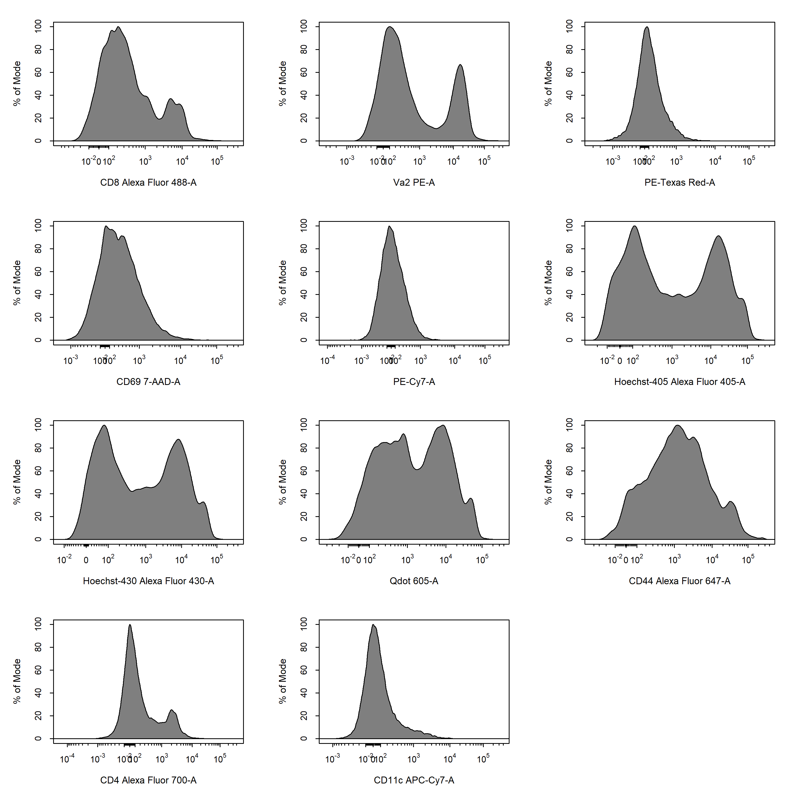

```{r, include = FALSE}
knitr::opts_chunk$set(
  collapse = TRUE,
  comment = "#>"
)
```

# Introduction

<div style="line-height: 1.8em;"> The full capabilities of **CytoExploreR** will be documented in series of vignettes which address specific aspects of the data analysis pipeline. Before we dive into the details, let's walk through the basic steps to analyse some *in vitro* T cell activation data using **CytoExploreR**. 

This **Activation** dataset and associated **Compensation** controls have been shipped with **CytoExploreRData** for demonstration purposes. This *in vitro* assay involves stimulating dendritic cells (DCs) with different immune stimulators (referred to as Stim-A, Stim-B, Stim-C and Stim-D) under increasing concentrations of the surrogate antigen ovalbumin (0 nM, 5 nM, 50 nM or 500 nM OVA). These activated DCs are then co-cultured with antigen-specific OT-I (CD8+) and OT-II (CD4+) T cells. The ability of each of the immune stimulators to promote T cell activation was then assessed by measuring the expression of T cell activation markers (CD44 and CD69) by flow cytometry.

Although **CytoExploreR** has full support for automated gating through **openCyto**, for simplicity in this vignette we will describe a manual gating analysis pipeline to analyse this dataset. </div>

<br>

# 1. Set Up New R Project

<div style="line-height: 1.8em;"> Before we begin, we will need to create a new R project by following these steps:

+ Select File -> New Project
+ Select New Directory -> New Project 
+ Set Directory Name to "CytoExploreR-Demo"
+ Indicate where the project should be created and select Create Project

</div>

<br>

# 2. Load Required Packages

<div style="line-height: 1.8em;"> **CytoExploreR** is closely integrated with the RGLab's suite of cytometry packages, including **flowCore**, **flowWorkspace** and **openCyto**. This means that these packages will be automatically loaded when **CytoExploreR** is loaded and any functions from these packages are completely compatible with **CytoExploreR**. To demonstrate the features of **CytoExploreR** we will also need to load **CytoExploreRData** which contains the **Compensation** and **Activation** datasets.  </div>

```{r, eval = FALSE}
# Load required packages
library(CytoExploreR)
library(CytoExploreRData)
```

<br>

# 3. Save FCS Files

<div style="line-height: 1.8em;"> Users should create a new folder in the current working directory and add their FCS files into this folder. It is recommended that you store your compensation controls and samples in separate folders as these files will be analysed separately. The following snippet outlines the steps required to download FCS files for the **Compensation** and **Activation** datasets and save them to appropriately named folders in your current working directory. </div>

```{r, eval = FALSE}
# Compensation FCS Files
cyto_save(Compensation, 
          save_as = "Compensation-Samples")

# Activation FCS Files
cyto_save(Activation,
          save_as = "Activation-Samples")
```

<br>

# 4. Compensation of Fluorescent Spillover

<div style="line-height: 1.8em;"> Flow cytometry users will need to compensate their data for fluorescent spillover prior to downstream analyses. The basic steps required to compute and refine the spillover matrix are outlined below. Refer to the Compensation vignette for a more details. </div>

## 4.1 Prepare compensation controls

<div style="line-height: 1.8em;"> The compensation controls can be loaded into a GatingSet by passing the name of the folder where the FCS files are saved to `cyto_setup`. At this stage it is also a good idea to setup a new gatingTemplate to record any downstream gating operations. Once the compensation controls have been loaded into a GatingSet, we need to transform the fluorescent channels using `cyto_transform`. The transformed data can then be gated using `cyto_gate_draw` to remove debris and doublets to ensure accurate computation of spillover values. </div>

```{r, eval = FALSE}
# Setup compensation controls
gs <- cyto_setup("Compensation-Samples",
                 gatingTemplate = "Compensation-gatingTemplate.csv")

# Transform fluorescent channels - default logicle transformations
gs <- cyto_transform(gs)

# Gate Cells
cyto_gate_draw(gs,
               parent = "root",
               alias = "Cells",
               channels = c("FSC-A", "SSC-A"))

# Gate Single Cells
cyto_gate_draw(gs,
               parent = "Cells",
               alias = "Single Cells",
               channels = c("FSC-A", "SSC-A"))
```

```{r, echo=FALSE, fig.align="center", out.width = '98%'}

```

<br>

## 4.2 Compute Spillover Matrix

<div style="line-height: 1.8em;"> The spillover matrix can be automatically calculated using `cyto_spillover_compute`. Users are asked to assign a channel to compensation control and then gate the positive signal for each control in the indicated channel. **CytoExploreR** supports the use of either a universal unstained control or requires that each single colour control contain its own internal unstained reference population. The spillover matrix will be calculated using the method described by Bagwell & Adams 1993. </div>

```{r, eval = FALSE}
# Compute spillover matrix
spill <- cyto_spillover_compute(gs,
                                parent = "Single Cells",
                                spillover = "Spillover-Matrix.csv")
```

```{r, echo=FALSE, fig.align="center", out.width = '98%'}

```

## 4.3 Edit Spillover Matrix

<div style="line-height: 1.8em;"> The computed spillover matrix can be interactively edited in realtime using `cyto_spillover_edit`. Users should refer to the **Plots** to identify any lingering compensation issues and return to the **Editor** tab to refine the spillover matrix. By definition, the data is correctly compensated when the MedFI of the stained control is equal to that of the reference unstained control in all secondary detectors. The updated spillover matrix will be saved to a CSV file for downstream use. </div>

```{r, eval = FALSE}
# Edit spillover matrix
spill <- cyto_spillover_edit(gs,
                             parent = "Single Cells",
                             spillover = "Spillover-Matrix.csv")
```

```{r, echo=FALSE, fig.align="center", out.width = '98%'}
knitr::include_graphics('Compensation/Compensation-10.png')
```

<br>

## 4.4 Visualise Compensation

<div style="line-height: 1.8em;"> After editing the spillover matrix manually, it is a good idea to check that all compensation issues have been addressed. The easiest way to do this without having to launch the spillover matrix editor is through `cyto_plot_compensation`. `cyto_plot_compensation` will plot uncompensated and compensated data in all fluorescent channels to check the compensation. The unstained control will automatically be overlaid onto the plots as a reference if supplied. </div>

```{r, eval = FALSE}
# Visualise uncompensated data
cyto_plot_compensation(gs,
                       parent = "Single Cells")

# Visualise compensated data
cyto_plot_compensation(gs,
                       parent = "Single Cells",
                       spillover = "Spillover-Matrix.csv",
                       compensate = TRUE)
```

```{r, echo=FALSE, fig.align="center", out.width = '98%'}

```

<br>

# 5. Analyse Samples

<div style="line-height: 1.8em;"> Once we have finalised the spillover matrix, we are done with our compensation controls and can now move on to analysing our samples. The steps involved in this process are outlined below. </div>

## 5.1 Load and Annotate Samples

<div style="line-height: 1.8em;"> To load the samples directly into a GatingSet and annotate them with experimental details, we use `cyto_setup`. This function will open inteactive table editors to allow entry of experimenta markers and experiment details. For the purpose of demonstration, the details of this experiment have already been added. </div>

```{r, eval = TRUE, echo = FALSE, message = FALSE, warn = FALSE}
library(CytoExploreR)
library(CytoExploreRData)

fs <- Activation
gs <- GatingSet(fs)
gs <- cyto_compensate(gs)
gs <- cyto_transform(gs)
gs <- cyto_gatingTemplate_apply(gs, Activation_gatingTemplate)
```

```{r, eval = FALSE}
# Load and annotate samples
gs <- cyto_setup("Activation-Samples",
                 gatingTemplate = "Activation-gatingTemplate.csv")
```

```{r, echo=FALSE, fig.align="center", out.width = '50%'}

```

## 5.2 Apply Compensation and Data Transformations

<div style="line-height: 1.8em;"> Since the data is always imported uncompensated and on a linear scale, we will need to apply our spillover matrix and transform the fluorescent channels to appropriately visualise the data. We can apply our spillover matrix to the samples using `cyto_compensate` and transform the fluorescent channels using `cyto_transform`. It is important that data compensation and transformations occur in this order as compensation must be applied to linear data only. </div>

```{r, eval = FALSE}
# Apply compensation
gs <- cyto_compensate(gs,
                      spillover = "Spillover-Matrix.csv")

# Transform fluorescent channels - default logicle transformations
gs <- cyto_transform(gs)
```

```{r, echo=FALSE, fig.align="center", out.width = '98%'}

```

<br>

## 5.3 Gate Samples

<div style="line-height: 1.8em;"> Now that the data has been properly prepared, it's time to manually gate populations using `cyto_gate_draw`. This function allows us to interactively draw gates around populations using a variety of useful gate types. Let's begin by drawing a polygon gate around the leukocyte population using the FSC-A and SSC-A parameteres. Since polygon gates are the default ate type for 2D plots, we don't need to specify the gate type through the `type` argument. Polygon gates can be closed by right clicking and selecting "stop". </div>

```{r, eval = FALSE}
# Gate Cells
cyto_gate_draw(gs,
               parent = "root",
               alias = "Cells",
               channels = c("FSC-A","SSC-A"))
```

```{r, eval = FALSE, echo = FALSE}
cyto_plot_save("CytoExploreR-4.png",
               height = 7,
               width = 7)
cyto_plot(gs,
          parent = "root",
          alias = "Cells",
          channels = c("FSC-A","SSC-A"),
          group_by = "all",
          label_text_size = 1)
```

```{r, echo=FALSE, fig.align="center", out.width = '60%'}

```

<div style="line-height: 1.8em;"> Constructing new gates is as simple as copying and editing the above code. Now let's gate the single cells within the cells population by drawing a polygon gate using the FSC-A and FSC-H parameters. </div>

```{r, eval = FALSE}
# Gate Single Cells
cyto_gate_draw(gs,
               parent = "Cells",
               alias = "Single Cells",
               channels = c("FSC-A","FSC-H"))
```

```{r, eval = FALSE, echo = FALSE}
cyto_plot_save("CytoExploreR-5.png",
               height = 7,
               width = 7)
cyto_plot(gs,
          parent = "Cells",
          alias = "Single Cells",
          channels = c("FSC-A","SSC-A"),
          group_by = "all",
          label_text_size = 1)
```

```{r, echo=FALSE, fig.align="center", out.width = '60%'}

```

<div style="line-height: 1.8em;"> As with any other function in **CytoExploreR** that generates plots, `cyto_gate_draw` makes use of `cyto_plot` to visualise the data. This means that we can pass any `cyto_plot` arguments through `cyto_gate_draw` to modify the constructed plots. This allows us to pull out samples or populations and overlay them on the plot to help us decide where the gate(s) should be set. As an examples, below we have extracted the unstained control and overlaid it onto the plot so that we can better set our live and dead cells gates. Notice how **CytoExploreR** supports gate negation through the `negate` argument. This means that any events outside the dead cells gate will be classified as live cells without the need for drawing additional gates. To construct the rectangle gate simply select the two diagonal points that encompass the population. </div>

```{r, eval = FALSE}
# Extract unstained control 
NIL <- cyto_extract(gs, "Single Cells")[[33]]

# Gate Live Cells
cyto_gate_draw(gs,
               parent = "Single Cells",
               alias = c("Dead Cells", "Live Cells"),
               channels = c("Hoechst-405", "Hoechst-430"),
               type = "rectangle",
               negate = TRUE,
               overlay = NIL)
```

```{r, eval = FALSE, echo = FALSE}
cyto_plot_save("CytoExploreR-6.png",
               height = 7,
               width = 7)
cyto_plot(gs,
          parent = "Single Cells",
          alias = "",
          channels = c("Hoechst-405","Hoechst-430"),
          group_by = "all",
          overlay = cyto_extract(gs, "Single Cells")[[33]],
          label_text_size = 1)
```

```{r, echo=FALSE, fig.align="center", out.width = '60%'}
knitr::include_graphics('CytoExploreR/CytoExploreR-6.png')
```

<div style="line-height: 1.8em;"> `cyto_gate_draw` also has support for mixed gate type when gating multiplpe populations. For example, we could use an ellipsoid gate for the T cells population and a rectangle gate for the dendritic cells populations. </div>

```{r, eval = FALSE}
# Gate T Cells and Dedritic Cells
cyto_gate_draw(gs,
               parent = "Live Cells",
               alias = c("T Cells", "Dendritic Cells"),
               channels = c("CD11c", "Va2"),
               type = c("ellipse", "rectangle"),
               overlay = NIL)
```

```{r, eval = FALSE, echo = FALSE}
cyto_plot_save("CytoExploreR-7.png",
               height = 7,
               width = 7)
cyto_plot(gs,
          parent = "Live Cells",
          alias = "",
          channels = c("CD11c","Va2"),
          group_by = "all",
          overlay = cyto_extract(gs, "Single Cells")[[33]],
          label_text_size = 1)
```

```{r, echo=FALSE, fig.align="center", out.width = '60%'}
knitr::include_graphics('CytoExploreR/CytoExploreR-7.png')
```

<div style="line-height: 1.8em;"> Next we will gate the CD4 and CD8 T cells using rectangle gates. </div>

```{r, eval = FALSE}
# Gate CD4 & CD8 T Cells
cyto_gate_draw(gs,
               parent = "T Cells",
               alias = c("CD4 T Cells", "CD8 T Cells"),
               channels = c("CD4", "CD8"),
               type = "r")
```

```{r, eval = FALSE, echo = FALSE}
cyto_plot_save("CytoExploreR-8.png",
               height = 7,
               width = 7)
cyto_plot(gs,
          parent = "T Cells",
          alias = "",
          channels = c("CD4","CD8"),
          group_by = "all",
          label_text_size = 1)
```

```{r, echo=FALSE, fig.align="center", out.width = '60%'}

```

<div style="line-height: 1.8em;"> In our last couple of gates, we want to gate our activated CD69+ CD4 and CD8 T cells. For the CD4 T cells we will extract the samples which contain unactivated T cells (i.e. received to antigen) and overlay these onto the plot to make it easier to set the gate. </div>

```{r, eval = FALSE}
# Extract CD4 T Cells
CD4 <- cyto_extract(gs, "CD4 T Cells")

# Extract naive CD4 T Cells
CD4_naive <- cyto_select(CD4, OVAConc = 0)

# Gate CD69+ CD4 T Cells
cyto_gate_draw(gs,
               parent = "CD4 T Cells",
               alias = "CD69+ CD4 T Cells",
               channels = c("CD44", "CD69"),
               type = "rectangle",
               overlay = CD4_naive)
```

```{r, eval = FALSE, echo = FALSE}
cyto_plot_save("CytoExploreR-9.png",
               height = 7,
               width = 7)
cyto_plot(gs,
          parent = "CD4 T Cells",
          alias = "",
          channels = c("CD44","CD69"),
          group_by = "all",
          label_text_size = 1,
          overlay = cyto_select(cyto_extract(gs, "CD4 T Cells"), OVAConc = 0))
```

```{r, echo=FALSE, fig.align="center", out.width = '60%'}

```

<div style="line-height: 1.8em;"> Adding contour lines to the plot can also be helpful in deciding where gates should be set. Let's add some onto the CD8 T cells so we can set the CD69+ gate.  </div>

```{r, eval = FALSE}
# Gate CD69+ CD8 T Cells
cyto_gate_draw(gs,
               parent = "CD8 T Cells",
               alias = "CD69+ CD8 T Cells",
               channels = c("CD44", "CD69"),
               type = "rectangle",
               contour_lines = 15)
```

```{r, eval = FALSE, echo = FALSE}
cyto_plot_save("CytoExploreR-10.png",
               height = 7,
               width = 7)
cyto_plot(gs,
          parent = "CD8 T Cells",
          alias = "",
          channels = c("CD44","CD69"),
          group_by = "all",
          label_text_size = 1,
          contour_lines = 15)
```

```{r, echo=FALSE, fig.align="center", out.width = '60%'}

```

<br>

# 5.4 Explore Gated Samples

<div style="line-height: 1.8em;"> **CytoExploreR** has a variety of visualisation tools to explore gated data. One of my personal favourites is `cyto_plot_gating_tree`. This function plots the gating tree with nodes scaled by population size and can also display frequency and count statistics for each node. Since `cyto_plot_gating_tree` doesn't plot the actual data it is super fast and provides a quick overview of the data. It is also completely interactive! Try clicking and dragging nodes, it's loads of fun! </div>

```{r, eval = TRUE, fig.align = "center", out.width = '100%'}
# Gating Tree
cyto_plot_gating_tree(gs[[32]],
                      stat = "freq")
```

<div style="line-height: 1.8em;"> It is also easy to plot entire gating schemes using `cyto_plot_gating_scheme`. This is an extremely powerful function that can plot gating schemes for all samples, and has full support for back gating and gate tracking. </div>

```{r, eval = FALSE}
# Gating scheme
cyto_plot_gating_scheme(gs[32],
                        back_gate = TRUE,
                        gate_track = TRUE)
```

```{r, eval = FALSE, echo = FALSE}
cyto_plot_save("CytoExploreR-11.png",
               height = 10,
               width = 10)
cyto_plot_gating_scheme(gs[[32]],
                        back_gate = TRUE,
                        gate_track = TRUE)
```

```{r, echo=FALSE, fig.align="center", out.width = '98%'}

```

<br>

# 5.5 Export Statistics

<div style="line-height: 1.8em;"> At the end of any analysis pipeline, we want to export population-level statistics for reporting. This is easily acheived using `cyto_stats_compute` which will compute the desired statistics for the specified populations and return a tidyverse friendly output that retains all the experiment details. This makes it easy to plot the exported statistics using other R packages, such as ggplot2. </div>

```{r, eval = TRUE, warn = FALSE}
# Compute medFI - exclude unstained control
cyto_stats_compute(gs[1:32],
                   alias = c("CD69+ CD4 T Cells",
                             "CD69+ CD8 T Cells"),
                   stat = "median",
                   channels = c("CD44", "CD69"))
```

<br>

# 6. Summary

<div style="line-height: 1.8em;"> **CytoExploreR** is a feature packed R package that contains all the tools necessary to analyse your cytometry data. The purpose of this vignette was simply to introduce some of the key features of the package, and to highlight how easy it is to use. It is impossible to include all the feaures of the package in this vignette, so I recommend that you explore the other package vignettes which explore each of these components in a lot more detail. </div>
