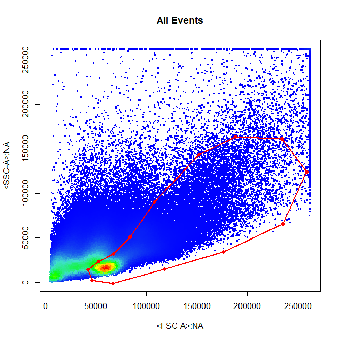
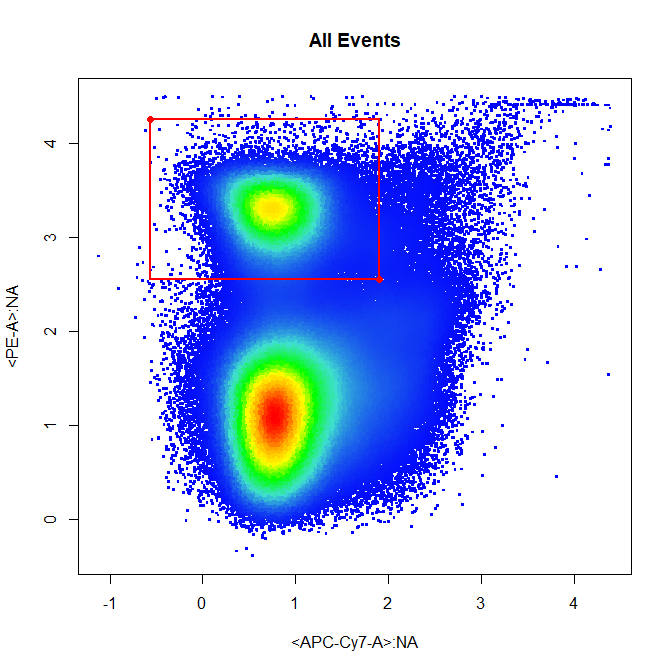
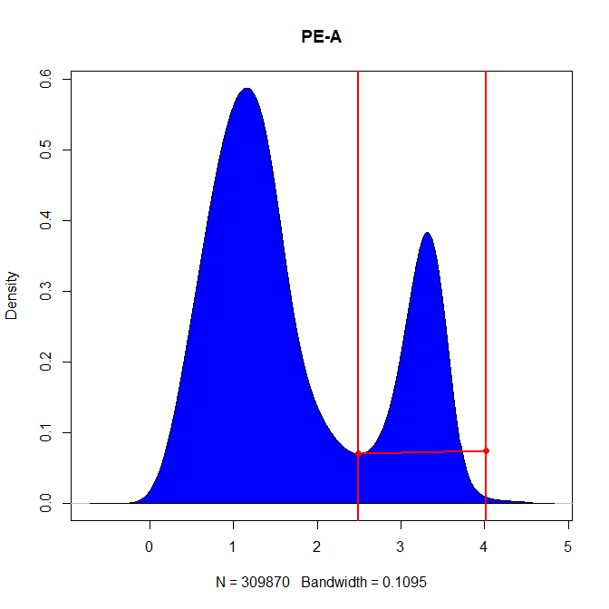
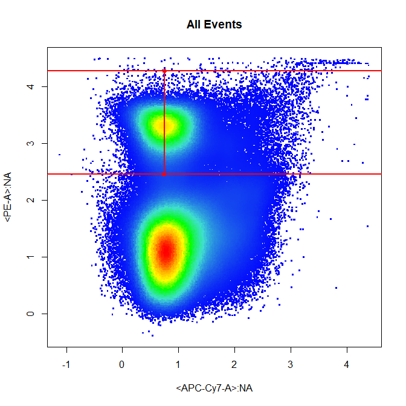
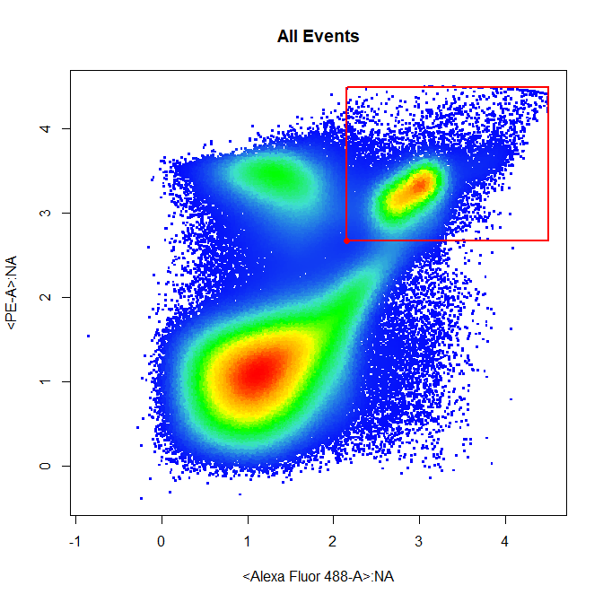
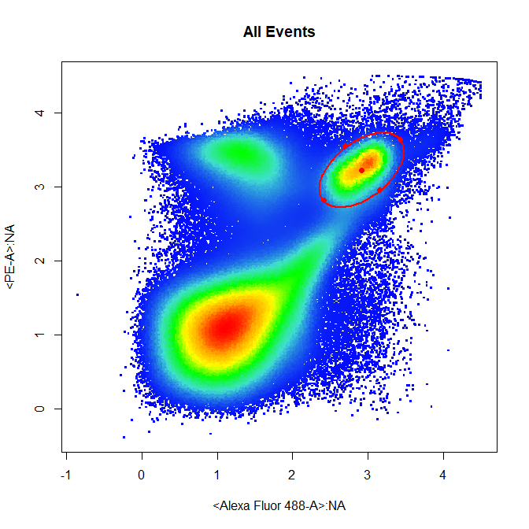
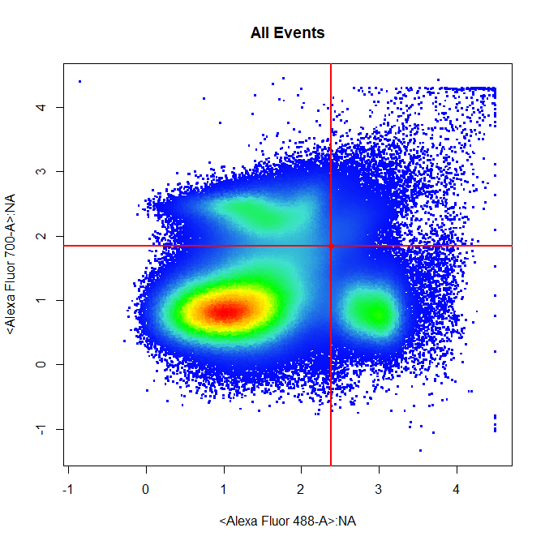
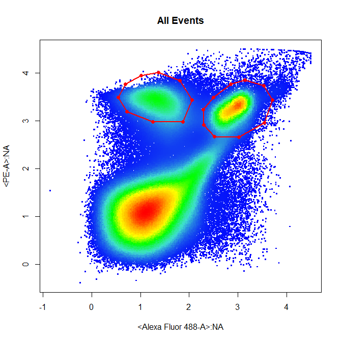

```{r setup, include=FALSE}
library(knitr)
opts_chunk$set(out.extra='style="display:block; margin: auto"', fig.align="center", message = FALSE, warning = FALSE)
```

Overview of CytoGate Features
==============================

Introduction
------------------------------

The `Cytogate` package provides an interactive interface for drawing gates to analyse flow cytometry data through the `DrawGate` function. The package also contains a plugin function `gate_draw` to incorporate these interactive features into the `openCyto` gating pipeline. Here we aim to demonstrate the main gating features of `CytoGate` and how these features can be used with `openCyto`.

### 1. Adding **CytoGate** to **openCyto** as a Plugin.

The features of `CytoGate` can be easily incorporated into `openCyto` as a plugin. To do this we will need to supply the name of the gating function `gate_draw` and give the gating method a name for use within `openCyto`, here we will use `DrawGate` as the gating method name. To check whether the function has been successfully added we use `listgtMethods()` to return a list of supported gating methods

```{r, echo = TRUE}
library(openCyto)
library(CytoGate)

registerPlugins(fun = gate_draw, methodName = "DrawGate")
listgtMethods()

```

### 2. Loading in Data for Analysis

To demonstrate the main features of `CytoGate` we will use a data set supplied by CytoGate called **Activation**. This data set contains eight **.fcs** files used to determine the activation state of  OT-I and OT-II transgenic T cells. We will add these samples to a `GatingSet` called `gs` for subsequent gating using the `openCyto` framework.

```{r, echo = TRUE}
fs <- Activation

gs <- GatingSet(fs)
```

### 3. Preparing Data for Analysis

Once the data has been added to the `GatingSet` we perform necessary compensation using the attached spillover matrix and perform logicle transformation on all fluorescent channels.

```{r, echo = TRUE}
spill <- fs[[1]]@description$SPILL
gs <- compensate(gs, spill)

channels <- colnames(fs)
trans.channels <- channels[!channels %in% c("FSC-A","FSC-H","FSC-W","SSC-A","SSC-H","SSC-W","Time")]

trans <- estimateLogicle(gs[[1]], trans.channels)
gs <- transform(gs, trans)
```

### 4. Supported Gate Types & Expected Inputs

The `DrawGate` gating method will automatically open a new interactive plotting window where the user can specify the coordinates of gates manually. The type of gate to constructed is supplied to the `GatingTemplate` as the `gate_type` argument - this will be demonstarted later. Currently the supported gate types and expected inputs are as follows:

- `"polygon"` constructs a polygon gate from `n` selected points where `n` must be greater than `3`. To seal the polygon the user must **right click** and select **"stop"**. This is the default `gate_type` used by `DrawGate`. `n>3`  
- `"rectangle"` constructs a rectangle gate parallel to the x and y axes from 2 selected points along the diagonal of the rectangle. `n=2`
- `"interval"` constructs a gate based on user defined lower and upper bounds. 1D and 2D interval gates are supported, For 1D gates a density distribution is plotted and 2 points selected indicating the lower and upper bounds of the gate. 2D interval gates require an additional argument `axis` used to specifiy whether the `"x"` or `"y"` axis should be gated. `n=2`
- `"threshold"` constructs a gate that selects all events above a selected lower bound. 1D and 2D threshold gates are supported. For 2D threshold gates a rectangle gate is constructed which selects events above the selcted x and y co-ordinates. `n=1`
- `"ellipse"` constructs an ellipse gate from 4 selcted points indicating the limits of the gate in 2 dimensons. `n=4`
- `"quadrant"` constructs 4 rectangle gates based on selection of a single point indicating the center of the crosshairs. `n=1`

Multi-gates are supported for all gate types except `"threshold"` and `"quadrant"` through an additional argument `N` defining the number of gates to be constructed. This multi-gate feature will be demonstrated later.

### 5. Polygon Gates (n)

Below is an example of the entry in the `GatingTemplate`. When using `DrawGate` as an `openCyto` plugin it is recommended that pooled using the `collapseDataForGating` and `groupBy` arguments to ensure that the selected gates encompass the population in all samples. Additionally, to speed up the gating process user should also supply the `subSample` argument to restrict the data to a subset of the pooled data for plotting. Notice how the `gate_type` is supplied as a `gating_args` using **'gatetype'**.

```{r, echo = TRUE, eval = FALSE}
template <- add_pop(
  gs, alias = "Cells", parent = "root", pop = "+", dims = "FSC-A,SSC-A", gating_method = "DrawGate",
  gating_args = "subSample=25000,gate_type='polygon'", collapseDataForGating = TRUE, groupBy = 8
)
```



### 6. Rectangle Gates (n=2)

```{r, echo = TRUE, eval = FALSE}
template <- add_pop(
  gs, alias = "PE+", parent = "root", pop = "+", dims = "FSC-A,SSC-A", gating_method = "DrawGate",
  gating_args = "subSample=25000,gate_type='rectangle'", collapseDataForGating = TRUE, groupBy = 2
)
```



### 6. Interval Gates

1-Dimensional Interval Gates (n=2)

```{r, echo = TRUE, eval = FALSE}
template <- add_pop(
  gs, alias = "PE+", parent = "root", pop = "+", dims = "PE-A", gating_method = "DrawGate",
  gating_args = "subSample=25000,gate_type='interval'", collapseDataForGating = TRUE, groupBy = 2
)
```



2-Dimensional Interval Gates - Axis Argument (n=2)

```{r, echo = TRUE, eval = FALSE}
template <- add_pop(
  gs, alias = "PE+", parent = "root", pop = "+", dims = "APC-Cy7-A,PE-A", gating_method = "DrawGate",
  gating_args = "subSample=25000,gate_type='interval',axis='y'", collapseDataForGating = TRUE, groupBy = 2
)
```



### 7. Threshold Gates

1-Dimensional Threshold Gates (n=1)

```{r, echo = TRUE, eval = FALSE}
template <- add_pop(
  gs, alias = "PE+", parent = "root", pop = "+", dims = "PE-A", gating_method = "DrawGate",
  gating_args = "subSample=25000,gate_type='threshold'", collapseDataForGating = TRUE, groupBy = 2
)
```


2-Dimensional Threshold Gates (n=1)

```{r, echo = TRUE, eval = FALSE}
template <- add_pop(
  gs, alias = "PE+FITC+", parent = "root", pop = "+", dims = "Alexa Fluor 488-A,PE-A", gating_method = "DrawGate",
  gating_args = "subSample=25000,gate_type='threshold'", collapseDataForGating = TRUE, groupBy = 2
)
```



### 8. Ellipsoid Gates (n=4)

```{r, echo = TRUE, eval = FALSE}
template <- add_pop(
  gs, alias = "PE+FITC+", parent = "root", pop = "+", dims = "Alexa Fluor 488-A,PE-A", gating_method = "DrawGate",
  gating_args = "subSample=25000,gate_type='ellipse'", collapseDataForGating = TRUE, groupBy = 2
)
```



### 9. Quadrant Gates (n=1)

Quadrant gates returns 4 gates and therefore 4 populations names must be supplied as the `alias` argument and `pop` should be set to `"*"` indicating that multiple gates will be returned.

```{r, echo = TRUE, eval = FALSE}
template <- add_pop(
  gs, alias = "DN,FITC+,AF700+FITC+,AF700+", parent = "root", pop = "*", dims = "Alexa Fluor 488-A,Alexa Fluor 700-A", gating_method = "DrawGate",
  gating_args = "subSample=25000,gate_type='quadrant'", collapseDataForGating = TRUE, groupBy = 2
)
```



### 10. Multi-Gates

Here we will demonstrate the multi-gate feature of `DrawGate` for `gate_type = "ppolygon"` only although this feature is supported for all other gate types except `threshold` and `quadrant`. Simply supply the number of gates to construct as the argument `N` - for example to construct 2 polygon gates set `N=2`, supply two population names to the `alias` column and set `pop="*"` to return multuiple populations.

```{r, echo = TRUE, eval = FALSE}
template <- add_pop(
  gs, alias = "PE+,FITC+", parent = "root", pop = "*", dims = "Alexa Fluor 488-A,PE-A", gating_method = "DrawGate",
  gating_args = "subSample=25000,gate_type='polygon',N=2", collapseDataForGating = TRUE, groupBy = 2
)
```


