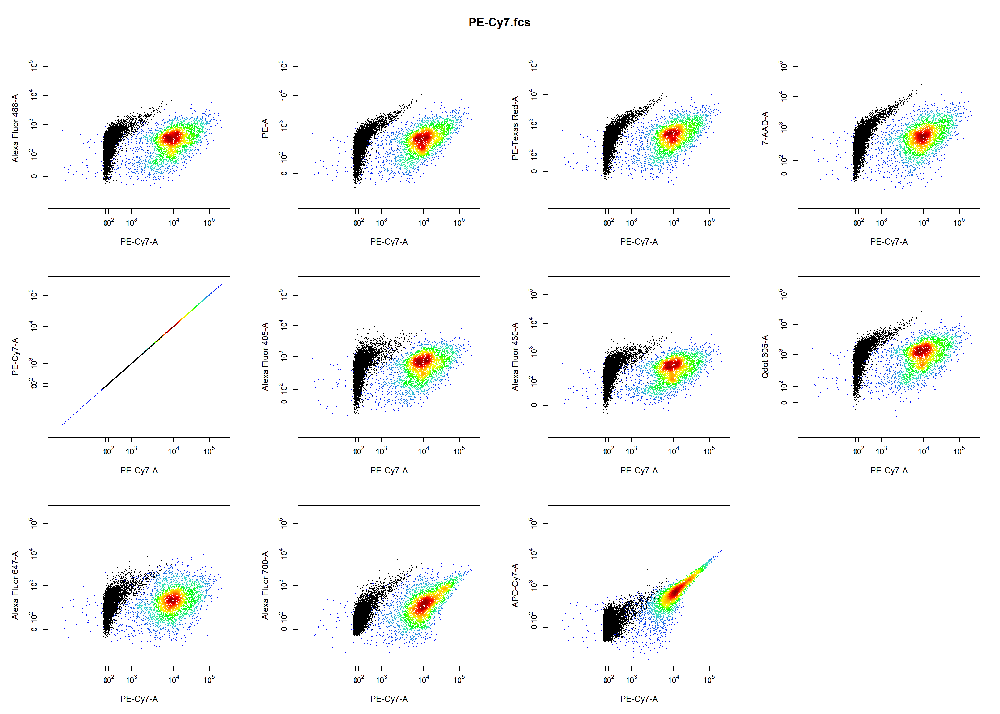

```{r setup, include=FALSE}
knitr::opts_chunk$set(echo = TRUE)
```

# 1. Introduction

**CytoRSuite** provides some useful functions to aid in compensation of fluorescent spillover, including `spillover_compute` for automated compensation, `spillover_edit` to interactively modify spillover matrices and `cyto_plot_compensation` to visualise compensation. Here we aim to demonstrate the appropriate use of these functions to obtain accurate spillover values for compensation.

The **CytoRSuite** compensation workflow is as follows:

1. Save .fcs files to folder "Compensation Controls" and read into a `flowSet`.
2. Load in compensation controls and an unstained control into a `GatingSet`.
3. Gate controls using `gate_draw` to home in on a homogenous cell population (e.g. Single Cells).
4. Use `spillover_compute` to automatically calculate estimates for the spillover matrix.
5. Fine tune spillover values interactively using `spillover_edit`.
6. Visualise compensation using `cyto_plot_compensation` to identify any issues.
7. If issues exist continue to fine tune the spillover values using `spillover_edit`.
8. Apply the spillover matrix to samples prior to transformation of fluorescent channels and gating.

# 2. Demonstration

## 2.1 Load in Compensation Controls into `flowSet`

Traditionally, all compensation controls including an universal unstained control are stored in a folder called "Compensation Controls" in the current working directory. For demonstration purposes we will use the `Compensation` dataset supplied in **CytoRSuiteData** which is a flowSet containing 5 single stain compensation controls and a universal unstained control.

```{r, eval = TRUE, message = FALSE, warning = FALSE}
library(CytoRSuite)
library(CytoRSuiteData)

# Assign Compensation flowSet to fs
fs <- Compensation
```

## 2.2 Add Compensation Controls to `GatingSet`

```{r, eval = TRUE, message = FALSE}
gs <- GatingSet(fs)
```

## 2.3 Gate Compensation Controls

Let's gate the samples to home in on the Single Cells population. Gating prior to using `spillover_compute` will yield much more accurate spillover values. 

```{r, echo = FALSE, eval = FALSE, message = FALSE, warning = FALSE}
gating(Compensation_gatingTemplate, gs)
```

```{r, eval = FALSE}
# Cells
gate_draw(gs,
         parent = "root",
         alias = "Cells",
         channels = c("FSC-A","SSC-A"),
         gatingTemplate = "Compensation gatingTemplate.csv")
```

```{r echo=FALSE, out.width='75%', out.height='75%',fig.align="center"}
knitr::include_graphics('Compensation/Compensation1.png')
```

```{r, eval = FALSE}
# Cells
gate_draw(gs,
         parent = "Cells",
         alias = "Single Cells",
         channels = c("FSC-A","FSC-H"),
         gatingTemplate = "Compensation gatingTemplate.csv")
```

```{r echo=FALSE, out.width='75%', out.height='75%',fig.align="center"}
knitr::include_graphics('Compensation/Compensation2.png')
```

## 2.4 Automated Spillover Calculation Using `spillover_compute`

`spillover_compute` will guide the user through channel selection for each of the compensation controls and save these selections to "Compensation-Channels.csv" for downstream use. This file can be passed to the `channel_match` argument of `cyto_plot_compensation` to bypass the channel selection process. Next the user gates the positive signal for each single stain control using an `interval` gate. This population will be used internally to calculate the percentage spillover based on the unstained control. The calculated spillover matrix is returned and written to a csv file for downstream analyses. The name of this file is controlled by the `spillover` argument.

```{r, eval = FALSE}
spill <- spillover_compute(gs, parent = "Single Cells")
```

### 2.4.1 Channel Selection Process

Users are prompted to select a fluorescent channel for each of the compensation controls from a drop-down menu. The results are saved to a csv file called "Compensation-Channels.csv" for later use. This channel selection process can be bypassed by supplying the name of a channel match file to the `channel_match` argument.

```{r, echo=FALSE, out.width='100%', out.height='100%',fig.align="center"}
knitr::include_graphics('Compensation/channel_select.png')
```

### 2.4.2 Gating Positive Signal

A density distribution of each control in the appropriate channel will be plotted for users to gate the positive signal to use for spillover calculation. The unstained control is overlaid in red as a reference for gating.

```{r, echo=FALSE, out.width='75%', out.height='75%',fig.align="center"}
knitr::include_graphics('Compensation/Compensation3.png')
```

### 2.4.3 Reading Exported Spillover Matrix File

The calculated spillover matrix can be read into R using read.csv:
```{r, eval = FALSE}
spill <- read.csv("Spillover-Matrix.csv", header = TRUE, row.names = 1)
colnames(spill) <- rownames(spill)
spill
```

```{r, eval = TRUE, echo = FALSE}
spill <- read.csv("Compensation/Spillover-Matrix.csv", header = TRUE, row.names = 1)
colnames(spill) <- rownames(spill)
spill
```

### 2.5 Modify Spillover Values Interactively Using `spillover_edit`

`spillover_edit` leverages a shiny interface to facilitate realtime visualisation of changes to fluorescent spillover values. 

```{r, eval = FALSE}
spillover_edit(gs, parent = "Single Cells", spillover = "Spillover-Matrix.csv")
```

`spillover_edit` features:

- automatic plot updates with changes to spillover values
- matrix cell colour change indicates the degree of compensation required
- overlay **unstained** control as a reference
- red horizontal line indicating median fluorescent intensity of the unstained control
- purple **median tracker** line which monitors changes in the median fluorescent intensity of the stained population
- density distributions automatically update with changes and display median fluorescent intensities for unstained and single stain controls.
- **save** updates by clicking save button
- **Plots** tab displays compensation changes in all fluorescent channels

```{r, echo=FALSE, out.width='100%'}
knitr::include_graphics('Compensation/spillover_edit1.png')
```

Modifying the spillover values will automatically result in the plot being updated. The correct spillover value is such that the median of the stained population is equal to that of the unstained population (i.e. red line and purple line should meet in the center of the stained population). Looks like the PE-Cy7 control is slightly over compensated in the APC-Cy7 channel, let's modify the value and click **save** to correct this:

```{r, echo=FALSE, out.width='100%'}
knitr::include_graphics('Compensation/spillover_edit2.png')
```

Clicking on the **Plots** tab will display fluorescence spillover in all fluorescent channels with options to overlay the unstained control and the un-compensated sample.

```{r, echo=FALSE, out.width='100%'}
knitr::include_graphics('Compensation/spillover_edit3.png')
```

### 2.6 Visualise Compensation Using `cyto_plot_compensation`

`cyto_plot_compensation` will automatically plot each compensation control in all fluorescent channels to identify any potential compensation issues. To identify any issues simply scroll through the plots by clicking the arrows in the **Plots** window. For brevity only the plots for PE Cy7 compensation control are shown below:

```{r, eval = FALSE}
# Un-compensated
cyto_plot_compensation(gs, 
                       parent = "Single Cells", 
                       channel_match = "Compensation-channels.csv")
```

```{r echo=FALSE, out.width='100%'}

```

```{r, eval = FALSE}
# Compensated
cyto_plot_compensation(gs, 
                       parent = "Single Cells", 
                       channel_match = "Compensation-channels.csv",
                       compensate = TRUE,
                       spillover = "Spillover-Matrix.csv")
```

```{r echo=FALSE, out.width='100%'}
knitr::include_graphics('Compensation/cyto_plot_comp2.png')
```

## 3. More Information

For more information on these compensation functions refer to the documentation for these functions in the [Reference](https://dillonhammill.github.io/CytoRSuite/reference/index.html). To learn more about the gating functions included in **CytoRSuite** refer to [Gating Functions](https://dillonhammill.github.io/CytoRSuite/articles/CytoRSuite-Gating-Functions.html) vignette.
