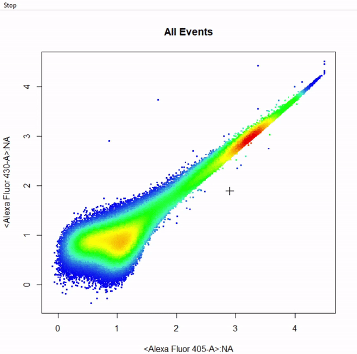
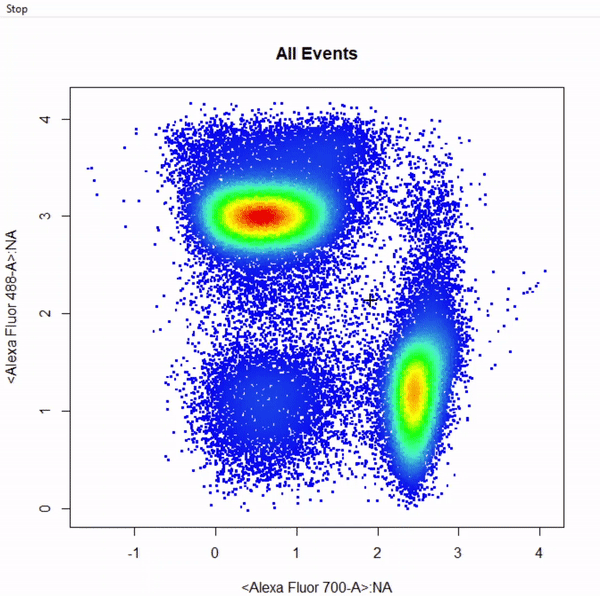

```{r setup, include=FALSE}
knitr::opts_chunk$set(echo = TRUE)
```

# 1. Introduction

**CytoRSuite** provides a variety of useful gating functions to interactively draw gates around populations for the analysis of flow cytometry data. Here we will demonstrate the use of these functions to return `flowCore` gate objects for downstream analyses. Below we outline the gating functions currently supported by **CytoRSuite** as well as their required inputs:

* `gate_polygon_draw` - constructs **polygonGate(s)** based on selection of a minimum of 3 points. Polygon gates are sealed by right clicking and selecting "stop".
* `gate_rectangle_draw` - constructs **rectangleGate(s)** based on selection of 2 diagonal points defining the limits of the gate.
* `gate_boundary_draw` - constructs a lower open-ended **rectangleGate** based on selection of 1 point indicating the upper bound of the population. Boundary gates are supported in both 1 and 2 dimensions.
* `gate_threshold_draw` - constructs an upper open-ended **rectangleGate** based on selection of 1 point indicating the lower bound of the population. Threshold gates are supported in both 1 and 2 dimensions.
* `gate_interval_draw` - constructs **rectangleGate(s)** based on selection of 2 points indicating the lower and upper bounds of the population. Interval gates are supported in both 1 and 2 dimensions.
* `gate_ellipse_draw` - constructs **ellipsoidGate(s)** based on selection of 4 points indicating the lower and upper bounds of the population in 2 dimensions. 
* `gate_quadrant_draw` - constructs 4 open-ended **rectangleGates** based on selection of 1 point indicating the center of the crosshair between 4 populations. 
* `gate_web_draw` - constructs any number of **polygonGates** based on selection of a center point and surrounding separating points. See below for demonstration.
* `gate_draw` is a wrapper for all of these gating functions which takes on an argument `type` to indicate that type of gate to draw and construct.

## 2. Gating Arguments

All gating functions have the same format with minor variations as detailed below:

gate_draw(fr, channels, alias = NULL, display = 1, plot = TRUE, label = TRUE, ...)

* **type** of gate to be drawn, possible options include "rectangle", "polygon", "threshold", "boundary", "interval", "ellipse", "quadrant" and "web".
* **fr** an object of class `flowFrame` to be gated. For objects of classes `flowSet` and `GatingSet` refer to the more versatile `gate_draw` function.
* **channels** vector indicating the name(s) of the channel(s) to be used for gating.
* **alias** vector indicating the names of the population(s) to be gated. The length of the alias argument dictates the number of gates to construct. This argument **MUST** be supplied in order to construct the gates.
* **axis** used by drawInterval to specify whether the "x" or "y" axis should be used when constructing 2-D interval gates.
* **display** numeric [0,1] indicating the percentage of events to display when plotting, set to all events by default. If the supplied value is greater than the total number of events in the `flowFrame`, all events will be plotted.
* **plot** logical indicating whether a plot should be constructed, set to **TRUE** by default. This argument can be used to turn off plotting when mixing gating functions as detailed later.
* **label** logical indicating whether population names and statistics should be added to the plot after gating, set to **TRUE** by default.
* **...** additional arguments passed to cyto_plot for plotting.

## 3. Demonstration of Gating Functions

To demonstrate the use of CytoRSuite's gating functions we will use the "Activation" flowSet shipped with **CytoRSuiteData**. This flowSet contains 4 samples from an *in vitro* activation assay where activated dendritic cells pulsed with ovalbumin were used to stimulate OT-I (CD8+) and OT-II (CD4+) transgenic T cells. For more information about this `flowSet` see **?Activation**.

## 3.1 Prepare Samples for Gating
```{r, eval = FALSE}
# Load in required packages
library(CytoRSuite)
library(CytoRSuiteData)

# Load in Activation dataset
fs <- Activation

# Extract spillover matrix from flowFrame description slot - see ?computeSpillover ?editSpillover
spill <- fs[[1]]@description$SPILL

# Apply compensation to samples & save to object fs
fs <- compensate(fs, spill)

# Apply logicle transformation to all fluorescent channels
trans <- estimateLogicle(fs[[1]], colnames(spill))
fs <- transform(fs, trans)

# We will use the pooled samples for gating - for large datasets use display to limit events for plotting
fr <- as(fs, "flowFrame")
```

## 3.2 `gate_polygon_draw`
```{r echo = TRUE, eval = FALSE, fig.keep = 'none'}
# Gate cells based on FSC-A & SSC-A - close gate by right click & "stop" - save gate to gts
gts <- gate_polygon_draw(fr, alias = "Cells", channels = c("FSC-A","SSC-A"))
```

```{r echo=FALSE, out.width='60%', out.height='60%',fig.align="center"}
knitr::include_graphics('Gating-functions/drawPolygon.gif')
```

```{r echo = TRUE, eval = FALSE}
# gts is a filters list containing the constructed gates that can be easily applied to samples
Cells <- Subset(fr, gts[[1]])
```

## 3.3 `gate_rectangle_draw`
```{r echo = TRUE, eval = FALSE, fig.keep = 'none'}
# Gate single cells by selecting 2 diagonal points of rectangle - add gate to gts
gts <- gate_rectangle_draw(Cells, alias = "Single Cells", channels = c("SSC-W","SSC-H"))
```

```{r echo=FALSE, out.width='60%', out.height='60%',fig.align="center"}
knitr::include_graphics('Gating-functions/drawRectangle.gif')
```

```{r echo = TRUE, eval = FALSE}
# gts is a filters list containing the constructed gates that can be easily applied to samples
Singlets <- Subset(Cells, gts[[1]])
```

## 3.4 `gate_boundary_draw`

### 3.4.1 1-Dimensional Boundary Gate
```{r echo = TRUE, eval = FALSE, fig.keep = 'none'}
# Gate live cells as Hoechst- Alexa Fluor 405-A - gate not applied to demonstrate 2-D boundary gates
gate_boundary_draw(Singlets, alias = "Cells", channels = "Alexa Fluor 405-A")
```

```{r echo=FALSE, out.width='60%', out.height='60%',fig.align="center"}
knitr::include_graphics('Gating-functions/drawBoundary1D.gif')
```

### 3.4.2 2-Dimensional Boundary Gate
```{r echo = TRUE, eval = FALSE, fig.keep = 'none'}
# Gate live cells using 2-D boundary gate
gts <- gate_boundary_draw(Singlets, alias = "Live Cells", channels = c("Alexa Fluor 405-A","Alexa Fluor 430-A"))
```

```{r echo=FALSE, out.width='60%', out.height='60%',fig.align="center"}

```

```{r echo = TRUE, eval = FALSE}
# gts is a filters list containing the constructed gates that can be easily applied to samples
Live <- Subset(Singlets, gts[[1]])
```

## 3.5 gate_threshold_draw

### 3.5.1 1-Dimensional Threshold Gate
```{r echo = TRUE, eval = FALSE, fig.keep = 'none'}
# Gate T cells as Va2-PE+ - gate not applied to demonstrate 2-D threshold gates
gate_threshold_draw(Live, alias = "T Cells", channels = "PE-A")
```

```{r echo=FALSE, out.width='60%', out.height='60%',fig.align="center"}
knitr::include_graphics('Gating-functions/drawThreshold1D.gif')
```

### 3.5.2 2-Dimensional Threshold Gate
```{r echo = TRUE, eval = FALSE, fig.keep = 'none'}
# Gate T cells as Va2-PE+ using 2-D threshold gate
gts <- gate_threshold_draw(Live, alias = "T Cells", channels = c("APC-Cy7-A","PE-A"))
```

```{r echo=FALSE, out.width='60%', out.height='60%',fig.align="center"}
knitr::include_graphics('Gating-functions/drawThreshold2D.gif')
```

```{r echo = TRUE, eval = FALSE}
# gts is a filters list containing the constructed gates that can be easily applied to samples
Va2 <- Subset(Live, gts[[1]])
```

## 3.6 gate_interval_draw

### 3.6.1 1-Dimensional Interval Gate
```{r echo = TRUE, eval = FALSE, fig.keep = 'none'}
# Gate Dendritic cells CD11c+ APC cy7 using 1D interval gate - gate not applied to demonstrate 2D interval gates
gate_interval_draw(Live, alias = "Dendritic Cells", channels = "APC-Cy7-A")
```

```{r echo=FALSE, out.width='60%', out.height='60%',fig.align="center"}
knitr::include_graphics('Gating-functions/drawInterval1D.gif')
```

### 3.6.2 2-Dimensional Interval Gate
```{r echo = TRUE, eval = FALSE, fig.keep = 'none'}
# Gate dendritic cells CD11c+ APC Cy7 using 2D interval gate
gts <- gate_interval_draw(Live, alias = "Dendritic Cells", channels = c("Qdot 605-A", "APC-Cy7-A"), axis = "y")
```

```{r echo=FALSE, out.width='60%', out.height='60%',fig.align="center"}
knitr::include_graphics('Gating-functions/drawInterval2D.gif')
```

```{r echo = TRUE, eval = FALSE}
# gts is a filters list containing the constructed gates that can be easily applied to samples
DC <- Subset(Live, gts[[1]])
```

## 3.7 gate_ellipse_draw
```{r echo = TRUE, eval = FALSE, fig.keep = 'none'}
# Gate CD8+ T cells using ellipsoid gate - gate not applied to demonstrate quadrant and web gates
gate_ellipse_draw(Va2, alias = "CD8 T Cells", channels = c("Alexa Fluor 700-A","Alexa Fluor 488-A"))
```

```{r echo=FALSE, out.width='60%', out.height='60%',fig.align="center"}
knitr::include_graphics('Gating-functions/drawEllipse.gif')
```

## 3.8 gate_quadrant_draw
```{r echo = TRUE, eval = FALSE, fig.keep = 'none'}
# Gate CD4 & CD8 T cells using quadrant gates - gates not applied to demonstrate web gates
# Quadrant gates are named from bottom left anticlockwise to top left
gate_quadrant_draw(Va2, alias = c("CD4- CD8-","CD4+ CD8-","CD4+ CD8+","CD4+ CD8+"), channels = c("Alexa Fluor 700-A","Alexa Fluor 488-A"))
```

```{r echo=FALSE, out.width='60%', out.height='60%',fig.align="center"}
knitr::include_graphics('Gating-functions/drawQuadrants.gif')
```

## 3.9 gate_web_draw
```{r echo = TRUE, eval = FALSE, fig.keep = 'none'}
# Gate CD4 & CD8 T cells using web gates - gates not applied to demonstrate web gates
# Gates are named from bottom left anticlockwise to top left
gts <- gate_web_draw(Va2, alias = c("DN","CD4 T Cells","CD8 T Cells"), channels = c("Alexa Fluor 700-A","Alexa Fluor 488-A"))
```

```{r echo=FALSE, out.width='60%', out.height='60%',fig.align="center"}
knitr::include_graphics('Gating-functions/drawWeb.gif')
```

```{r echo = TRUE, eval = FALSE}
# gts is a filters list containing the constructed gates that can be easily applied to samples
CD4 <- Subset(Va2, gts[[2]])
CD8 <- Subset(Va2, gts[[3]])
```

## 4. Multiple Gates
```{r echo = TRUE, eval = FALSE, fig.keep = 'none'}
# Gate CD4 & CD8 T cells using multiple rectangle gates - gates not applied
# Number of gates is determined based on how many populations are specified in "alias"
gate_rectangle_draw(Va2, alias = c("CD4 T Cells","CD8 T Cells"), channels = c("Alexa Fluor 700-A", "Alexa Fluor 488-A"))
```

```{r echo=FALSE, out.width='60%', out.height='60%',fig.align="center"}

```

## 5. Mixed Gates
```{r echo = TRUE, eval = FALSE, fig.keep = 'none'}
# Gate CD4 & CD8 T cells using mixed gates - gates not applied
# Gating functions can be mixed by setting plot = FALSE for subsequent gates & keep plotting window open
gate_rectangle_draw(Va2, alias = "CD4 T Cells", channels = c("Alexa Fluor 700-A","Alexa Fluor 488-A"))
gate_ellipse_draw(Va2, alias = "CD8 T Cells", channels = c("Alexa Fluor 700-A","Alexa Fluor 488-A"), plot = FALSE)
```

```{r echo=FALSE, out.width='60%', out.height='60%',fig.align="center"}

```

## 3. More information

For more information on these gating functions refer to the documentation for these functions in the [Reference](https://dillonhammill.github.io/CytoRSuite/reference/index.html). To learn more about how to edit and remove gates refer to [Gate Manipulation](https://dillonhammill.github.io/CytoRSuite/articles/CytoRSuite-Gate-Manipulation.html) vignette.
