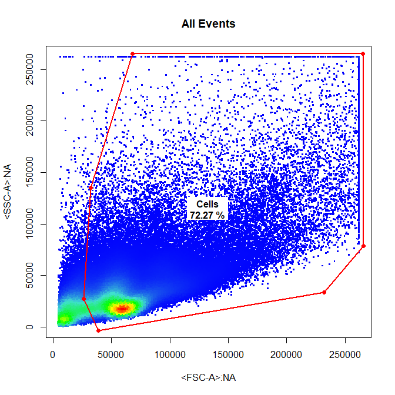
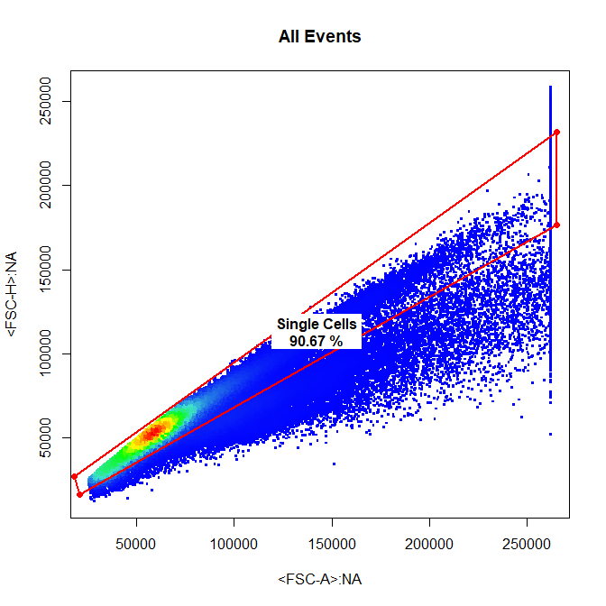
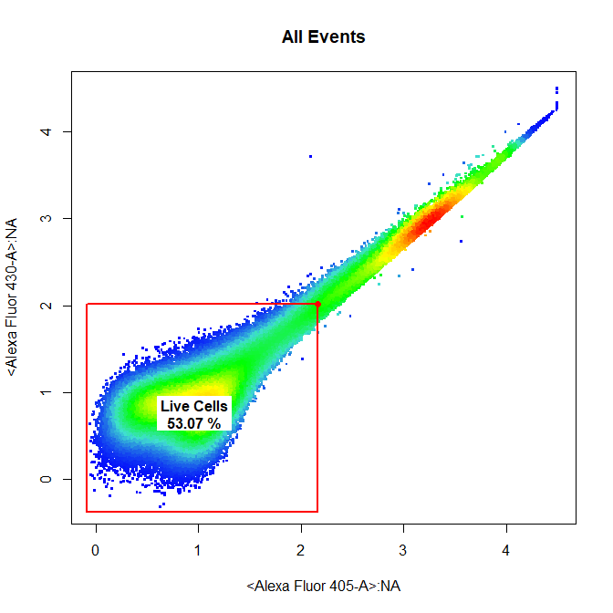
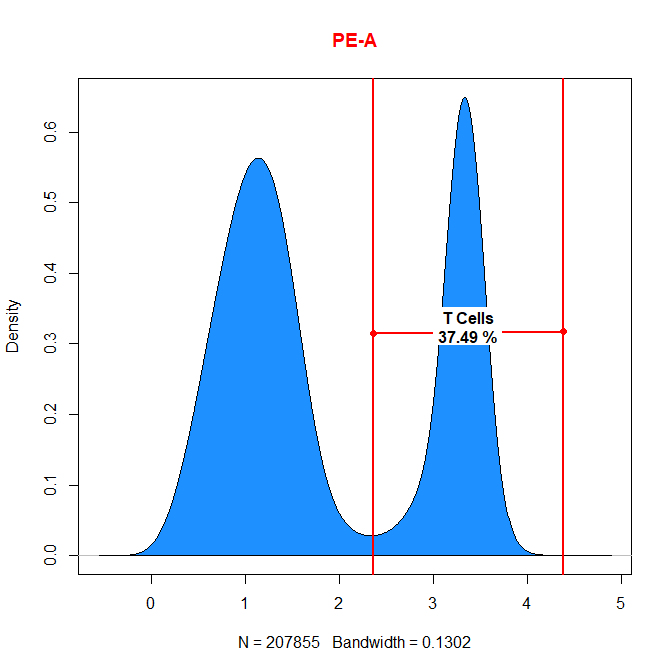
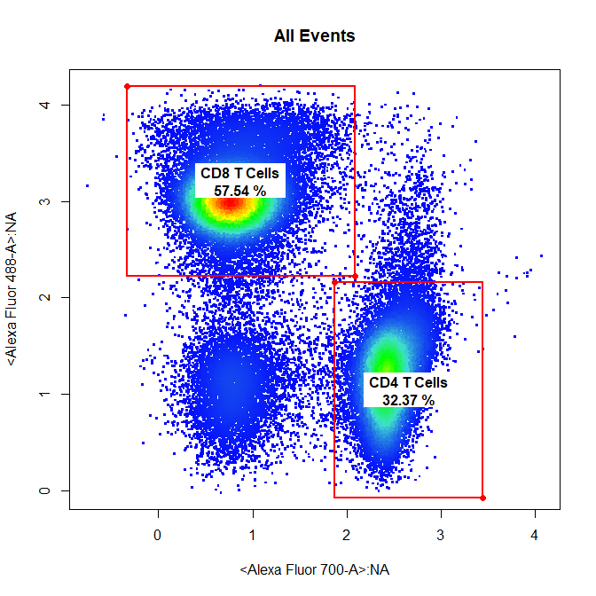
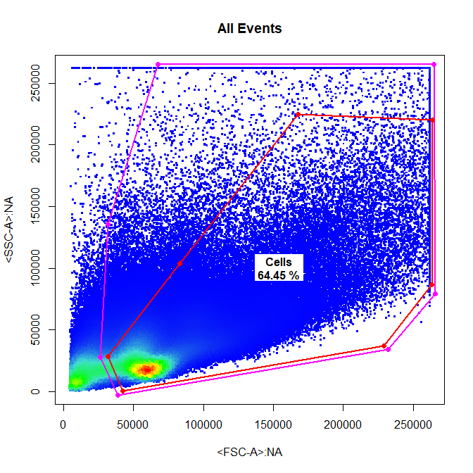
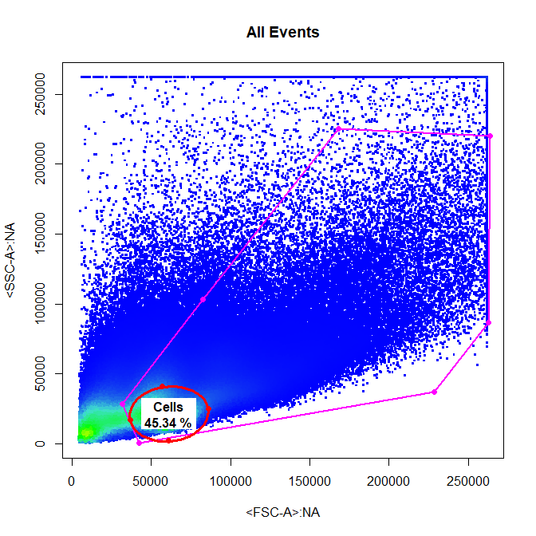
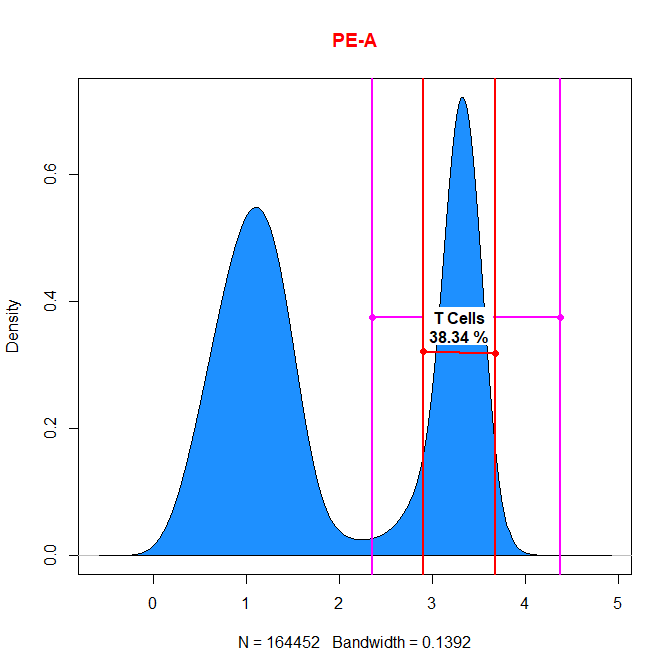

```{r setup, include=FALSE}
knitr::opts_chunk$set(echo = TRUE)
```

## **1. Introduction**

Manipulation of gates saved to the gatingTemplate is possible through the **removeGate** and **editGate** functions. As their names suggest **removeGate** will remove the gate from the GatingSet and the gatingTemplate, whilst **editGate** allows the user to update an existing gate and update the GatingSet and gatingTemplate. This vignette aims to demonstrate the appropriate use of these functions for manipulating gates using **cytoSuite**.

## **2. Gate Manipulation in cytoSuite**

To demonstrate **editGate** and **removeGate** we will use the "Activation" flowSet shipped with cytoSuite. For more details refer to ?Activation.

## 2.1. Prepare Samples for Gating
```{r, eval = TRUE, message = FALSE}
library(cytoRSuite, quietly = TRUE)

# Load in Activation dataset
data("Activation", package = "cytoRSuite")

# Add Samples to GatingSet
gs <- GatingSet(Activation)

# Extract spillover matrix from flowFrame description slot - see ?computeSpillover ?editSpillover
spill <- Activation[[1]]@description$SPILL

# Apply compensation to samples & save to object fs
gs <- compensate(gs, spill)

# Apply logicle transformation to all fluorescent channels
trans <- estimateLogicle(gs[[1]], colnames(spill))
gs <- transform(gs, trans)

```

```{r, eval = TRUE, echo = FALSE, message = FALSE}
gt <- suppressMessages(gatingTemplate("Manipulation gatingTemplate Full.csv"))
suppressMessages(gating(gt,gs))
```

## 2.2. Gate Samples Using drawGate
```{r, eval = FALSE, message = FALSE}
drawGate(gs,
         parent = "root",
         alias = "Cells",
         channels = c("FSC-A","SSC-A"),
         gate_type = "p",
         gtfile = "Manipulation gatingTemplate.csv")
```


```{r, eval = FALSE, message = FALSE}
drawGate(gs,
         parent = "Cells",
         alias = "Single Cells",
         channels = c("FSC-A","FSC-H"),
         gate_type = "p",
         gtfile = "Manipulation gatingTemplate.csv")
```


```{r, eval = FALSE, message = FALSE}
drawGate(gs,
         parent = "Single Cells",
         alias = "Live Cells",
         channels = c("Alexa Fluor 405-A","Alexa Fluor 430-A"),
         gate_type = "boundary",
         gtfile = "Manipulation gatingTemplate.csv")
```


```{r, eval = FALSE, message = FALSE}
drawGate(gs,
         parent = "Live Cells",
         alias = "T Cells",
         channels = "PE-A",
         gate_type = "interval",
         gtfile = "Manipulation gatingTemplate.csv")
```


```{r, eval = FALSE, message = FALSE}
drawGate(gs,
         parent = "T Cells",
         alias = c("CD4 T Cells","CD8 T Cells"),
         channels = c("Alexa Fluor 700-A","Alexa Fluor 488-A"),
         gate_type = "rectangle",
         gtfile = "Manipulation gatingTemplate.csv")
```


## **3. editGate**

**editGate** provides a simple way to modify existing gates applied to the GatingSet and saved to the gatingTemplate csv file. **editGate** features:

* Re-plots the data with the existing gate(s) in pink.
* Determines which **drawGate** gate_type was used to construct the gate(s).
* Makes the appropriate call to **cytoSuite** gating function(s) to allow the user to re-draw the gate(s) in red.
* Applies the new gate(s) to the GatingSet.
* Updates the relevant entries in the gatingTemplate.

The **gate_type** argument is not necessary if the gate_type of the new gate is to be the same as the old one. This argument allows users to change the **gate_type** of the existing gate(s) if necessary. We will demonstrate its use below:

Since no gate_type is supplied the new gate will have the same gate_type as the existing gate:
```{r, eval = FALSE, message = FALSE}
editGate(gs,
         parent = "root",
         alias = "Cells",
         gtfile = "Manipulation gatingTemplate.csv")
```


gate_type = "ellipse" will change the existing polygon gate to an ellipsoid gate - notice how the existing gate has been updated based on our last editGate call:
```{r, eval = FALSE, message = FALSE}
editGate(gs,
         parent = "root",
         alias = "Cells",
         gate_type = "ellipse",
         gtfile = "Manipulation gatingTemplate.csv")
```


Users can edit any gates with **editGate** including 1-D interval gates:
```{r, eval = FALSE, message = FALSE}
editGate(gs,
         parent = "Live Cells",
         alias = "T Cells",
         gtfile = "Manipulation gatingTemplate.csv")
```


## **4. removeGate**

**removeGate** simply removes the selected gate(s) and associated descendant populations from the GatingSet and the gatingTemplate. Removal of multiple populations in a single call is supported as long as these populations share the same parent. **removeGate** features:

* Remove gate(s) from GatingSet.
* Remove gate(s) entries from the gatingTemplate.

For example to remove the T Cells gate:
```{r, eval = FALSE, message = FALSE}
removeGate(gs,
           alias = "CD4 T Cells",
           gtfile = "Manipulation gatingTemplate.csv")
```

```{r, eval = TRUE, echo = FALSE}
gt <- suppressMessages(gatingTemplate("Manipulation gatingTemplate.csv"))
gs <- getData(gs, "root")
gs <- GatingSet(gs)
suppressMessages(gating(gt,gs))
```

T Cells node no longer exists in the GatingSet:
```{r, eval = TRUE}
getNodes(gs)
```

T Cells node no longer exists in the gatingTemplate:
```{r, eval = TRUE}
gatingTemplate("Manipulation gatingTemplate.csv")
```

Dillon Hammill, BMedSci (Hons)
<br /> Ph.D. Scholar
<br /> The Parish Group – Cancer & Vascular Biology
<br /> ACRF Department of Cancer Biology and Therapeutics
<br /> The John Curtin School of Medical Research
<br /> ANU College of Medicine, Biology and the Environment
<br /> The Australian National University
<br /> Acton ACT 2601
<br /> Dillon.Hammill@anu.edu.au
