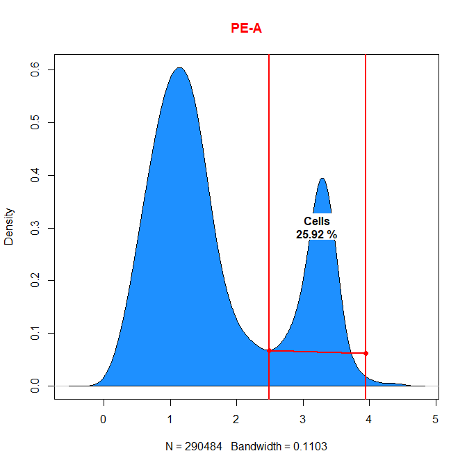
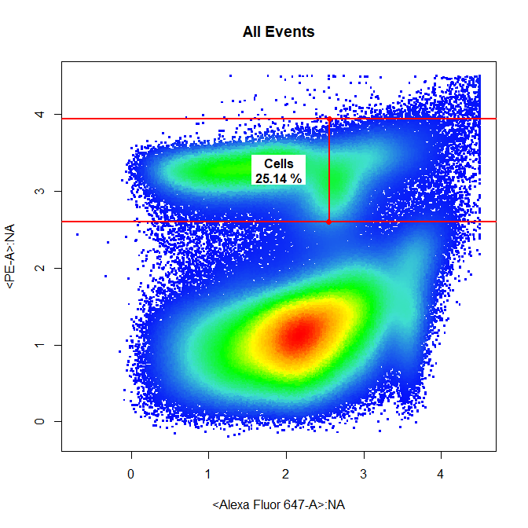
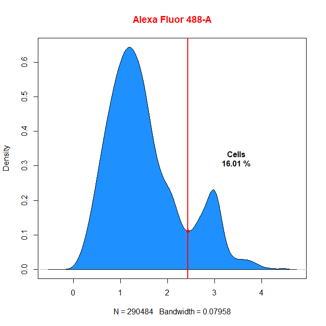
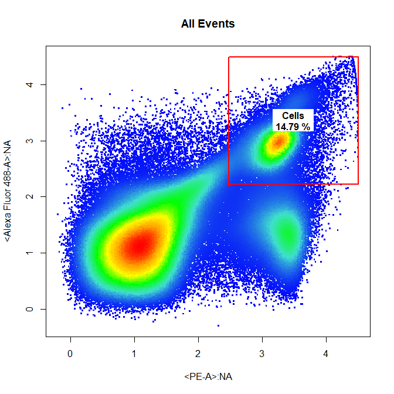
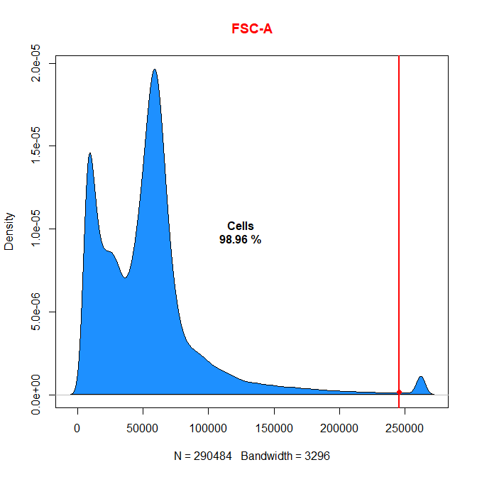
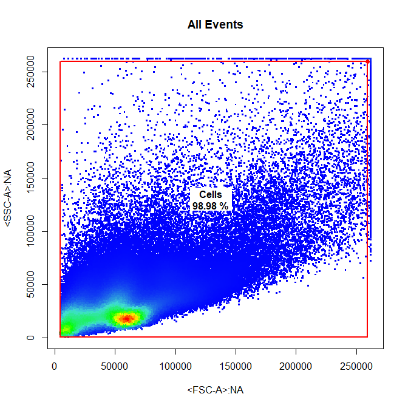
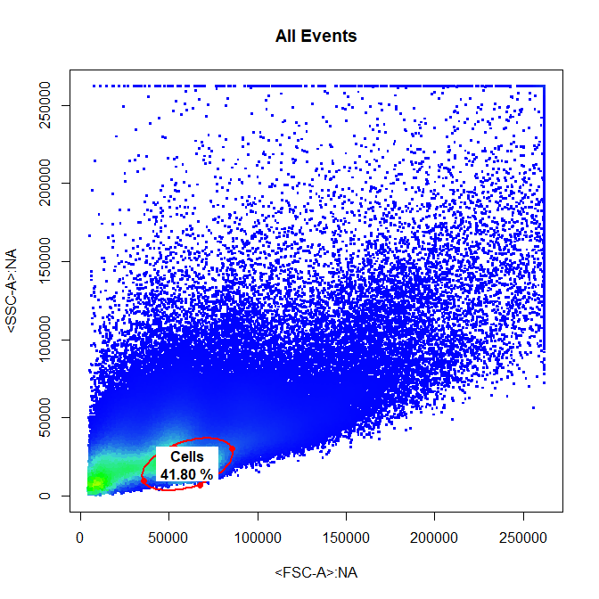
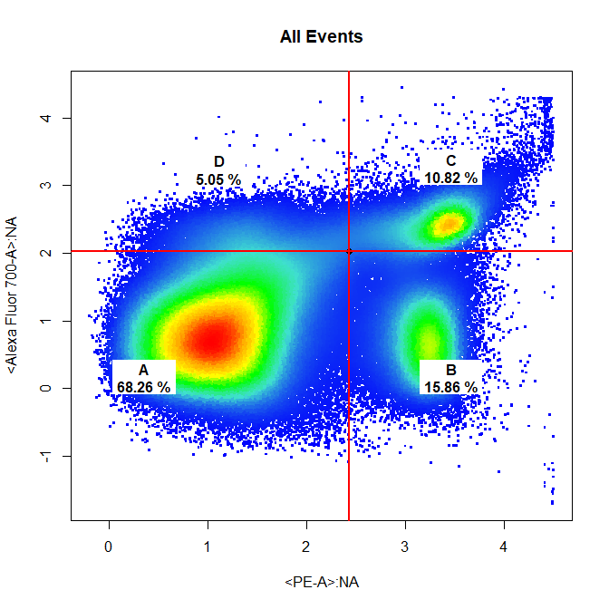

```{r setup, include=FALSE}
knitr::opts_chunk$set(echo = TRUE)
```

## Introduction

**cytoSuite** provides a variety of useful gating functions to interactively draw gates around populations during analysis of flow cytometry data. Here we aim to demonstrate the use of the followung gating functions provided by **cytoSuite**:

* **drawPolygon** - minimum of 3 selected points closed by right click and selecting "stop".
* **drawRectangle** - select 2 diagonal points to draw rectangle.
* **drawInterval** - select 2 points indicating the lower and upper bounds of the population.
* **drawThreshold** - select 1 point indicating the lower bound of the population.
* **drawBoundary** - select 1 point indicating the upper bound of the population.
* **drawEllipse** - select 4 points indicating the limits of the ellipse.
* **drawQuadrants** - select 1 point indicating the center of the crosshair.

## Gating Arguments

All gating functions have the same format with minor variations as detailed below:

draw___(fr, channels, alias = NULL, subSample = 250000, plot = TRUE, labs = TRUE,...)

* **fr** an object of class flowFrame to be gated. For objects of classes **flowSet** and **GatingSet** refer to the more versatile **drawGate** function.
* **channels** vector indicating the name(s) of the channel(s) to be used for gating.
* **alias** vector indicating the names of the population(s) to be gated. The length of the alias argument dictates the number of gates to construct. This argument **MUST** be supplied in order to construct the gates.
* **subSample** numeric indicating the number of events to display when plotting, set to 250000 events by default. If the supplied value is greater than the total number of events in the flowFrame, all events will be plotted.
* **plot** logical indicating whether a plot should be constructed, set to **TRUE** by default. This argument can be used to turn off plotting when mixing gating functions as detailed later.
* **labs** logical indicating whether population names and statistics should be added to the plot after gating, set to **TRUE** by default.
* **...** additional arguments detailed later.

## Prepare Data for Gating
```{r, results = "hide"}
library(cytoSuite, quietly = TRUE)

data("Activation", package = "cytoSuite")
spill <- Activation[[1]]@description$SPILL
fs <- compensate(Activation, spill)

trans <- estimateLogicle(Activation[[1]], colnames(spill))
fs <- transform(fs, trans)

fr <- fs[[1]]
```

## drawPolygon
```{r echo = TRUE, eval = FALSE}
drawPolygon(fr, alias = "Cells", channels = c("FSC-A","SSC-A"))
```


## drawRectangle
```{r echo = TRUE, eval = FALSE}
drawRectangle(fr, alias = "Cells", channels = c("FSC-A","SSC-A"))
```


## drawInterval
### 1-Dimensional Interval Gate
```{r echo = TRUE, eval = FALSE}
drawInterval(fr, alias = "Cells", channels = "PE-A")
```


### 2-Dimensional Interval Gate on Y Axis
```{r echo = TRUE, eval = FALSE}
drawInterval(fr, alias = "Cells", channels = c("Alexa Fluor 647-A","PE-A"), axis = "y")
```


## drawThreshold
### 1-Dimensional Threshold Gate
```{r echo = TRUE, eval = FALSE}
drawThreshold(fr, alias = "Cells", channels = "Alexa Fluor 488-A")
```


### 2-Dimensional Threshold Gate
```{r echo = TRUE, eval = FALSE}
drawThreshold(fr, alias = "Cells", channels = c("Alexa Fluor 647-A","Alexa Fluor 488-A"))
```


## drawBoundary
### 1-Dimensional Boundary Gate
```{r echo = TRUE, eval = FALSE}
drawBoundary(fr, alias = "Cells", channels = "FSC-A")
```


### 2-Dimensional Boundary Gate
```{r echo = TRUE, eval = FALSE}
drawBoundary(fr, alias = "Cells", channels = c("FSC-A","SSC-A"))
```


## drawEllipse
```{r echo = TRUE, eval = FALSE}
drawEllipse(fr, alias = "Cells", channels = c("FSC-A","SSC-A"))
```


## drawQuadrants
```{r echo = TRUE, eval = FALSE}
drawQuadrants(fr, alias = c("A","B","C","D"), channels = c("PE-A","Alexa Fluor 700-A"))
```



