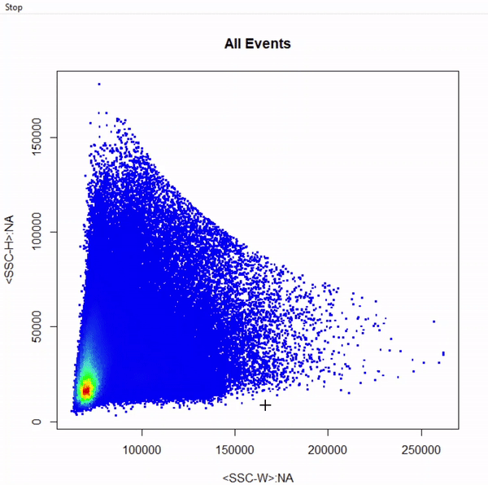
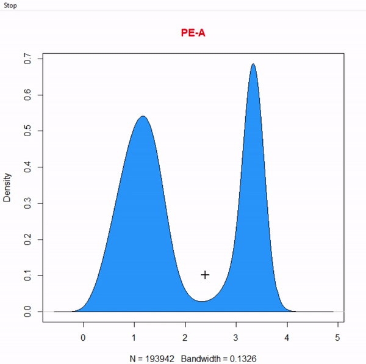
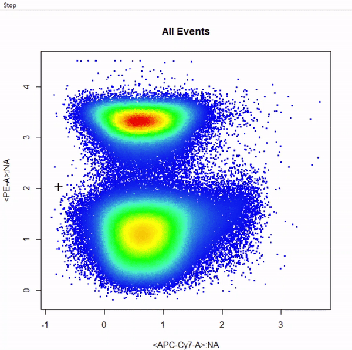
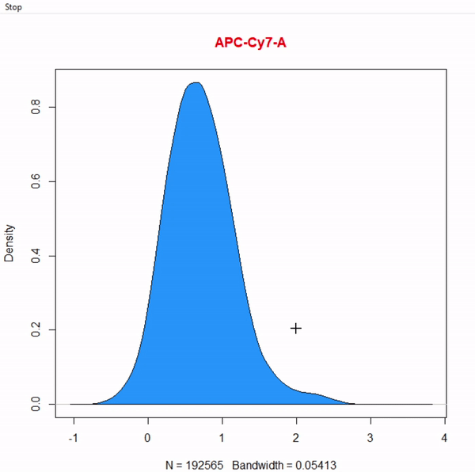
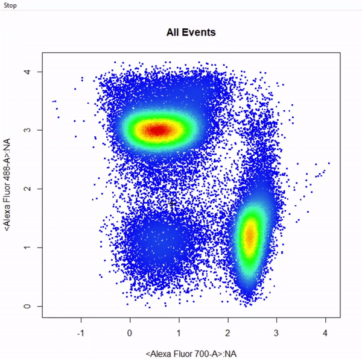

```{r setup, include=FALSE}
knitr::opts_chunk$set(echo = TRUE)
```

## 1. **Introduction**

**cytoSuite** provides a variety of useful gating functions to interactively draw gates around populations for the analysis of flow cytometry data. Here we will demonstarte the use of these functions to return **flowCore** gate objects for downstream analyses. Below we outline the gating functions currently supported by **cytoSuite** as well as their required inputs:

* **drawPolygon** - constructs **polygonGate(s)** based on selection of a minimum of 3 points. Polygon gates are sealed by right clicking and selecting "stop".
* **drawRectangle** - constructs **rectangleGate(s)** based on selection of 2 diagonal points defining the limits of the gate.
* **drawBoundary** - constructs a lower open-ended **rectangleGate** based on selection of 1 point indicating the upper bound of the population. Boundary gates are supported in both 1 and 2 dimensions.
* **drawThreshold** - constructs an upper open-ended **rectangleGate** based on selection of 1 point indicating the lower bound of the population. Threshold gates are supported in both 1 and 2 dimensions.
* **drawInterval** - constructs **rectangleGate(s)** based on selection of 2 points indicating the lower and upper bounds of the population. Interval gates are supported in both 1 and 2 dimensions.
* **drawEllipse** - constructs **ellipsoidGate(s)** based on selection of 4 points indicating the lower and upper bounds of the population in 2 dimensions. 
* **drawQuadrants** - constructs 4 open-ended **rectangleGates** based on selection of 1 point indicating the center of the crosshair between 4 populations. 
* **drawWeb** - constructs any number of **polygonGates** based on selection of a center point and surrounding separating points. See below for demonstration.

## 1.1 Gating Arguments

All gating functions have the same format with minor variations as detailed below:

draw___(fr, channels, alias = NULL, subSample = 250000, plot = TRUE, labs = TRUE,...)

* ___ type of gate to be drawn, possible options include Rectangle, Polygon, Threshold, Boundary, Interval, Ellipse, Quadrants and Web.
* **fr** an object of class flowFrame to be gated. For objects of classes **flowSet** and **GatingSet** refer to the more versatile **drawGate** function.
* **channels** vector indicating the name(s) of the channel(s) to be used for gating.
* **alias** vector indicating the names of the population(s) to be gated. The length of the alias argument dictates the number of gates to construct. This argument **MUST** be supplied in order to construct the gates.
* **axis** used by drawInterval to specify whether the "x" or "y" axis should be used when constructing 2-D interval gates.
* **subSample** numeric indicating the number of events to display when plotting, set to 250000 events by default. If the supplied value is greater than the total number of events in the flowFrame, all events will be plotted.
* **plot** logical indicating whether a plot should be constructed, set to **TRUE** by default. This argument can be used to turn off plotting when mixing gating functions as detailed later.
* **labs** logical indicating whether population names and statistics should be added to the plot after gating, set to **TRUE** by default.
* **...** additional arguments passed to plotDens for plotting.

## 2. **Demonstration of Gating Functions**

To demonstrate the use of cytoSuite's gating functions we will use the "Activation" flowSet shipped with **cytoSuite**. This flowSet contains two samples from an *in vitro* activation assay where activated dendritic cells pulsed with ovalbumin were used to stimulate OT-I (CD8+) and OT-II (CD4+) transgenic T cells. For more information about this flowSet see **?Activation**.

## 2.1 Prepare Samples for Gating
```{r, eval = FALSE}
# Load in required packages
library(cytoSuite)

# Load in Activation dataset
data("Activation", package = "cytoSuite")

# Extract spillover matrix from flowFrame description slot - see ?computeSpillover ?editSpillover
spill <- Activation[[1]]@description$SPILL

# Apply compensation to samples & save to object fs
fs <- compensate(Activation, spill)

# Apply logicle transformation to all fluorescent channels
trans <- estimateLogicle(Activation[[1]], colnames(spill))
fs <- transform(fs, trans)

# We will use the pooled samples for gating - for large datasets use subSample to limit events for plotting
fr <- as(fs, "flowFrame")
```

## 2.2 drawPolygon
```{r echo = TRUE, eval = FALSE, fig.keep = 'none'}
# Gate cells based on FSC-A & SSC-A - close gate by right click & "stop" - save gate to gts
gts <- drawPolygon(fr, alias = "Cells", channels = c("FSC-A","SSC-A"))
```

```{r echo = TRUE, eval = FALSE}
# gts is a filters list containing the constructed gates that can be easily applied to samples
Cells <- Subset(fr, gts[[1]])
```

## drawRectangle
```{r echo = TRUE, eval = FALSE, fig.keep = 'none'}
# Gate single cells by selecting 2 diagonal points of rectangle - add gate to gts
gts <- drawRectangle(Cells, alias = "Single Cells", channels = c("SSC-W","SSC-H"))
```

```{r echo = TRUE, eval = FALSE}
# gts is a filters list containing the constructed gates that can be easily applied to samples
Singlets <- Subset(Cells, gts[[1]])
```

## drawBoundary
### 1-Dimensional Boundary Gate
```{r echo = TRUE, eval = FALSE, fig.keep = 'none'}
# Gate live cells as Hoechst- Alexa Fluor 405-A - gate not applied to demonstrate 2-D boundary gates
drawBoundary(Singlets, alias = "Cells", channels = "Alexa Fluor 405-A")
```


### 2-Dimensional Boundary Gate
```{r echo = TRUE, eval = FALSE, fig.keep = 'none'}
# Gate live cells using 2-D boundary gate
gts <- drawBoundary(Singlets, alias = "Live Cells", channels = c("Alexa Fluor 405-A","Alexa Fluor 430-A"))
```

```{r echo = TRUE, eval = FALSE}
# gts is a filters list containing the constructed gates that can be easily applied to samples
Live <- Subset(Singlets, gts[[1]])
```

## drawThreshold
### 1-Dimensional Threshold Gate
```{r echo = TRUE, eval = FALSE, fig.keep = 'none'}
# Gate T cells as Va2-PE+ - gate not applied to demonstrate 2-D threshold gates
drawThreshold(Live, alias = "T Cells", channels = "PE-A")
```


### 2-Dimensional Threshold Gate
```{r echo = TRUE, eval = FALSE, fig.keep = 'none'}
# Gate T cells as Va2-PE+ using 2-D threshold gate
gts <- drawThreshold(Live, alias = "T Cells", channels = c("APC-Cy7-A","PE-A"))
```

```{r echo = TRUE, eval = FALSE}
# gts is a filters list containing the constructed gates that can be easily applied to samples
Va2 <- Subset(Live, gts[[1]])
```

## drawInterval
### 1-Dimensional Interval Gate
```{r echo = TRUE, eval = FALSE, fig.keep = 'none'}
# Gate Dendritic cells CD11c+ APC cy7 using 1D interval gate - gate not applied to demonstrate 2D interval gates
drawInterval(Live, alias = "Dendritic Cells", channels = "APC-Cy7-A")
```


### 2-Dimensional Interval Gate
```{r echo = TRUE, eval = FALSE, fig.keep = 'none'}
# Gate dendritic cells CD11c+ APC Cy7 using 2D interval gate
gts <- drawInterval(Live, alias = "Dendritic Cells", channels = c("Qdot 605-A", "APC-Cy7-A"), axis = "y")
```

```{r echo = TRUE, eval = FALSE}
# gts is a filters list containing the constructed gates that can be easily applied to samples
DC <- Subset(Live, gts[[1]])
```

## drawEllipse
```{r echo = TRUE, eval = FALSE, fig.keep = 'none'}
# Gate CD8+ T cells using ellipsoid gate - gate not applied to demonstrate quadrant and web gates
drawEllipse(Va2, alias = "CD8 T Cells", channels = c("Alexa Fluor 700-A","Alexa Fluor 488-A"))
```


## drawQuadrants
```{r echo = TRUE, eval = FALSE, fig.keep = 'none'}
# Gate CD4 & CD8 T cells using quadrant gates - gates not applied to demonstrate web gates
# Quadrant gates are named from bottom left anticlockwise to top left
drawQuadrants(Va2, alias = c("CD4- CD8-","CD4+ CD8-","CD4+ CD8+","CD4+ CD8+"), channels = c("Alexa Fluor 700-A","Alexa Fluor 488-A"))
```


## drawWeb
```{r echo = TRUE, eval = FALSE, fig.keep = 'none'}
# Gate CD4 & CD8 T cells using web gates - gates not applied to demonstrate web gates
# Gates are named from bottom left anticlockwise to top left
gts <- drawWeb(Va2, alias = c("DN","CD4 T Cells","CD8 T Cells"), channels = c("Alexa Fluor 700-A","Alexa Fluor 488-A"))
```

```{r echo = TRUE, eval = FALSE}
# gts is a filters list containing the constructed gates that can be easily applied to samples
CD4 <- Subset(Va2, gts[[2]])
CD8 <- Subset(Va2, gts[[3]])
```

## Multiple Gates
```{r echo = TRUE, eval = FALSE, fig.keep = 'none'}
# Gate CD4 & CD8 T cells using multiple rectangle gates - gates not applied
# Number of gates is determined based on how many populations are specified in "alias"
drawRectangle(Va2, alias = c("CD4 T Cells","CD8 T Cells"), channels = c("Alexa Fluor 700-A", "Alexa Fluor 488-A"))
```


## Mixed Gates
```{r echo = TRUE, eval = FALSE, fig.keep = 'none'}
# Gate CD4 & CD8 T cells using mixed gates - gates not applied
# Gating functions can be mixed by setting plot = FALSE for subsequent gates & keep plotting window open
drawRectangle(Va2, alias = "CD4 T Cells", channels = c("Alexa Fluor 700-A","Alexa Fluor 488-A"))
drawEllipse(Va2, alias = "CD8 T Cells", channels = c("Alexa Fluor 700-A","Alexa Fluor 488-A"), plot = FALSE)
```


Dillon Hammill, BMedSci (Hons)
<br /> Ph.D. Scholar
<br /> The Parish Group – Cancer & Vascular Biology
<br /> ACRF Department of Cancer Biology and Therapeutics
<br /> The John Curtin School of Medical Research
<br /> ANU College of Medicine, Biology and the Environment
<br /> The Australian National University
<br /> Acton ACT 2601
<br /> Dillon.Hammill@anu.edu.au